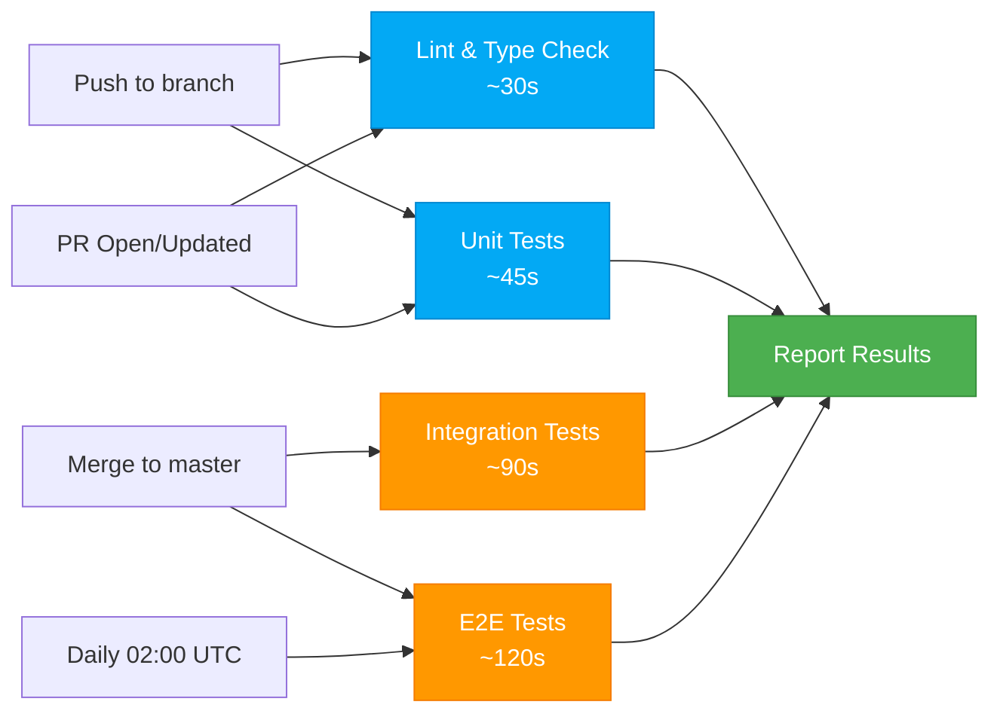

# GitHub Actions CI/CD Brief
## FiremanDecko (Architect) + ArsonWells (Lead Dev) → Dek (Repo Owner)

**Date**: 2026-02-22 | **Status**: Conversation Starter | **Decision Needed**: Key questions below

---

## 1. What We Have Today

### Test Infrastructure Overview

We currently have three test layers, all **manual right now**:

1. **Unit/Integration Tests (Python)**
   - **File**: `quality/scripts/test_api_integration.py`
   - **Coverage**: 25+ test cases across WebSocket API (query_devices, subscribe, set_threshold)
   - **Framework**: pytest + pytest-asyncio + websockets
   - **Run**: `pytest quality/scripts/test_api_integration.py -v`
   - **Requires**: Live HA instance + `.env` with HA_TOKEN, HA_URL

2. **Setup/Teardown Scripts (Bash)**
   - **File**: `quality/scripts/setup-test-env.sh`
   - **Purpose**: Creates/cleans up mock battery entities via HA REST API
   - **Run**: `./quality/scripts/setup-test-env.sh --create --count 150`
   - **Requires**: `.env` with HA_URL, HA_TOKEN, HA_PORT

3. **E2E Tests (Playwright/TypeScript)**
   - **Files**: `quality/e2e/tests/*.spec.ts` (7 test suites)
   - **Coverage**: Panel load, device list, infinite scroll, sorting, dark mode, modals, debug
   - **Framework**: Playwright Test @ 1.48.0
   - **Run**: `npm -C quality/e2e test`
   - **Config**: `quality/e2e/playwright.config.ts` + global auth setup
   - **Requires**: Live HA + `.env.test` with HA_URL, HA_TOKEN, HA_USERNAME, HA_PASSWORD

### Secrets Management

- **Root `.env`**: Contains HA_URL, HA_PORT, HA_TOKEN, SSH_HOST, SSH_USER, SSH_KEY_PATH, HA_CONFIG_PATH
- **E2E `.env.test`**: HA connection + login credentials
- **Current practice**: `.env*` gitignored; manually copied to test environment

### Current Manual Flow

```
Developer commits code
    ↓
Developer (Loki, QA) manually:
    1. Sets up test HA instance
    2. Runs setup-test-env.sh to create test entities
    3. Deploys custom_components/ via SSH
    4. Runs pytest suite
    5. Runs Playwright suite
    6. Verifies no console errors
```

**Problem**: No gating on PRs, no automated feedback, manual setup friction, easy to skip tests.

---

## 2. Recommended GitHub Actions Architecture

### High-Level Workflow Design

We propose **three workflows** triggered at different points:



### Workflow 1: PR Checks (Fast Feedback)
**Triggers**: Push to any branch, PR open/sync | **Runs on**: GitHub-hosted runners (ubuntu-latest)

**Jobs** (parallel):
1. **Lint & Format**
   - Python: `flake8`, `mypy` on `quality/scripts/`
   - TypeScript: `eslint` on `quality/e2e/tests/`
   - Markdown: Check diagrams render (Mermaid syntax validation)
   - **Time**: ~30s

2. **Unit Tests (Backend)**
   - Python pytest on `quality/scripts/test_api_integration.py`
   - **BUT**: Mock the WebSocket layer (no live HA needed)
   - **Strategy**: Use `pytest-mock` + fixture to stub HAWebSocketClient
   - **Keeps**: Real validation of query parsing, pagination logic, error handling
   - **Time**: ~45s
   - **Note**: This is fast feedback only — real integration tests run post-merge

3. **Frontend Type Check**
   - TypeScript compilation: `tsc --noEmit` on `quality/e2e/`
   - Playwright config validation
   - **Time**: ~15s

**Does NOT run**: E2E, real integration tests (those need live HA)

### Workflow 2: Integration & E2E Tests (Post-Merge)
**Triggers**: Push to `master` | **Runs on**: Self-hosted runner (or docker container with HA instance)

**Problem to Solve**: Our tests require a live HA instance + custom integration deployed. GitHub-hosted runners can't reach an external HA server.

**Our Recommendation**: **Self-Hosted Runner with Docker Compose**

- Dek provisions one self-hosted runner (cheap: could be a spare Raspberry Pi or local VM)
- We create `docker-compose.yml` that spins up:
  - **HA Core** container (official `ghcr.io/home-assistant/home-assistant:latest`)
  - **Shared volume** for custom_components/
- On each workflow run:
  1. Docker Compose pulls latest images, starts containers
  2. Deploy integration via rsync to volume
  3. Run setup-test-env.sh to create test entities
  4. Run pytest suite (via containerized Python)
  5. Run Playwright suite (via containerized browser)
  6. Collect results, tear down containers

**Alternative if no self-hosted option available**: Skip E2E on PR; only run on scheduled job + manual dispatch

**Jobs** (sequential — HA startup takes 20-30s):
1. **Spin up test HA** (Docker Compose)
2. **Deploy integration** (SSH/rsync to container)
3. **Integration Tests** (pytest via container)
   - All 25+ WebSocket tests, real HA instance
   - **Time**: ~60s
4. **Setup test entities** (REST API calls)
5. **E2E Tests** (Playwright via container)
   - All 7 test suites, 200+ device scenarios
   - **Time**: ~90s
6. **Collect reports** (JSON + HTML)
7. **Tear down** (containers, volumes)

**Total Time**: ~10min (including HA startup)

### Workflow 3: Scheduled Deep Tests
**Triggers**: Daily @ 02:00 UTC | **Runs on**: Self-hosted runner

Same as Workflow 2, but also includes:
- **Load test**: 500 devices, pagination stress
- **Long-running soak**: Panel open for 30min, WebSocket reconnection
- **Performance benchmarks**: Capture latest metrics

**Purpose**: Catch edge cases that don't surface in normal PRs.

---

## 3. Critical Problem: Integration & E2E Dependency on Live HA

This is the hard part. We have **four options**:

### Option A: Self-Hosted Runner + Docker Compose (Recommended)

**Pros**:
- Real HA instance in each run
- Full integration test coverage
- Isolated environment
- Can run locally for debugging
- Reproduces exact production setup

**Cons**:
- Requires Dek to set up self-hosted runner
- Takes ~10min per run (HA startup overhead)
- Uses Actions minutes only on merges/schedule

**Implementation**:
```yaml
# .github/workflows/integration.yml
jobs:
  integration:
    runs-on: [self-hosted, docker]
    steps:
      - uses: actions/checkout@v4
      - name: Spin up HA
        run: docker-compose -f .github/docker-compose.yml up -d
      - name: Deploy integration
        run: rsync -av custom_components/ docker-ha:/root/homeassistant/custom_components/
      - name: Run tests
        run: docker exec ha-core pytest /work/quality/scripts/test_api_integration.py
```

### Option B: GitHub Actions Container Service (Native)

**Pros**:
- No self-hosted runner needed
- Built-in GitHub feature

**Cons**:
- Can't easily persist HA state/config between steps
- E2E needs actual browser — complex to set up in container service
- GitHub-hosted runners can't reach external networks anyway
- **Not viable** for our use case

### Option C: Skip E2E on PRs, Run Only on Merge

**Pros**:
- Keep PRs fast (<2min)
- Can skip self-hosted entirely if we stub integration tests
- Good enough for feature PRs

**Cons**:
- E2E bugs surface after merge (not during review)
- Slower feedback loop
- Still need self-hosted for post-merge

### Option D: Mock HA + Mock WebSocket

**Pros**:
- Fast feedback in PRs
- No infrastructure needed

**Cons**:
- Mocks are often wrong (test passes, prod fails)
- Can't catch real HA API changes
- Not suitable for a Home Assistant integration

---

## 4. What ArsonWells Needs to Build

**If we go with Option A (Self-Hosted + Docker)**, we need these files:

### New Files to Create

1. **`.github/workflows/pr-checks.yml`**
   - Lint, format, unit tests (mocked backend)
   - Runs on all PRs
   - ~5 minutes total

2. **`.github/workflows/integration.yml`**
   - Integration + E2E tests (real HA)
   - Runs on push to master
   - ~15 minutes total (including teardown)

3. **`.github/workflows/scheduled.yml`**
   - Deep tests, performance benchmarks
   - Runs daily @ 02:00 UTC
   - ~20 minutes total

4. **`.github/docker-compose.yml`**
   - Spins up HA + test environment
   - Volume mounts for custom_components
   - Exposes ports 8123 (HTTP), 2222 (SSH)

5. **`quality/scripts/test_mock_integration.py`**
   - Mocked version of test_api_integration.py for PR runs
   - Uses `pytest-mock` to stub HAWebSocketClient
   - Keeps business logic tests, skips network I/O

6. **`quality/scripts/ci-setup.sh`**
   - Create `.env` from GitHub Secrets (HA_URL, HA_TOKEN, etc.)
   - Run setup-test-env.sh
   - Verify HA is ready before tests

7. **`.env.example`**
   - Template with all required variables
   - Already exists conceptually in SKILL.md — formalize it
   - Variables: HA_URL, HA_PORT, HA_TOKEN, SSH_HOST, SSH_USER, HA_CONFIG_PATH

### Changes to Existing Files

1. **`.gitignore`**
   - Ensure `.env*` is ignored
   - Ensure `playwright-report/`, `test-results.json` are ignored
   - Already looks good

2. **`README.md`**
   - Add CI/CD status badge
   - Add links to workflow results
   - Document how to run tests locally

3. **`quality/e2e/package.json`**
   - Pin Playwright version (done)
   - May need `dotenv` import for GitHub Actions env loading

---

## 5. GitHub Secrets We'll Need

These go in **Settings → Secrets and Variables → Actions**:

| Secret | Used By | Example |
|--------|---------|---------|
| `HA_URL` | Integration tests | `http://homeassistant.lan` |
| `HA_PORT` | Integration tests | `8123` |
| `HA_TOKEN` | Integration tests | `eyJhbGc...` (JWT) |
| `HA_USERNAME` | E2E login | `sprocket` |
| `HA_PASSWORD` | E2E login | `(securely stored)` |
| `SSH_HOST` | Deployment (post-merge) | `homeassistant.lan` |
| `SSH_PORT` | Deployment | `2222` |
| `SSH_USER` | Deployment | `root` |
| `SSH_PRIVATE_KEY` | Deployment | (PEM-formatted key) |
| `HA_CONFIG_PATH` | Deployment | `/root/homeassistant` |

**Note**: These are optional for PR checks (mocked tests don't need them). They're required for integration/E2E workflows.

---

## 6. Job Parallelism vs Sequencing

### PR Checks (Workflow 1) — Parallel
```
lint ┐
     ├─→ report (all pass/fail)
unit ┤
     ├─→ (3-5min total, OK to run everything)
type ┘
```
Run all 3 jobs in parallel. PR is gated until all pass.

### Integration Tests (Workflow 2) — Sequential
```
checkout ───→ setup HA ───→ deploy ───→ pytest ───→ setup-entities ───→ e2e ───→ report ───→ teardown
(1m)          (25m)        (2m)        (1m)      (1m)               (2m)     (1m)    (1m)
```

**Why sequential?** HA startup is slow. We don't parallelize test runs; instead, we sequence test phases through a single HA instance.

---

## 7. Open Questions for Dek

Before we lock in the architecture, we need your input on:

### 1. Runner Infrastructure
- **Do you have a self-hosted runner available?** (Linux VM, Raspberry Pi, MacBook, etc.)
  - If yes: What's the resource profile? (CPU, RAM, disk)
  - If no: We can skip E2E on PRs and only run post-merge (slower feedback, but no infra cost)

### 2. Test HA Network Access
- **Is the test HA instance (currently at homeassistant.lan) accessible from GitHub Actions runners?**
  - If self-hosted on your network: Yes, we're good
  - If we need Docker Compose in Actions: We'll create a container each run
  - If neither: We might need to stub more, or use GitHub-hosted Docker services (complex)

### 3. E2E Test Gating
- **Should E2E tests block PRs, or only run on merge/schedule?**
  - Block PRs = slower feedback, better quality (catch regressions early)
  - Don't block PRs = faster feedback, allow merge to catch issues (post-hoc)
  - We recommend: Don't block PRs. Require lint + mocked unit tests. E2E runs async post-merge.

### 4. Secrets Management
- **Do you want to store all secrets in GitHub Secrets, or can we read from `.env` files on a self-hosted runner?**
  - GitHub Secrets: More secure, visible in Actions UI, portable
  - `.env` on runner: Simpler, but hard to audit
  - We recommend: GitHub Secrets. They're encrypted at rest and only exposed to workflow steps.

### 5. Actions Minutes Budget
- **Any cost or runtime constraints on GitHub Actions?**
  - PR checks: ~3-5min/PR (all branches) — could be 20+ runs/day during development
  - Integration: ~15min/merge (master only) — ~1-5 runs/day
  - Scheduled: ~20min/day
  - With self-hosted runner: **All integration/E2E minutes are free** (only GitHub-hosted counts)
  - Estimate: ~100-200 GitHub-hosted minutes/month (negligible cost)

### 6. Branch Strategy
- **Do PRs get merged via squash, or do we keep commit history?**
  - Affects: Do we run tests on all commits (expensive) or just PR branches (cheaper)?
  - Current practice: We're on master (no branching yet). When you add branching, we'll filter

---

## 8. Proposed Next Steps

### If Dek approves Option A (Self-Hosted + Docker):
1. **ArsonWells** creates workflow files + docker-compose.yml
2. **ArsonWells** refactors unit tests into mocked + integration versions
3. **Dek** provisions self-hosted runner + configures GitHub Secrets
4. **FiremanDecko** reviews workflow logic, ADR it if needed
5. **All** test locally with docker-compose before merging

### If Dek prefers Option C (Skip E2E on PRs):
1. **ArsonWells** creates lightweight pr-checks.yml + mocked unit tests
2. **ArsonWells** creates post-merge workflow (manual or scheduled)
3. **Dek** still configures GitHub Secrets (for post-merge only)
4. Simpler, faster, less infrastructure

### Regardless:
- **Create `.env.example`** with all variables
- **Update README** with CI/CD section
- **Document local test run** (for developers)

---

## 9. Risk Assessment

| Risk | Mitigation |
|------|-----------|
| Self-hosted runner unavailable | Fall back to Option C (no E2E on PRs) |
| HA startup slow (20-30min) | Cache Docker layers, consider lighter HA image, accept the time |
| Secrets leak in logs | GitHub Actions auto-masks secret values; we'll audit step output |
| Tests flaky due to timing | Add retries (Playwright has built-in); increase timeouts; use explicit waits |
| Custom integration deployment fails mid-test | rsync already handles idempotency; add health check before tests |

---

## 10. Success Metrics

Once live, we'll measure:
- **PR feedback time**: <5min (mocked checks)
- **Integration test coverage**: >80% of WebSocket commands
- **E2E test coverage**: >90% of user journeys
- **False negatives**: 0 (tests pass but prod breaks)
- **False positives**: <5% (tests fail but prod OK)
- **Infrastructure cost**: Free or <$10/month (self-hosted runner is free)

---

## Summary

We're ready to move forward once you decide:

1. **Self-hosted runner available?** (Yes/No)
2. **E2E block PRs or post-merge only?** (Block/Async)
3. **Any constraints on actions minutes or secrets?** (Budget/Policy)

Everything else we can design and build. Timelines:
- Lightweight option (pr-checks + mocked tests): **2-3 days**
- Full option (self-hosted + docker): **5-7 days** (depends on runner setup)

Looking forward to your input!

—**FiremanDecko & ArsonWells**
