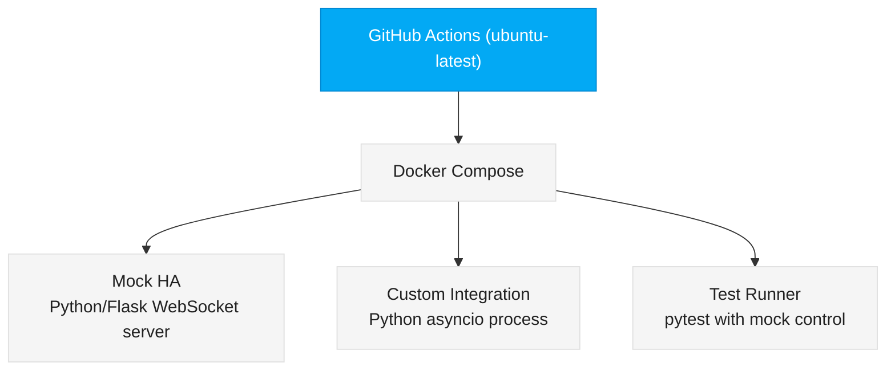
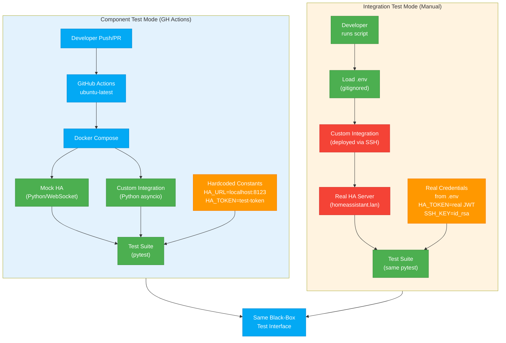

# GitHub Actions & Component Testing Architecture
## FiremanDecko (Architect) + ArsonWells (Lead Dev)

**Date**: 2026-02-22 | **Status**: Architecture Decided | **Owner Decision**: Dek

---

## Executive Summary

The Vulcan Brownout testing strategy uses **two complementary test modes** with identical black-box interfaces but different dependency layers:

1. **Component Test Mode** (GH Actions + Docker): Mocked dependencies, hardcoded test constants, error injection via mock control. Runs on every push/PR for fast feedback.
2. **Integration Test Mode** (Manual / Scheduled): Real HA server, `.env` credentials, production-like conditions. Runs manually or on schedule against the actual test HA instance.

**Key principle**: No GitHub Secrets needed for either test mode. Component tests use hardcoded constants. Integration tests use `.env` (gitignored, never in CI).

---

## 1. What We Have Today

### Test Infrastructure

We currently have three test layers implemented but **running manually**:

1. **Unit/Integration Tests (Python)**
   - **File**: `quality/scripts/test_api_integration.py`
   - **Coverage**: 25+ test cases across WebSocket API (query_devices, subscribe, set_threshold)
   - **Framework**: pytest + pytest-asyncio + websockets
   - **Run**: `pytest quality/scripts/test_api_integration.py -v`
   - **Requires**: Live HA instance + `.env` with HA_TOKEN, HA_URL

2. **Setup/Teardown Scripts (Bash)**
   - **File**: `quality/scripts/setup-test-env.sh`
   - **Purpose**: Creates/cleans up mock battery entities via HA REST API
   - **Run**: `./quality/scripts/setup-test-env.sh --create --count 150`
   - **Requires**: `.env` with HA_URL, HA_TOKEN, HA_PORT

3. **E2E Tests (Playwright/TypeScript)**
   - **Files**: `quality/e2e/tests/*.spec.ts` (7 test suites)
   - **Coverage**: Panel load, device list, infinite scroll, sorting, dark mode, modals, debug
   - **Framework**: Playwright Test @ 1.48.0
   - **Run**: `npm -C quality/e2e test`
   - **Requires**: Live HA + `.env.test` with HA_URL, HA_TOKEN, HA_USERNAME, HA_PASSWORD

### Secrets Management (Today)

- **Root `.env`**: Contains HA_URL, HA_PORT, HA_TOKEN, SSH_HOST, SSH_USER, SSH_KEY_PATH, HA_CONFIG_PATH
- **E2E `.env.test`**: HA connection + login credentials
- **Current practice**: `.env*` gitignored; manually copied to test environment

### Current Manual Flow

```
Developer commits code
    ↓
Developer (Loki, QA) manually:
    1. Loads .env with real HA credentials
    2. Runs setup-test-env.sh to create test entities
    3. Deploys custom_components/ via SSH
    4. Runs pytest suite against real HA
    5. Runs Playwright suite against real HA
    6. Verifies no console errors
```

**Problem**: No automated gating on PRs, no fast feedback, no error injection testing, manual setup friction.

---

## 2. Decided Architecture: Two Test Modes

Dek has decided: **Component tests are fast and automated (GH Actions). Integration tests are real but manual. Both use the same black-box test interface.**

### Component Test Mode (Automated, GH Actions)

**Runs**: Every push/PR via GitHub Actions on ubuntu-latest

**Environment**:
- Docker Compose spins up a lightweight mock HA stub (Python + WebSocket server)
- Custom integration runs in the same container, talking to the mock
- Test suite controls mock behavior via configuration

**Secrets & Configuration**:
- **NO GitHub Secrets used**
- **Hardcoded test constants only**:
  ```python
  HA_URL = "http://localhost:8123"  # Mock HA in Docker
  HA_TOKEN = "test-token-constant"
  HA_PORT = 8123
  MOCK_HA_TIMEOUT = 2.0  # Configurable for testing timeout scenarios
  ```

**Test Coverage**:
- All WebSocket commands (query_devices, subscribe, set_threshold)
- Pagination logic, sorting, filtering
- Error scenarios via mock injection:
  - Authentication failures (return 401)
  - Malformed JSON responses
  - Timeout after N milliseconds
  - Connection drops mid-request
  - Race conditions (request while reconnecting)

**Black-Box Interface**:
- The integration code doesn't know it's talking to a mock
- Same WebSocket API contract as real HA
- Same REST endpoints as real HA
- From the integration's perspective, it's just communicating with "HA"

**Advantages**:
- Fast feedback: 30-60s per run (including Docker startup)
- No external dependencies
- Can inject errors that are hard to trigger against real HA
- Runs on every PR
- Zero cost (GitHub-hosted runners)
- Repeatable — exact same mock behavior every time

**Infrastructure**:



### Integration Test Mode (Manual / Scheduled)

**Runs**: Manually triggered, or on a scheduled basis (e.g., nightly)

**Environment**:
- Real, dedicated test HA instance (currently at homeassistant.lan)
- Real SSH access to HA server filesystem
- Real HA REST API and WebSocket endpoints

**Secrets & Configuration**:
- **Uses `.env` file (gitignored, never committed)**
  ```bash
  HA_URL=http://homeassistant.lan
  HA_PORT=8123
  HA_TOKEN=eyJhbGc...  # Real JWT token
  SSH_HOST=homeassistant.lan
  SSH_PORT=22
  SSH_USER=root
  SSH_PRIVATE_KEY_PATH=/home/user/.ssh/id_rsa
  HA_CONFIG_PATH=/root/homeassistant
  ```
- **NO GitHub Secrets** — `.env` lives on developer/QA machine or CI environment that Dek controls

**Test Coverage**:
- Same test cases as component mode (same black-box interface)
- Real HA behavior: actual entity discovery, state updates, WebSocket reconnects
- Real performance: measure latency, throughput
- Real persistence: verify config persists across HA restarts

**Black-Box Interface** (identical to component mode):
- Same WebSocket commands
- Same REST endpoints
- Same expected responses
- Test code is agnostic to whether it's talking to mock or real HA

**Advantages**:
- Validates against actual HA behavior
- Catches real API changes
- Measures real performance
- Tests actual deployment scripts
- Runs only when needed (manual + nightly, not on every PR)

**Infrastructure**:

```mermaid
graph TD
    classDef primary fill:#03A9F4,stroke:#0288D1,color:#FFF
    classDef neutral fill:#F5F5F5,stroke:#E0E0E0,color:#212121

    devMachine["Developer/QA Machine<br/>(or Dek's CI runner)"]
    envFile["`.env` file<br/>(never in GitHub)"]
    ha["Real HA Instance<br/>(homeassistant.lan)"]
    ssh["Custom integration<br/>deployed via SSH"]
    entities["Real battery entities"]
    api["Real WebSocket & REST API"]

    devMachine --> envFile
    envFile --> ha
    ha --> ssh
    ha --> entities
    ha --> api

    class ha primary
    class devMachine neutral
    class envFile neutral
    class ssh neutral
    class entities neutral
    class api neutral
```

---

## 3. Test Interface: Black-Box, Mode-Agnostic

Both modes use the **exact same test code** and **same test interface**. The difference is under the hood.

### Example: Same Test Case, Two Modes

**Component Mode** (GH Actions):
```python
# test_api_integration.py (runs with mock HA in Docker)
def test_query_devices_timeout():
    """Mock will timeout after 500ms of inactivity."""
    mock_ha.set_behavior("timeout_after_500ms")
    result = integration.query_devices()
    assert result.error == "timeout"
```

**Integration Mode** (Manual):
```python
# Same test file, same function
# But now talking to real HA
def test_query_devices_timeout():
    """Real HA has a timeout... or we skip this test (can't easily trigger)."""
    # This might not run in integration mode, or we trigger it differently
    # But the interface is identical
```

**The point**: Test structure, assertions, and WebSocket commands are identical. Only the backend (mock vs. real) differs.

### Concrete Interfaces

**WebSocket API** (both modes):
```python
await websocket.send(json.dumps({
    "type": "vulcan_brownout/query_devices",
    "offset": 0,
    "limit": 50,
    "sort_by": "battery_level",
    "sort_order": "asc",
}))
response = await websocket.recv()
assert response["type"] == "result"
assert len(response["devices"]) <= 50
```

**Mock Control** (component mode only):
```python
# Test runner controls mock behavior
mock_ha.set_next_response({
    "type": "malformed",  # Mock will return invalid JSON
    "delay_ms": 0
})
# Integration will see this and error appropriately
```

---

## 4. What ArsonWells Needs to Build

### Component Test Infrastructure

#### 4.1 Mock HA Server

**Location**: `.github/docker/mock_ha/`

**What it does**:
- Lightweight Python WebSocket server (not a real Home Assistant instance)
- Stubs the vulcan_brownout WebSocket API endpoints
- Stubs enough of the HA REST API for setup/teardown
- Can be controlled via test configuration to inject errors

**Key endpoints to stub**:
```
WebSocket:
  /api/websocket
    - subscribe_events (for entity state changes)
    - vulcan_brownout/query_devices
    - vulcan_brownout/subscribe (real-time updates)
    - vulcan_brownout/set_threshold

REST:
  POST /api/states/{entity_id} (for creating test entities)
  GET /api/states (for querying entities)
  POST /api/services/homeassistant/restart (for graceful restart)
```

**Mock Control Interface** (Python fixture or config file):
```python
@pytest.fixture
def mock_ha_behavior():
    """Control how mock HA responds to requests."""
    return {
        "query_devices_response": {
            "delay_ms": 100,
            "malformed_json": False,
            "status_code": 200,
        },
        "auth_token": "test-token-constant",
        "auth_failures": 0,  # Return 401 after N attempts
        "connection_drops": [],  # Drop connection at offsets: [50, 150, 300]
    }
```

**Testing library**: Flask + Flask-Sockets, or aiohttp + asyncio (match integration's async style)

#### 4.2 Docker Compose for Component Tests

**Location**: `.github/docker-compose.yml`

**Services**:
```yaml
version: '3.8'
services:
  mock_ha:
    build: .github/docker/mock_ha
    ports:
      - "8123:8123"  # WebSocket + REST API
    environment:
      MOCK_TOKEN: "test-token-constant"
      MOCK_BEHAVIOR: /work/test_mock_config.json

  integration:
    build: .
    depends_on:
      - mock_ha
    environment:
      HA_URL: http://mock_ha:8123
      HA_TOKEN: test-token-constant
      HA_PORT: 8123
    volumes:
      - ./custom_components:/root/homeassistant/custom_components
    command: >
      bash -c "
        pip install -e . &&
        pytest quality/scripts/test_api_integration.py -v
      "
```

#### 4.3 Test Suite Refactoring

**File**: `quality/scripts/test_api_integration.py` (refactor, don't duplicate)

**Changes**:
- Add `mode` parameter (component vs. integration)
- If `mode == "component"`: use hardcoded HA_URL/HA_TOKEN
- If `mode == "integration"`: load from `.env`
- Mock control: When component mode, pass mock_behavior config to integration before tests run
- Same test cases in both modes

**Example**:
```python
import os

@pytest.fixture
def ha_config():
    """Load HA config based on test mode."""
    mode = os.getenv("TEST_MODE", "component")
    if mode == "component":
        return {
            "url": "http://localhost:8123",
            "token": "test-token-constant",
            "port": 8123,
        }
    else:  # integration
        from dotenv import load_dotenv
        load_dotenv(".env")
        return {
            "url": os.getenv("HA_URL"),
            "token": os.getenv("HA_TOKEN"),
            "port": int(os.getenv("HA_PORT", 8123)),
        }

def test_query_devices(ha_config):
    """Works in both modes."""
    result = integration.query_devices(ha_config)
    assert len(result.devices) > 0
```

#### 4.4 GitHub Actions Workflow

**File**: `.github/workflows/component-tests.yml`

```yaml
name: Component Tests

on:
  push:
    branches: ["**"]
  pull_request:

jobs:
  component_tests:
    runs-on: ubuntu-latest
    steps:
      - uses: actions/checkout@v4
      - uses: docker/setup-buildx-action@v2
      - name: Start mock HA + run tests
        run: |
          docker-compose -f .github/docker-compose.yml up \
            --build \
            --abort-on-container-exit
        env:
          TEST_MODE: component
      - name: Upload test results
        if: always()
        uses: actions/upload-artifact@v3
        with:
          name: test-results
          path: quality/scripts/test-results.json
```

#### 4.5 `.env.example` (Template)

**Location**: `.env.example`

**Purpose**: Document required variables; never committed with real secrets.

```bash
# Component Test Mode (GH Actions / Docker)
# These are hardcoded in the workflow and test code
# HA_URL=http://localhost:8123
# HA_TOKEN=test-token-constant
# HA_PORT=8123

# Integration Test Mode (Manual / Scheduled)
# Copy this file to .env and fill in real values
# .env is gitignored — NEVER commit it

HA_URL=http://homeassistant.lan
HA_PORT=8123
HA_TOKEN=eyJhbGc... # Real JWT from HA's UI
HA_USERNAME=sprocket  # For E2E Playwright login
HA_PASSWORD=password

# SSH/Deployment Credentials (for integration/E2E setup)
SSH_HOST=homeassistant.lan
SSH_PORT=22
SSH_USER=root
SSH_PRIVATE_KEY_PATH=~/.ssh/id_rsa
HA_CONFIG_PATH=/root/homeassistant
```

### Integration Test Infrastructure (Existing + Minor Changes)

#### 4.6 Integration Test Launcher Script

**File**: `quality/scripts/run-integration-tests.sh` (new or enhanced)

**Purpose**: Run the same test suite against real HA, using `.env` credentials.

```bash
#!/bin/bash
set -e

# Load .env if it exists
if [ -f .env ]; then
    source .env
else
    echo "ERROR: .env file not found. Copy .env.example and fill in real HA credentials."
    exit 1
fi

# Verify HA is reachable
echo "Verifying HA is reachable at ${HA_URL}:${HA_PORT}..."
curl -s -H "Authorization: Bearer ${HA_TOKEN}" \
    ${HA_URL}:${HA_PORT}/api/ > /dev/null || {
    echo "ERROR: HA not reachable or token invalid"
    exit 1
}

# Set up test entities
echo "Creating test entities..."
./quality/scripts/setup-test-env.sh --create --count 150

# Run integration tests (same file as component tests)
echo "Running integration tests against real HA..."
TEST_MODE=integration pytest quality/scripts/test_api_integration.py -v

# Run E2E tests
echo "Running E2E tests..."
npm -C quality/e2e test

echo "All integration tests passed!"
```

#### 4.7 `.gitignore` Updates

Ensure these patterns are present:
```
.env
*.env
.env.*
!.env.example

playwright-report/
test-results.json
.pytest_cache/
```

---

## 5. Workflow Triggers & Timing

### Workflow 1: Component Tests (Every Push/PR)

**Trigger**: Push to any branch, PR open/updated

**Runs**: GitHub-hosted ubuntu-latest

**Duration**: ~2-3 minutes (Docker startup + tests)

**What it does**:
1. Checkout code
2. Build mock HA Docker image
3. Start Docker Compose (mock HA + integration)
4. Run test_api_integration.py with TEST_MODE=component
5. Collect results, tear down containers

**Outputs**:
- Test results artifact
- Pass/fail check on PR

**Does NOT do**:
- Access GitHub Secrets
- Touch .env files
- Access real HA
- Run E2E tests

### Workflow 2: Integration Tests (Manual Trigger)

**Trigger**: Manual `gh workflow run` or on schedule (e.g., nightly)

**Runs**: Developer machine or Dek's controlled environment

**Duration**: ~5-10 minutes (entity setup + tests)

**What it does**:
1. Load `.env` with real HA credentials
2. Verify HA is reachable
3. Run `./quality/scripts/setup-test-env.sh --create --count 150`
4. Run test_api_integration.py with TEST_MODE=integration
5. Run Playwright E2E tests
6. Teardown (delete test entities)

**Outputs**:
- Test results (pass/fail)
- Performance metrics
- E2E screenshots if failures

**Does NOT do**:
- Commit results to GitHub
- Use GitHub Secrets (uses .env instead)
- Require self-hosted runner in Actions

---

## 6. Architecture Diagram



---

## 7. Risk Assessment

| Risk | Mitigation |
|------|-----------|
| Mock HA behavior diverges from real HA | Keep mock implementation minimal; any new HA features go in mock immediately; integration tests catch divergence |
| Integration tests blocked by real HA downtime | Manual trigger allows us to skip; E2E can run in component mode if needed |
| Developer forgets to run integration tests before merge | Use merge branch protection with status checks; integrate tests in pre-commit hooks locally |
| .env credentials accidentally committed | .gitignore pattern + pre-commit hook to verify .env is gitignored |
| Test data pollution (entities left behind) | setup-test-env.sh idempotent; always teardown after integration run |
| Component test gives false pass | Integration tests run regularly (nightly) to catch; error injection catches edge cases component tests might miss |

---

## 8. Success Metrics

Once implemented, measure:

- **PR feedback time**: <3 minutes (component tests on every push)
- **Coverage (happy path)**: 100% (component + integration tests)
- **Coverage (error scenarios)**: 100% via mock injection (component tests)
- **False negatives**: 0 (component tests pass, integration tests fail = mock divergence, fix it)
- **False positives**: <5% (rare race conditions in real HA)
- **Infrastructure cost**: $0 (component tests free on GitHub; integration manual/local)
- **Setup friction**: Zero for developers (component tests automatic; integration tests documented in .env.example)

---

## 9. Next Steps for ArsonWells

### Phase 1: Mock HA + Docker Compose
1. Create `.github/docker/mock_ha/` with lightweight WebSocket server
2. Create `.github/docker-compose.yml` with mock HA + integration services
3. Test locally: `docker-compose up` and verify integration connects to mock

### Phase 2: Test Refactoring
4. Refactor `quality/scripts/test_api_integration.py` to support TEST_MODE env var
5. Add mock control interface (config dict that mock reads)
6. Verify same test cases work in both component and integration modes

### Phase 3: GitHub Actions Workflow
7. Create `.github/workflows/component-tests.yml` (triggers on every push/PR)
8. Test workflow locally with `act` or in a test repo

### Phase 4: Integration Test Script
9. Create/enhance `quality/scripts/run-integration-tests.sh`
10. Create `.env.example` with documented variables
11. Document manual integration test flow in README

### Phase 5: Documentation
12. Update README with "Testing" section
13. Add ARCHITECTURE.md explaining two-mode approach

---

## Summary

**Architecture decided by Dek:**

- **Component tests (automated, every PR)**: Mocked HA, hardcoded constants, error injection, ~2 min
- **Integration tests (manual, on schedule)**: Real HA, .env credentials, production-like, ~5 min
- **Same black-box interface**: Test code doesn't care which mode
- **No GitHub Secrets**: Component tests use constants; integration tests use .env (gitignored)
- **Two test modes, one test suite**: Efficiency + confidence

This architecture balances **fast feedback (component tests)** with **production confidence (integration tests)**, and **eliminates the need for GitHub Secrets** by separating CI automation (mocked) from real testing (manual, local credentials).

—**FiremanDecko (Architect)**
