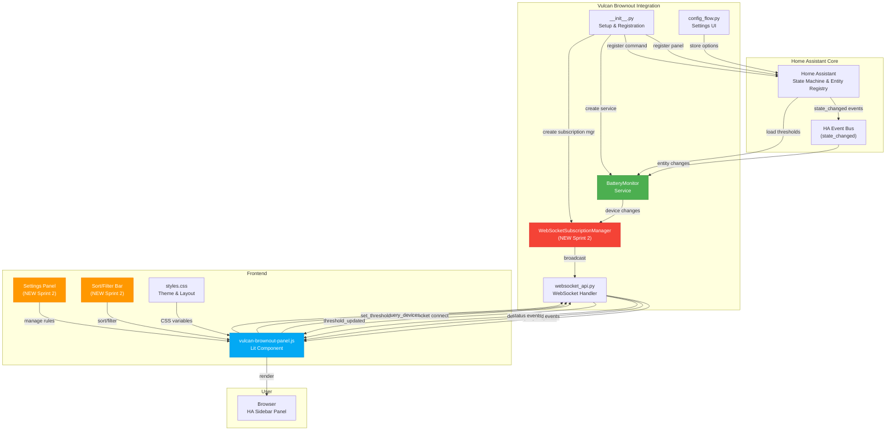

# Vulcan Brownout: Sprint 2 System Design

**Author**: FiremanDecko (Architect)
**Date**: February 2026
**Status**: Proposed
**Previous**: [Sprint 1 System Design](../sprint-1/architecture/system-design.md)

---

## Overview

Sprint 2 builds on Sprint 1's foundation to transform Vulcan Brownout from a passive status display into an active monitoring tool. Three key features are added:

1. **Real-Time WebSocket Subscriptions** — Battery updates flow in real-time (< 2s latency)
2. **Configurable Thresholds** — Users set global and per-device thresholds (5-100%)
3. **Sorting & Filtering** — Users organize the device list by priority, battery level, or name

The system evolves from:
- **Query-Response Pattern** (Sprint 1) → **Push + Query Hybrid** (Sprint 2)
- **Single Threshold** (Sprint 1) → **Global + Per-Device Rules** (Sprint 2)
- **Implicit Sorting** (Sprint 1) → **Explicit Sort/Filter Controls** (Sprint 2)

---

## Component Architecture

### Updated Component Diagram



### Component Changes from Sprint 1

**New Components:**
- `WebSocketSubscriptionManager` — Manages client subscriptions, broadcasts updates
- `Settings Panel` (Frontend) — UI for threshold configuration
- `Sort/Filter Bar` (Frontend) — UI for sorting and filtering controls

**Modified Components:**
- `BatteryMonitor` — Added threshold lookup, status calculation
- `config_flow.py` — Options flow for threshold settings
- `websocket_api.py` — New commands: `subscribe`, `set_threshold`
- `vulcan-brownout-panel.js` — Settings UI, sort/filter logic, real-time update handling

**Unchanged Components:**
- `__init__.py` — Same setup pattern
- Entity discovery — Same auto-discovery logic
- Core WebSocket connection — Same session-based auth

---

## Data Flow: Real-Time Updates (NEW)

### Scenario: Battery Level Changes During Active Monitoring

```
T=0s:
  User has sidebar open
  Battery level in HA: Solar Backup = 95%
  UI shows: 🟢 Solar Backup    95% [████████████████░░░░░░]
  WebSocket subscription active

T=5s:
  Device battery drops: 95% → 92%
  HA fires: state_changed event
            { entity_id: "sensor.solar_backup_battery", new_state: "92" }

T=5-50ms:
  BatteryMonitor.on_state_changed() handler fires
  Checks: Is this entity in any active subscription? YES
  Calls: SubMgr.broadcast_device_changed(entity_id, new_data)

T=50-100ms:
  SubMgr iterates all connected clients
  For each client:
    - Checks if this entity is in their visible list
    - Sends WebSocket event: vulcan-brownout/device_changed
      { entity_id: "sensor.solar_backup_battery", battery_level: 92, ... }

T=100-150ms:
  Frontend receives device_changed event
  Updates local state: device.battery_level = 92
  Triggers Lit re-render

T=150-300ms:
  Lit re-renders component
  Progress bar CSS transitions from 95% to 92% (300ms animation)
  Timestamp updates: "Updated 2 seconds ago"

T=300ms+:
  User sees: 🟢 Solar Backup    92% [███████████████░░░░░░░░]
  Smooth animation, no jank
```

---

## Data Flow: Threshold Configuration (NEW)

### Scenario: User Changes Global Threshold from 15% to 25%

```
T=0s:
  User clicks ⚙️ (settings icon)
  Settings panel slides in from right

T=100ms:
  Settings panel visible
  Shows:
    - Global Threshold: [████░░░░░░] 15%
    - Live preview: "8 batteries below this threshold"
    - Device-specific rules list (empty)

T=200ms:
  User moves threshold slider to 25%

T=200-300ms:
  Live preview updates in real-time:
    "12 batteries below this threshold"
    (3 more devices crossed the new threshold)

T=400ms:
  User clicks "SAVE"

T=400-500ms:
  Frontend sends WebSocket command:
    vulcan-brownout/set_threshold
    { global_threshold: 25, device_rules: {} }

T=500-600ms:
  Backend receives command
  Validates: 25 is between 5-100 ✓
  Updates: hass.config_entries[entry_id].options['global_threshold'] = 25
  Calls: battery_monitor.on_options_updated(new_options)
  BatteryMonitor updates threshold cache
  Broadcasts: vulcan-brownout/threshold_updated to all clients

T=600-700ms:
  Frontend receives threshold_updated event
  Re-calculates status for each device:
    - Devices with level ≤ 25% now status=CRITICAL
    - Devices with level 25-35% now status=WARNING
    - Devices with level > 35% now status=HEALTHY
  Triggers full re-render

T=700-800ms:
  Lit re-renders:
    - 3 previously-HEALTHY devices now show CRITICAL color (red)
    - Progress bars change color
    - Device count in status bar updates
  Settings panel closes
  Focus returns to settings icon

T=800ms+:
  User sees updated list with new colors
  Settings saved (persists in HA config entry)
  If page reloads, thresholds still apply
```

---

## Data Flow: Sort/Filter (NEW)

### Scenario: User Applies Multiple Filters

```
T=0s:
  Device list visible with 13 devices:
    - 2 CRITICAL (red)
    - 3 WARNING (orange)
    - 8 HEALTHY (green)

T=100ms:
  User clicks "Sort" dropdown
  Sees 4 options:
    ● Priority (Critical > Warning > Healthy)
    ○ Alphabetical (A-Z)
    ○ Battery Level (Low → High)
    ○ Battery Level (High → Low)

T=200ms:
  User selects "Battery Level (Low → High)"

T=200-300ms:
  Frontend:
    - Updates this.sort_method = 'level_asc'
    - Calls _apply_sort(devices, 'level_asc')
    - Re-renders list
    - Saves to localStorage

T=300ms:
  User sees list reordered by battery level:
    1. Front Door Lock - 5%
    2. Kitchen Sensor - 8%
    3. Bedroom Motion - 12%
    ...
    13. Solar Backup - 95%

T=400ms:
  User clicks "Filter" dropdown
  Sees checkboxes:
    ✓ Critical (2)
    ✓ Warning (3)
    ✓ Healthy (8)
    ☐ Unavailable (0)

T=500ms:
  User unchecks "Healthy"
  Live: List filters in real-time
        Now showing only 5 devices (2 Critical + 3 Warning)
        Label updates: "Filter (5 selected)"

T=600ms:
  User clicks "Apply"
  - Saves filter state to localStorage
  - Modal closes
  - List remains filtered

T=700ms+:
  User continues interacting with filtered view
  If they refresh page:
    - Sort preference: loaded from localStorage → Priority
    - Filter state: loaded from localStorage → Healthy unchecked
  Sort/filter persists per session
```

---

## Connection State Machine

### WebSocket Connection Lifecycle (Enhanced for Sprint 2)

```
┌─────────────────────────────────────────────────────────────┐
│                  WebSocket States (Sprint 2)                │
└─────────────────────────────────────────────────────────────┘

[DISCONNECTED]
    ↓ (User opens sidebar)

[CONNECTING]
    ├─ WebSocket handshake
    ├─ HA authentication
    └─ (50-200ms)

[CONNECTED] ← Status badge: 🟢 GREEN
    ├─ Events can be received
    ├─ Real-time updates flowing
    ├─ Timestamp actively updating
    └─ (Normal operation)

[CONNECTED] ──→ [RECONNECTING] ← Status badge: 🔵 BLUE (spinning)
    │ (Network drops)
    │ (No data > 5s)
    ├─ Exponential backoff: wait 1s, 2s, 4s, 8s, 16s, 30s
    ├─ Retry WebSocket connect
    └─ (Device shows grayed out)

[RECONNECTING] ──→ [CONNECTED] ← Automatic recovery
    ├─ Auth succeeds
    ├─ Re-subscribe to updates
    ├─ Toast: "✓ Connection updated"
    └─ Fresh data loaded

[RECONNECTING] ──→ [OFFLINE] ← Status badge: 🔴 RED
    │ (Max retries exceeded ~1 min)
    ├─ User sees offline message
    ├─ Can manually click "Retry"
    └─ (Device shows grayed out)

[OFFLINE] ──→ [CONNECTING] ← (User clicks "Retry" or page reloads)
    └─ Attempt to re-establish connection

[OFFLINE] ──→ [DISCONNECTED] ← (User closes sidebar)
    └─ Release subscription resources
```

---

## Threshold Application Logic

### How Thresholds Determine Device Status

```python
def get_status_for_device(device, threshold_config):
    """
    Determine device status (critical, warning, healthy, unavailable)
    based on battery level and threshold configuration.
    """

    # Step 1: Check availability
    if not device.available:
        return 'unavailable'

    # Step 2: Get applicable threshold
    threshold = get_threshold_for_device(device.entity_id, threshold_config)
    # Returns: device-specific rule, or global threshold

    # Step 3: Classify based on threshold
    if device.battery_level <= threshold:
        return 'critical'     # Red — immediate attention
    elif device.battery_level <= (threshold + 10):
        return 'warning'      # Orange — soon needs attention
    else:
        return 'healthy'      # Green — OK
```

### Threshold Resolution Order

```
For entity_id="sensor.solar_backup_battery":

1. Check device_rules: { "sensor.solar_backup_battery": 50 }
   → Found! Use 50%

2. If not in device_rules, use global_threshold: 15
   → Not found, use 15%

3. If global_threshold not set, use hardcoded default: 15
   → Never reached (always set)

Result: Solar Backup is CRITICAL if level ≤ 50%
```

---

## Sort Algorithm Specifications

### Priority Sort (DEFAULT)

```javascript
// Sort order: critical < warning < healthy < unavailable
// Within each group: battery level ascending

devices.sort((a, b) => {
  const statusOrder = { critical: 0, warning: 1, healthy: 2, unavailable: 3 };
  const aStatus = getStatus(a);
  const bStatus = getStatus(b);

  if (aStatus !== bStatus) {
    return statusOrder[aStatus] - statusOrder[bStatus];
  }

  // Same status: sort by battery level ascending
  return a.battery_level - b.battery_level;
});

Example result:
  1. Kitchen Sensor - 5% (CRITICAL)
  2. Front Door Lock - 8% (CRITICAL)
  3. Bedroom Motion - 18% (WARNING)
  4. Phone Battery - unavailable (UNAVAILABLE)
  5. Solar Backup - 95% (HEALTHY)
```

### Alphabetical Sort (A-Z)

```javascript
devices.sort((a, b) => {
  return a.device_name.localeCompare(b.device_name);
});

Example result:
  1. Bathroom Fan Switch - 87%
  2. Bedroom Motion - 18%
  3. Front Door Lock - 8%
  4. Garage Light Switch - 92%
  5. Kitchen Sensor - 5%
  ... (A-Z)
```

### Battery Level Ascending (Low → High)

```javascript
devices.sort((a, b) => a.battery_level - b.battery_level);

Example result:
  1. Kitchen Sensor - 5%
  2. Front Door Lock - 8%
  3. Bedroom Motion - 18%
  4. Phone Battery - 0% (unavailable)
  5. Solar Backup - 95%
```

### Battery Level Descending (High → Low)

```javascript
devices.sort((a, b) => b.battery_level - a.battery_level);

Example result:
  1. Solar Backup - 95%
  2. Garage Light Switch - 92%
  3. Bedroom Motion - 18%
  4. Front Door Lock - 8%
  5. Kitchen Sensor - 5%
```

---

## Filter Logic

### Filter State Structure

```javascript
filter_state = {
  critical: true,     // Show CRITICAL devices (red)
  warning: true,      // Show WARNING devices (orange)
  healthy: true,      // Show HEALTHY devices (green)
  unavailable: false,  // Hide UNAVAILABLE devices (default)
}
```

### Filtering Algorithm

```javascript
function apply_filter(devices, filter_state) {
  return devices.filter(device => {
    const status = get_status(device);
    return filter_state[status] === true;
  });
}

// Example: filter_state = { critical: true, warning: true, healthy: false, unavailable: false }
// Input: 13 devices (2 critical, 3 warning, 7 healthy, 1 unavailable)
// Output: 5 devices (only critical + warning shown)
```

---

## Configuration Storage

### HA ConfigEntry Options Schema

```python
{
    'global_threshold': 15,  # int: 5-100
    'device_rules': {
        'sensor.solar_backup_battery': 50,
        'sensor.front_door_lock_battery': 30,
        # ... up to 10 rules
    },
    'filter_state': 'all',  # Placeholder for Sprint 3
    'sort_method': 'priority',  # Placeholder for Sprint 3
}
```

### localStorage (Client-Side, Session Persistence)

```json
{
  "sort_method": "priority",
  "filter_state": {
    "critical": true,
    "warning": true,
    "healthy": true,
    "unavailable": false
  }
}
```

**Note**: localStorage persists sort/filter per session, but thresholds are server-side (HA config entry).

---

## Performance Targets

| Operation | Target | Reasoning |
|-----------|--------|-----------|
| Real-time update latency | < 500ms | From HA state change to UI update |
| Battery level animation | 300ms | Smooth CSS transition |
| Sort 100 devices | < 50ms | Client-side, in-memory |
| Filter 100 devices | < 50ms | Client-side array filter |
| Threshold save | < 1s | Network + validation |
| Page load | < 3s | Including WebSocket setup |
| Reconnection | < 30s | Max backoff, user retry option |

---

## Error Handling

### Backend Errors

| Scenario | Handling | User Sees |
|----------|----------|-----------|
| Invalid threshold value | Validation error response | Error message in settings panel |
| Duplicate device rule | Reject with message | "Device already in rules" |
| Config entry missing | Fallback to defaults | Uses 15% threshold |
| WebSocket auth fails | Connection marked offline | Connection badge red |
| Subscription full (100 users) | Graceful backpressure | Update delayed slightly |

### Frontend Errors

| Scenario | Handling | User Sees |
|----------|----------|-----------|
| WebSocket disconnects | Exponential backoff reconnect | Connection badge changes state |
| Settings form invalid | Client-side validation | Error highlight on field |
| Sort/filter corrupted | Reload from localStorage | Defaults if cache corrupted |
| Theme colors unavailable | Use hardcoded fallbacks | Colors may not match theme |
| localStorage full | Fail silently, no persistence | Settings lost on reload |

---

## Security & Privacy

**Authentication**: Uses HA's WebSocket session (same as Sprint 1)

**Authorization**: HA's core device registry controls visibility

**Thresholds**: Stored in config entry; not transmitted to external services

**Data**: No telemetry, no external API calls

**Encryption**: HTTPS/WSS (HA handles)

**User Data**: Thresholds are per-home; not shared between users

---

## Scalability

### Supported Scales (Sprint 2)

| Metric | Limit | Notes |
|--------|-------|-------|
| Devices per user | 50 | Client-side sort/filter |
| Concurrent users | 20+ | Per HA instance |
| Device rules | 10 | UI shows 5 at once |
| Real-time events/second | 100+ | Debounced on frontend |
| localStorage size | < 5KB | Sort/filter state only |

### Upgrade Path (Sprint 3+)

- Server-side sort/filter for > 100 devices
- Pagination for device lists
- Advanced filtering (by device_class, type, etc.)
- Threshold presets and templates

---

## Related Documentation

- [ADR-006: WebSocket Subscriptions](./ADR-006-websocket-subscriptions.md)
- [ADR-007: Threshold Configuration](./ADR-007-threshold-configuration.md)
- [ADR-008: Sort/Filter Implementation](./ADR-008-sort-filter-implementation.md)
- [API Contracts](./api-contracts.md)
- [Interactions Spec](./interactions.md)
- [Wireframes](./wireframes.md)

---

**Approved by**: [Architect]
**Implementation**: [Lead Developer]
**Code Review**: [Code Review Lead]
