```mermaid
sequenceDiagram
    participant User as User (HA Settings)
    participant Panel as Panel JS
    participant HA as hass (WebSocket)
    participant CSS as Shadow DOM CSS

    Panel->>Panel: connectedCallback() fires
    Panel->>Panel: _detect_theme() — check hass.themes.darkMode
    alt hass.themes available
        Panel->>Panel: Use hass.themes.darkMode (boolean)
    else fallback
        Panel->>Panel: Check data-theme attribute
        Panel->>Panel: Check prefers-color-scheme
    end
    Panel->>Panel: Set --vb-bg-primary, --vb-color-critical, etc.
    Panel->>HA: Listen to hass_themes_updated event
    Panel->>User: Display in current theme

    User->>HA: Change theme in HA Settings
    HA->>Panel: hass_themes_updated event
    Panel->>Panel: _detect_theme() — re-check hass.themes.darkMode
    Panel->>CSS: Update CSS variables (transition: 300ms)
    CSS->>CSS: Fade backgrounds, text, button colors
    Panel->>User: New theme visible (smooth 300ms transition)
```

```mermaid
stateDiagram-v2
    [*] --> Visible: scrollTop < 100px

    Visible --> Hidden: User scrolls down past 30 items
    Hidden --> Hidden: Button visible, opacity 1

    Hidden --> Clicked: User clicks ↑ button
    Clicked --> Scrolling: Smooth scroll to top (500ms)
    Scrolling --> Visible: scrollTop reaches 0

    Visible --> Visible: scrollTop stays < 100px
```

```mermaid
sequenceDiagram
    participant User
    participant Modal as Settings Modal
    participant Panel as Panel JS
    participant API as HA WebSocket API

    User->>Modal: Click ⚙️ button
    Modal->>Panel: Show modal (slide 300ms)
    Panel->>Modal: Display current global_threshold

    User->>Modal: Type new threshold value
    Modal->>Panel: Update local state.settings_global_threshold

    User->>Modal: Click [💾 Save]
    Modal->>Panel: Validate 5 ≤ value ≤ 100
    Panel->>API: SET_THRESHOLD_COMMAND with new value
    API-->>Panel: Threshold updated
    Panel->>User: Toast: "Settings saved"
    Modal->>Panel: Close modal (slide 300ms)
```

```mermaid
graph TD
    classDef empty fill:#F5F5F5,stroke:#E0E0E0,color:#212121
    classDef requirement fill:none,stroke:none,color:#212121

    EmptyState["EMPTY STATE<br/>─────────────────"]

    Icon["🔋 Icon<br/>(48px)"]

    Message["No battery entities found.<br/>Check that devices have a battery_level<br/>attribute and are not binary sensors."]

    ReqList["REQUIREMENTS:<br/>✓ Device has battery_level attribute<br/>✓ Device is not a binary sensor<br/>✓ Device is available"]

    CTAs["CALL-TO-ACTION BUTTONS"]
    Docs["[📖 Docs]<br/>(new tab)"]
    Refresh["[🔄 Refresh]<br/>(_load_devices)"]
    Settings["[⚙️ Settings]<br/>(_open_settings)"]

    EmptyState --> Icon
    EmptyState --> Message
    EmptyState --> ReqList
    EmptyState --> CTAs
    CTAs --> Docs
    CTAs --> Refresh
    CTAs --> Settings

    class EmptyState empty
    class Message requirement
```

> **Note**: The interaction specs below document features from Sprints 4 and 5 that were **not implemented** in v6.0.0. Interactions 1, 9, 11-13 are archived for historical context.
>
> **v6.0.0 Current Interactions**: Interactions 2-8 and 10 describe the actual v6.0.0 UI behavior.

---

# Interaction Specs — v6.0.0 (Current)

**By**: Luna (UX) | **Status**: Current | **Date**: 2026-02-23

All interactions for Vulcan Brownout panel v6.0.0. These specs define how users interact with the minimal, simplified UI.

---

## ⚠️ IMPORTANT: v6.0.0 vs. Archived Interactions

**v6.0.0 Current Interactions** (5 interactions implemented):
- **Interaction 2**: Infinite Scroll with Skeleton Loaders
- **Interaction 3**: Back-to-Top Button
- **Interaction 6**: Empty State (No Battery Devices Found)
- **Interaction 7**: Error State (Connection Lost / API Failure)
- **Interaction 8**: Scroll Position Persistence
- **Interaction 10**: Mobile Responsiveness

**Archived Interactions** (NOT implemented in v6.0.0):
- **Interaction 1**: Theme Detection (Sprint 4 removed)
- **Interaction 4**: Notification Preferences Modal (Sprint 4 removed)
- **Interaction 5**: Settings Panel / Threshold Configuration (Sprint 4 removed)
- **Interaction 9**: Sort & Filter Controls (Sprint 5 removed)
- **Interactions 11-13**: Filter Selection, Chips, Dynamic Population (Sprint 5 removed)

Archived interactions are preserved below for historical context and to understand past design decisions, but **do NOT** represent the current product. See CLAUDE.md for v6.0.0 architecture.

---

# Current v6.0.0 Interactions

Below are the six interactions that are **implemented in v6.0.0**. Archived interactions are at the end of this document.

---

### Trigger
1. **On load**: Panel `connectedCallback()` fires
2. **On theme change**: User changes theme in HA Settings → `hass_themes_updated` event fires

### Behavior

**On Load:**
1. Component calls `_detect_theme()`
2. Check priority: `hass.themes.darkMode` (boolean) → `data-theme` DOM attribute → `prefers-color-scheme` media query
3. Set `this.current_theme` to "dark" or "light"
4. Apply CSS custom properties via `:host` selector in Shadow DOM
5. Setup event listener for `hass_themes_updated`

**On Theme Change (from HA Settings):**
1. HA fires `hass_themes_updated` event on `hass.connection`
2. Panel listener receives event
3. Call `_detect_theme()` again
4. Update `this.current_theme` (triggers Lit re-render)
5. CSS variables transition smoothly (300ms) to new theme colors
6. Real-time updates continue during transition (no stall)

### Flow Diagram



### States
- **Initial**: Awaiting theme detection
- **Light Mode**: Light backgrounds, dark text, light-adjusted status colors
- **Dark Mode**: Dark backgrounds, light text, dark-adjusted status colors
- **Transitioning**: Colors animating smoothly (300ms) between modes

### Animations/Transitions
- **CSS transition**: `transition: background-color 300ms ease, color 300ms ease, box-shadow 300ms ease`
- **No layout shift**: Colors only, no position/size changes
- **No flicker**: New CSS variables applied atomically before render

### Edge Cases
1. **HA connection unavailable**: Fallback to DOM `data-theme` + `prefers-color-scheme`
2. **hass.themes undefined**: Use fallback chain (DOM → prefers-color-scheme)
3. **Multiple events in rapid succession**: Debounce `_detect_theme()` calls (max 1 per 100ms)
4. **Theme change during WebSocket fetch**: Real-time updates continue unaffected (different async context)
5. **Mobile orientation change**: Theme detection rechecked on resize, no impact on theme switch
6. **Panel closed/re-opened**: Event listener cleaned up on `disconnectedCallback()`, re-added on `connectedCallback()`

### Accessibility
- Color contrast verified WCAG AA in both themes
- No reliance on color alone — status indicated by text label ("CRITICAL", "WARNING", "HEALTHY")
- Screen reader announces theme via ARIA live region (optional enhancement)

---

## Interaction 2: Infinite Scroll with Skeleton Loaders

### Trigger
User scrolls to within 100px of bottom of device list.

### Behavior
1. **Setup**: `IntersectionObserver` watches a sentinel element 100px from bottom
2. **Detect scroll**: When sentinel enters viewport, fire `_load_next_page()`
3. **Fetch**: Call WebSocket with `cursor: this.current_cursor`
4. **Show loaders**: Set `show_skeleton_loaders = true` → render 5 shimmer loaders
5. **Append**: API returns next batch of devices → append to `battery_devices` array
6. **Fade in**: New items render with 0.2s fade-in animation
7. **Fade out**: Skeleton loaders fade out, then remove
8. **End**: If no more devices, hide loaders + show "All devices loaded" message

### Flow Diagram


### States
- **Ready**: Scroll observer active, listening for bottom scroll
- **Fetching**: API request in flight, `is_fetching = true`
- **Showing Loaders**: Skeleton loaders visible, shimmer animation running
- **Error**: API failed, retry button visible

### Animations/Transitions
- **Skeleton shimmer**: 2s infinite linear gradient animation (left-to-right)
- **Fade in new items**: 200ms ease-in opacity (0 → 1)
- **Fade out skeletons**: 300ms ease-out opacity (1 → 0)
- **Smooth append**: No layout shift, items append below existing list

### Edge Cases
1. **Rapid scrolling**: Debounce scroll check (max 1 fetch per 500ms)
2. **Multiple fetch attempts**: Guard with `is_fetching` flag to prevent duplicate requests
3. **Empty result**: `has_more = false` → stop showing loaders + "All devices loaded"
4. **Network error during pagination**: Show error message + [RETRY] button
5. **Scroll position lost**: SessionStorage saves scroll position, restored on next load
6. **Very large batch**: No limit on append size, but initial load capped at 50 items

### Accessibility
- Error message has `role="alert"` for screen reader announcement
- Loaders have `aria-label="Loading more devices"` for context
- Tab order preserved during append (dynamically added items aren't tabbed until stable)

---

## Interaction 3: Back-to-Top Button

### Trigger
1. User scrolls past 30 device cards (approx. 1000px scroll)
2. Button fades in and becomes clickable

### Behavior
1. **Detect scroll**: Track `scrollTop` of `.battery-list` container
2. **Show threshold**: Calculate scrolled items ≈ `scrollTop / 68px (card height)`
3. **Show button**: If `scrolled_items > 30`, set `show_back_to_top = true`
4. **Fade in**: CSS class applied, opacity transitions 0 → 1 (300ms)
5. **Click**: User clicks ↑ button
6. **Scroll**: `scrollTo({ top: 0, behavior: 'smooth' })` over 500ms
7. **Hide button**: Once `scrollTop < 100px`, fade out button (300ms)

### Flow Diagram



### States
- **Hidden**: Opacity 0, `pointer-events: none`, off-screen effectively
- **Visible**: Opacity 1, `pointer-events: auto`, clickable
- **Scrolling**: During smooth scroll, button remains visible

### Animations/Transitions
- **Fade in**: 300ms ease (opacity 0 → 1) when threshold crossed
- **Fade out**: 300ms ease (opacity 1 → 0) when scroll returns to top
- **Smooth scroll**: 500ms ease-out cubic-bezier scroll to top (native `behavior: 'smooth'`)
- **No layout shift**: Button is `position: fixed`, doesn't affect layout flow

### Edge Cases
1. **Rapid scroll up/down**: Debounce scroll tracking (100ms timer) to avoid jank
2. **Multiple clicks**: Scroll behavior queued naturally, no double-triggers
3. **Very fast scroll**: Button fade-in/out may not be visible, but interaction still works
4. **Mobile viewport**: Button positioned correctly (16px offset from bottom-right)
5. **Scroll position lost**: SessionStorage saves/restores position on panel reload

### Accessibility
- `aria-label="Back to top"` on button
- `title="Back to top"` for tooltip
- Button has 48×48px touch target (minimum 44px)
- Button is keyboard accessible (Tab focus, Enter/Space activates)

---

## Interaction 4: Notification Preferences Modal

### Trigger
User clicks "[🔔 Notifications]" button in header.

### Behavior
1. **Open**: Modal slides in from right (desktop) or bottom (mobile) over 300ms
2. **Load prefs**: Call WebSocket `GET_NOTIFICATION_PREFERENCES_COMMAND`
3. **Display**: Show current settings in form (toggle, dropdowns, radios, checkboxes)
4. **User edits**: Checkboxes toggled, dropdowns changed, text searched
5. **Per-device list**: If > 5 devices, show first 5 + "[Show more...]" link
6. **Search**: User types device name → filters visible checkboxes
7. **Save**: Click "[💾 Save]" → validates → POST to WebSocket → close modal → toast "Preferences saved"
8. **Cancel**: Click "Cancel" or [×] button
9. **Unsaved check**: If any field changed, confirm "Discard changes?" before closing

### Flow Diagram


### States
- **Closed**: Modal not visible, pointer-events: none
- **Opening**: Modal sliding in, 300ms animation
- **Open**: Modal visible, form interactive, scroll enabled if content > 80vh
- **Saving**: Submit button disabled, loading spinner shown
- **Closing**: Modal sliding out, 300ms animation

### Animations/Transitions
- **Slide in**: `transform: translateX(0) / translateY(0)` from right (desktop) or bottom (mobile), 300ms ease-out
- **Slide out**: `transform: translateX(100%) / translateY(100%)`, 300ms ease-in
- **Overlay fade**: Background overlay `opacity: 0 → 0.5` (300ms)

### Form Sections (Order)
1. **Global Toggle**: "Enable Notifications" checkbox
2. **Frequency Cap**: Dropdown (1h / 6h / 24h)
3. **Severity Filter**: Radio buttons (Critical Only / Critical & Warning)
4. **Per-Device List**: Searchable checkboxes (show first 5, "Show more..." link)
5. **Notification History**: Last 5 notifications with device name + battery % + timestamp

### Edge Cases
1. **No per-device list**: Message "No devices configured" if list empty
2. **Search returns zero**: "No devices match your search" message
3. **Network error on save**: Error toast with [RETRY] button
4. **Modal closed abruptly**: Confirm "Discard changes?" if unsaved edits
5. **Keyboard Escape**: Close modal (same as Cancel with unsaved check)
6. **Tab navigation**: Tab order: toggle → dropdown → radios → search → checkboxes → [Save] [Cancel]

### Accessibility
- Modal has `role="dialog"` and `aria-modal="true"`
- Modal header has `aria-label="Notification Preferences"`
- All form inputs have associated `<label>` elements
- Toggle, radios, checkboxes have correct `role` attributes
- Screen reader announces: form structure, current values, unsaved changes warning
- Keyboard navigation: Tab cycles through controls, Space/Enter activates toggles/buttons, Escape closes

---

## Interaction 5: Settings Panel (Threshold Configuration)

### Trigger
User clicks "[⚙️ Settings]" button in header.

### Behavior
1. **Open**: Modal slides in from right (desktop) or bottom (mobile) over 300ms
2. **Load settings**: Display current `global_threshold` value in number input
3. **Edit**: User changes threshold value (5–100%)
4. **Save**: Click "[💾 Save]" → validate (5 ≤ value ≤ 100) → POST to WebSocket → close modal → toast "Settings saved"
5. **Cancel**: Click "Cancel" or [×] button → close without saving
6. **Unsaved check**: If input value changed, confirm "Discard changes?" before closing

### Flow Diagram



### States
- **Closed**: Modal not visible
- **Open**: Modal visible, input focused (optional auto-focus)
- **Saving**: Submit button disabled, loading spinner
- **Invalid**: Input border red, error message "Enter a value between 5 and 100"

### Animations/Transitions
- **Slide in**: `transform: translateX(0) / translateY(0)` from right (desktop) or bottom (mobile), 300ms ease-out
- **Slide out**: `transform: translateX(100%) / translateY(100%)`, 300ms ease-in

### Input Validation
- **Min**: 5%
- **Max**: 100%
- **Type**: Number input
- **Real-time feedback**: Show error message if value out of range

### Edge Cases
1. **No valid value**: Error message "Threshold must be a number between 5 and 100"
2. **Network error on save**: Error toast with [RETRY] button
3. **Modal closed abruptly**: Confirm "Discard changes?" if unsaved edits
4. **Mobile orientation change**: Modal reflows, input remains focused if possible

### Accessibility
- Modal has `role="dialog"` and `aria-modal="true"`
- Input has associated `<label>` and `aria-label`
- Number input type ensures mobile keyboard (numeric)
- Error messages have `role="alert"` for screen reader announcement
- Keyboard: Tab cycles through input + buttons, Enter saves, Escape closes

---

## Interaction 6: Empty State (No Battery Devices Found)

### Trigger
Page loads, `_load_devices()` completes, `battery_devices.length === 0` and `!isLoading`.

### Behavior
1. **Detect**: If devices array empty after fetch, show empty state instead of list
2. **Display**: Centered icon, helpful message, requirement checklist, CTA buttons
3. **Message**: "No battery entities found. Check that your devices have a `battery_level` attribute and are not binary sensors."
4. **Requirements**: List three conditions (battery_level attribute, not binary sensor, available)
5. **CTAs**:
   - "[📖 Docs]" → opens documentation in new tab
   - "[🔄 Refresh]" → re-calls `_load_devices()`
   - "[⚙️ Settings]" → opens Settings modal
6. **Auto-update**: If device added in HA config, [Refresh] discovers it

### Flow Diagram



### States
- **Hidden**: Devices found, show normal list
- **Visible**: No devices, show empty state centered with padding

### Animations/Transitions
- **Fade in**: Empty state fades in (200ms) when devices array empties
- **Fade out**: Empty state fades out (200ms) when new device detected

### Edge Cases
1. **Loading in progress**: Don't show empty state during initial `isLoading`, show skeleton loaders instead
2. **Error state**: If error fetching, show error message instead of empty state
3. **Devices loaded then removed**: If HA user removes all battery devices, empty state appears
4. **Docs link**: Should point to integration GitHub README or HA community docs

### Accessibility
- Empty state container has `role="main"` and `aria-label="No devices found"`
- Message is announced by screen reader
- All buttons have clear labels and are keyboard accessible
- Icon is decorative (no alt-text needed)

---

## Interaction 7: Error State (Connection Lost / API Failure)

### Trigger
WebSocket connection lost or API request fails during load/pagination.

### Behavior
1. **Detect error**: API call throws exception or times out
2. **Show error**: Display error message at top of panel (above device list)
3. **Message**: "Connection lost. Retrying..." (during reconnect) or "Failed to load devices [RETRY]" (manual retry needed)
4. **Auto-retry**: System automatically attempts reconnect with exponential backoff (1s → 2s → 4s → 8s → 16s → 30s)
5. **Manual retry**: User clicks "[🔄 RETRY]" button to attempt immediate reconnect
6. **Recovery**: Once connection restored, dismiss error + load devices + resume normal operation

### Flow Diagram


### States
- **Connected**: No error, normal list displayed
- **Reconnecting**: Auto-retry in progress, badge shows "Reconnecting..." with pulsing dot
- **Error**: Manual retry needed, error message + [RETRY] button visible

### Animations/Transitions
- **Error message fade-in**: 200ms
- **Pulsing reconnect dot**: 1s pulse animation (opacity 1 → 0.5 → 1)
- **Retry button hover**: Slight opacity change on hover

### Error Messages
- **Reconnecting**: "Connection lost. Reconnecting..." (with pulsing dot)
- **API Failure**: "Failed to load devices. [RETRY]"
- **Pagination Error**: "Failed to load more devices. [RETRY]" (shown in list)
- **Generic Error**: Error string from server (e.g., "Invalid authentication")

### Reconnect Strategy
- **Max attempts**: 10
- **Backoff**: [1s, 2s, 4s, 8s, 16s, 30s] repeated
- **Abort after**: 10 × 30s = ~5 min max total retry duration
- **Manual override**: User [RETRY] button resets attempt counter

### Edge Cases
1. **Multiple errors in succession**: Backoff timer continues, user can still click [RETRY] to override
2. **Connection restored mid-pagination**: Resume pagination from last cursor
3. **Error during theme switch**: Error state persists, theme change doesn't dismiss error
4. **User closes panel during reconnect**: Cleanup timer on `disconnectedCallback()`

### Accessibility
- Error message has `role="alert"` for screen reader announcement
- Error appears at top of panel (not bottom) for visibility
- [RETRY] button is clearly labeled and keyboard accessible
- Screen reader announces retry status updates

---

## Interaction 8: Scroll Position Persistence

### Trigger
User scrolls device list → sessionStorage updates.

### Behavior
1. **On scroll**: Debounce scroll event (100ms), save `scrollTop` to sessionStorage
2. **On reload**: On panel reconnect, restore scroll position from sessionStorage
3. **Infinite scroll**: Cursor-based pagination appends new items without disrupting scroll

### Implementation
```javascript
// Save on scroll
_save_scroll_position(position) {
  sessionStorage.setItem("vulcan_brownout_scroll", position.toString());
}

// Restore on load
_setup_infinite_scroll() {
  const saved_scroll = sessionStorage.getItem("vulcan_brownout_scroll");
  if (saved_scroll) {
    scroll_container.scrollTop = parseInt(saved_scroll);
  }
}
```

### Edge Cases
1. **List length changes**: Scroll position may be invalid if devices removed; scroll capped to max
2. **New device added**: If fewer items than saved scroll, position adjusted to end of list
3. **SessionStorage unavailable**: Silently fail, no error shown

---

# ARCHIVED: Interaction 9: Sort & Filter Controls (Sprint 5 — NOT IMPLEMENTED)

This interaction describes sorting and filtering controls that were planned for Sprint 5 but are **not** part of v6.0.0. The current v6.0.0 implementation shows all critical devices in a single, unsorted list with no filtering or sorting options.

---

## Interaction 10: Mobile Responsiveness

### Trigger
Window width changes via resize event or orientation change.

### Behavior
1. **Breakpoint**: Check `window.innerWidth < 768` → set `is_mobile = true`
2. **Modals**: Slide from bottom (mobile) vs. right (desktop)
3. **Layout**: Single-column on mobile, full-width cards
4. **Touch targets**: Ensure 44px minimum on all interactive elements
5. **Font sizes**: Adjust typography for smaller screens (but maintain readability)

### Viewport Sizes
- **Mobile**: < 600px (single-column, bottom modals)
- **Tablet**: 600–1024px (single-column, full-width modals)
- **Desktop**: ≥ 1024px (potential multi-column, right-side modals)

---

## Accessibility Specs (All Interactions)

### Keyboard Navigation
- **Tab order**: Settings → Connection Badge → Sort → Filter → Device List Items → Back to Top → Notification Preferences
- **Enter/Space**: Activates buttons, toggles checkboxes
- **Escape**: Closes modals
- **Arrow keys**: (Optional) Cycle through filter/sort options

### Screen Reader (ARIA)
- Panel: `role="main"`
- Modals: `role="dialog"`, `aria-modal="true"`, `aria-label`
- Error/loading: `role="alert"` on transient messages
- List: `aria-label="Battery devices"`, items have semantic HTML structure
- Status badges: `aria-label` describing connection status

### Color & Contrast
- All text ≥ 4.5:1 contrast ratio (WCAG AA)
- Status colors supplemented with text labels (not color-only indication)
- Icons paired with text or descriptive titles

### Touch Targets
- Minimum 44×44px for all buttons, checkboxes, radios
- Links and interactive text ≥ 18px font size or sufficient padding

### Focus Management
- Visible focus ring on all keyboard-interactive elements
- Focus visible on buttons (not hidden)
- Modal opens with focus moved to first form field (Settings/Notification modals)
- Modal closes with focus returned to trigger button (Back to Notifications button)

---

## Performance & Optimization

### Infinite Scroll Performance
- Debounce scroll tracking: 100ms
- Debounce pagination API: 500ms max, 1 per fetch
- Skeleton loaders: 5 placeholders (not unlimited)
- Device list capped at 1000 items in memory (very large installations)

### Theme Switching
- Debounce `_detect_theme()` calls: max 1 per 100ms
- CSS transition applied atomically (no double-renders)
- No layout recalculation during color transition

### Modal Performance
- Modals lazy-rendered (not in DOM unless open)
- Modal content (per-device list) virtualized if > 100 devices
- Search filtering on client-side (no API call)

---

## Testing Checklist (for QA)

- [ ] Theme switches smoothly (300ms, no flicker, no white flash)
- [ ] hass.themes.darkMode is checked first (not DOM or prefers-color-scheme)
- [ ] Fallback chain works if hass.themes unavailable
- [ ] Scroll performance smooth with 150+ devices
- [ ] Infinite scroll appends new items without layout shift
- [ ] Skeleton loaders animate smoothly (no jank)
- [ ] Back-to-top button appears/disappears at correct scroll threshold
- [ ] Back-to-top scroll smooth (500ms, eased)
- [ ] Notifications modal opens/closes smoothly, preserves form state
- [ ] Settings modal validates threshold input (5–100)
- [ ] Empty state appears when no devices
- [ ] Error state shows + auto-reconnect with backoff
- [ ] Scroll position persisted (sessionStorage)
- [ ] Sort/filter state persisted (localStorage)
- [ ] All touch targets ≥ 44px
- [ ] All WCAG AA contrast ratios maintained (both themes)
- [ ] Keyboard navigation works (Tab, Enter, Escape)
- [ ] Screen reader announces states, errors, theme changes
- [ ] Mobile layout responsive and touch-friendly

---

# ARCHIVED: Sprint 5 Filter Interactions (Interactions 11-13 — NOT IMPLEMENTED)

The following three interactions document filter controls planned for Sprint 5 but **not** implemented in v6.0.0:
- Interaction 11: Filter Selection & Application
- Interaction 12: Filter Chip Management
- Interaction 13: Dynamic Filter Population

These are preserved for historical context. In v6.0.0, filtering is not available.

---

### Trigger
1. **Desktop**: User clicks any filter trigger button (Manufacturer, Device Class, Status, Room) in the filter bar
2. **Mobile**: User taps the "Filter" button in the mobile filter bar, then checks options in the bottom sheet and taps "Apply Filters"

### Behavior

**Desktop Dropdown Flow:**
1. User clicks a filter trigger button (e.g., "Room")
2. If filter options not yet cached, show loading state inside dropdown while `get_filter_options` response is awaited
3. Dropdown panel opens below the trigger button, showing a checkbox list of available values
4. User checks one or more values (e.g., "Living Room", "Kitchen")
5. Checked items are immediately reflected in trigger button label (e.g., "Room (2)")
6. Dropdown closes on outside click or Escape key press
7. On close, the active filter state is updated immediately:
   - Active filter chips appear in the chip row
   - Cursor is reset to null
   - `query_devices` is called with new filter params
   - localStorage is updated with new filter state

**Mobile Bottom Sheet Flow:**
1. User taps "Filter" button — bottom sheet slides up (300ms)
2. Panel copies current active filters into staged state for the sheet
3. Accordion sections show all four categories; user expands and checks values
4. Changes accumulate in staged state (no immediate API call)
5. User taps "Apply Filters" button in sticky footer:
   - Staged state becomes active filter state
   - Sheet closes (slides down, 300ms)
   - Chip row updates, cursor resets, `query_devices` called, localStorage updated
6. User taps [X] or outside overlay:
   - Staged state is discarded
   - Sheet closes with no changes to active filters or device list

### Flow Diagram


### Mobile Filter Application Flow


### States


### Animations/Transitions
- **Dropdown open**: No animation — dropdown appears immediately (opacity 1, no slide)
- **Dropdown close**: No animation — dropdown disappears immediately on outside click
- **Chip row slide-in**: `max-height: 0 → 48px`, `opacity: 0 → 1`, 200ms ease-out, when first filter applied
- **Chip row slide-out**: `max-height: 48px → 0`, `opacity: 1 → 0`, 200ms ease-in, when last filter cleared
- **Bottom sheet open**: `transform: translateY(100%) → translateY(0)`, 300ms ease-out
- **Bottom sheet close**: `transform: translateY(0) → translateY(100%)`, 300ms ease-in
- **Overlay fade**: `opacity: 0 → 0.5`, 200ms ease-out on open; `opacity: 0.5 → 0`, 200ms ease-in on close
- **Device list refresh**: Skeleton loaders appear while filtered query is in flight; new results fade in (200ms)

### Edge Cases
1. **Filter options fetch fails**: Show `⚠️ Unable to load filter options [Retry]` inside dropdown (not a page-level error)
2. **All values in a category checked**: Equivalent to no filter on that category (show all) — backend must treat `filter_area: [all area values]` same as omitting the param
3. **Filter category has no options**: Show "No options available" inside dropdown; disable the trigger button
4. **Filter change during active pagination**: Cancel in-flight `query_devices` (if possible) and issue new request with updated filters and null cursor
5. **localStorage unavailable**: Silently skip persistence; filters still apply for the current session
6. **User rapidly opens and closes dropdowns**: Debounce dropdown-triggered `query_devices` calls (300ms) to avoid redundant API calls
7. **Filter applied with zero results**: Show filtered empty state (Wireframe 16), not the no-devices empty state (Wireframe 6)
8. **Mobile sheet open during device list fetch**: Sheet open is independent; ongoing fetch continues in background

### Accessibility
- **Dropdown trigger**: `aria-expanded="true/false"`, `aria-haspopup="listbox"`, `aria-label="Filter by Room, 2 selected"` (when active)
- **Dropdown panel**: `role="listbox"` (or `role="group"` with label), `aria-multiselectable="true"`
- **Checkbox items**: `role="option"` inside listbox, `aria-checked="true/false"`, keyboard: Space toggles, arrow keys navigate
- **Bottom sheet**: `role="dialog"`, `aria-modal="true"`, `aria-label="Filter options"`
- **Bottom sheet accordion headers**: `role="button"`, `aria-expanded="true/false"`, keyboard: Enter/Space expands/collapses
- **"Apply Filters" button**: `aria-label="Apply N filter selections"` (N = number of staged changes)
- **Filter trigger badge count**: `aria-label` updated to reflect current selection count (e.g., "Room filter, 2 values selected")
- **Focus management**: On dropdown open, focus moves to first unchecked item; on close, focus returns to trigger button. On bottom sheet open, focus moves to first accordion header; on close, focus returns to "Filter" button.
- **Escape key**: Closes open dropdown or bottom sheet, discards staged changes on mobile

---

## Interaction 12: Filter Chip Management

### Trigger
1. **Add chip**: A filter value is selected (via dropdown or mobile sheet apply)
2. **Remove chip**: User clicks [x] on a chip
3. **Clear all**: User clicks "Clear all" text link in chip row
4. **Clear via empty state**: User clicks "[Clear Filters]" button in filtered empty state

### Behavior

**Adding a Chip:**
1. When a filter value is selected and applied, a chip appears in the chip row
2. If the chip row was not visible, it slides into view (200ms)
3. Chip format: `[Category: Value  x]`
4. Chips appear in category order: Manufacturer → Device Class → Status → Room
5. Within a category, chips appear in the order values were selected

**Removing a Single Chip:**
1. User clicks [x] on a chip
2. Chip is removed from the DOM (no animation, immediate)
3. The corresponding value is removed from `active_filters[category]`
4. If no chips remain in that category, the filter trigger button label reverts to the category name (inactive style)
5. localStorage is updated
6. Cursor resets to null
7. `query_devices` is called with updated filter params
8. If chip row becomes empty, it slides out (200ms)

**Clearing All Filters:**
1. User clicks "Clear all" in chip row OR "[Clear Filters]" in filtered empty state
2. All chips are removed simultaneously
3. Chip row slides out (200ms)
4. All filter trigger buttons revert to inactive style with category-name-only labels
5. `active_filters` is reset to `{ manufacturer: [], device_class: [], status: [], area: [] }`
6. localStorage is updated with empty filter state
7. Cursor resets to null
8. `query_devices` is called with no filter params
9. Full unfiltered device list is returned and rendered

### Flow Diagram


### Chip Lifecycle State Machine


### Chip Ordering Logic


### Chip Persistence Logic


### Edge Cases
1. **Chip [x] clicked during active fetch**: Queue the removal; apply after current fetch resolves. Do not issue two simultaneous `query_devices` calls.
2. **"Clear all" clicked from filtered empty state**: Both the filtered empty state CTA and the chip row "Clear all" link must be functionally identical.
3. **Chip row overflow on narrow viewport**: Chip row scrolls horizontally. "Clear all" scrolls with the row (not pinned). Screen reader users can still reach "Clear all" via Tab.
4. **localStorage full**: Silently skip the write; filter state still applies for the current session. Do not show an error.
5. **Very long category or value name**: Chip text truncates with ellipsis at 160px max-width; full value shown in `title` tooltip and `aria-label`.
6. **Filter value no longer exists in HA**: If a persisted filter value (e.g., a deleted room) is restored from localStorage and not present in `get_filter_options` response, silently drop that value from active filters and do not render a chip for it.

### Accessibility
- **Chip [x] button**: `aria-label="Remove Room: Kitchen filter"` (not just "x" or "remove")
- **Chip row container**: `aria-label="Active filters"`, `role="group"`
- **"Clear all" button**: `aria-label="Clear all active filters"`
- **Keyboard**: Tab moves through chips in order; within a chip, Tab moves from chip label area to [x] button; Enter/Space on [x] removes the chip
- **Screen reader announcement**: When a chip is added, announce "Room: Kitchen filter added" via aria-live="polite". When removed, announce "Room: Kitchen filter removed". When all cleared, announce "All filters cleared".
- **Focus after chip removal**: Focus moves to the next chip in the row (or "Clear all" if it was the last chip). If chip row is removed entirely, focus returns to the filter trigger button for that category.

---

## Interaction 13: Dynamic Filter Population

### Trigger
1. **On panel load**: After WebSocket connection is established in `connectedCallback()`, before the first `query_devices` call
2. **On retry**: User clicks [Retry] inside a failed dropdown

### Behavior

**Initial Load:**
1. Panel connects to HA WebSocket (`connectedCallback()`)
2. Panel calls `vulcan-brownout/get_filter_options` WebSocket command
3. While awaiting response, filter trigger buttons show a loading state (subtle spinner or dimmed label)
4. Response arrives with `{ manufacturers, device_classes, areas, statuses }`
5. Panel caches the response in memory (`this._filter_options`) for the session
6. Filter trigger buttons are enabled; dropdowns are now populated
7. Filter options fetch completes before or in parallel with the first `query_devices` call. The first `query_devices` call must wait for filter options only if localStorage-restored filters reference values that need validation.
8. On mobile, the "Filter" button is enabled after options are received

**Dropdown Open (options already cached):**
1. Dropdown opens immediately — no fetch needed
2. Checkbox list renders from cached `this._filter_options[category]`

**Dropdown Open (options fetch failed and not yet cached):**
1. Show error state inside dropdown: `⚠️ Unable to load options [Retry]`
2. User clicks [Retry] → re-issue `get_filter_options` → on success, render checkbox list

**Filter Options Schema:**
```json
{
  "manufacturers": ["Aqara", "Hue", "IKEA", "Sonoff"],
  "device_classes": ["battery"],
  "areas": [
    { "id": "area_001", "name": "Living Room" },
    { "id": "area_002", "name": "Kitchen" },
    { "id": "area_003", "name": "Bedroom" }
  ],
  "statuses": ["critical", "warning", "healthy", "unavailable"]
}
```

### Flow Diagram


### Filter Population State Machine


### Filter Options Freshness


### Filter Categories — Backend Data Sources

```mermaid
graph LR
    classDef source fill:#E3F2FD,stroke:#90CAF9,color:#0D47A1
    classDef category fill:#F0F0F0,stroke:#E0E0E0,color:#212121

    FilterOptions["get_filter_options response"]

    ManufacturerCat["manufacturers[]<br/>(string list)"]
    ManufacturerSrc["Source: device_registry.devices[].manufacturer<br/>Deduplicated, sorted alphabetically<br/>Excludes None/null values"]

    ClassCat["device_classes[]<br/>(string list)"]
    ClassSrc["Source: entity_registry entities, attribute 'device_class'<br/>Deduplicated, sorted alphabetically<br/>Typically just ['battery'] for battery entities"]

    AreaCat["areas[]<br/>({ id: string, name: string } list)"]
    AreaSrc["Source: area_registry.areas<br/>Only areas that have at least one battery entity<br/>Sorted alphabetically by name<br/>Includes { id, name } — filter sent as area id"]

    StatusCat["statuses[]<br/>(string list)"]
    StatusSrc["Fixed: ['critical', 'warning', 'healthy', 'unavailable']<br/>Always all four — status computed server-side<br/>Not dynamically derived (all statuses always possible)"]

    FilterOptions --> ManufacturerCat
    ManufacturerCat --> ManufacturerSrc
    FilterOptions --> ClassCat
    ClassCat --> ClassSrc
    FilterOptions --> AreaCat
    AreaCat --> AreaSrc
    FilterOptions --> StatusCat
    StatusCat --> StatusSrc

    class ManufacturerSrc source
    class ClassSrc source
    class AreaSrc source
    class StatusSrc source
    class ManufacturerCat category
    class ClassCat category
    class AreaCat category
    class StatusCat category
```



### Edge Cases
1. **`get_filter_options` times out**: After 10 seconds with no response, treat as error; show [Retry] in dropdowns. Do not block `query_devices`.
2. **Empty category**: If no battery devices have a known manufacturer, `manufacturers: []`. Show "No options available" in that dropdown; disable the trigger button with a tooltip "No manufacturers found".
3. **Area with no name**: Areas without a display name should be omitted from the `areas` array by the backend.
4. **Very long manufacturer/area name list**: Dropdown scrolls vertically (max-height: 300px) — no pagination within the dropdown.
5. **Filter option value changes between load and apply**: If a user opens a dropdown, HA state changes (e.g., a device is unregistered), and the user checks a now-invalid option — the query will return 0 results and the filtered empty state shows. This is acceptable; no special handling needed.
6. **`get_filter_options` called multiple times**: Panel must guard against duplicate in-flight calls (use a `_filter_options_fetch_promise` guard). If a second request arrives while the first is in flight, reuse the same promise.
7. **WebSocket disconnection during fetch**: If the connection drops before `get_filter_options` responds, the fetch is retried after reconnection as part of the normal reconnect flow (same as `query_devices`).

### Accessibility
- **Loading state in filter triggers**: `aria-busy="true"` on trigger buttons while options are loading; `aria-label="Manufacturer filter, loading options"`
- **Error state in dropdown**: Error message has `role="alert"`; [Retry] button is keyboard accessible
- **Empty category trigger**: Disabled trigger button has `aria-disabled="true"` and `title="No [category] options available"`
- **Options rendered as list**: Checkbox list inside dropdown has `aria-label="[Category] filter options"` for screen reader context

---

## Sprint 5 Accessibility Additions

The following accessibility specs extend the global Accessibility Specs section for all filter interactions:

### Filter-Specific Tab Order (Desktop)
`Sort → [Manufacturer] → [Device Class] → [Status] → [Room] → [Active Chip 1] → [Active Chip 1 x] → [Active Chip 2] → ... → [Clear all] → Device List Items`

### Filter-Specific Screen Reader Announcements (aria-live="polite")
- Filter dropdown opens: "Room filter options panel open"
- Checkbox checked: "Living Room selected"
- Checkbox unchecked: "Living Room deselected"
- Dropdown closes with selections: "Room filter: 2 values selected"
- Chip added: "Room: Living Room filter added"
- Chip removed: "Room: Living Room filter removed"
- All filters cleared: "All filters cleared"
- Filtered query returns results: "Showing N devices matching your filters"
- Filtered empty state: "No devices match your current filters"

### Sprint 5 Touch Target Compliance
- Filter trigger buttons: 44px height (enforced in filter bar row)
- Chip [x] buttons: 28px icon target extended to 44px via padding on chip row items
- Bottom sheet checkbox rows: 44px height per row
- Bottom sheet accordion headers: 48px height
- "Apply Filters" button: 48px height
- "Clear all" link in chip row: min 44px touch target via vertical padding

---

## Sprint 5 Performance & Optimization Additions

### Filter Options Caching
- `get_filter_options` response cached in `this._filter_options` (in-memory)
- Not stored in localStorage (options reflect current HA state, not persisted)
- Not refreshed during session (acceptable stale risk)
- One in-flight guard via `this._filter_options_fetch_promise`

### Filter Query Debouncing (Desktop)
- If user rapidly opens and closes multiple dropdowns making selections, debounce the resulting `query_devices` calls by 300ms
- Only the final filter state triggers a `query_devices` call
- This avoids N API calls for N rapid filter changes

### Mobile Sheet — No Intermediate API Calls
- Staged filter state in bottom sheet never triggers `query_devices`
- Zero API overhead while user is browsing filter options
- Single `query_devices` call on "Apply Filters"

### Cursor Reset on Filter Change
- Every filter change resets `this._current_cursor = null`
- Prevents pagination from continuing from a cursor that belongs to a different (pre-filter) result set
- The `IntersectionObserver` for infinite scroll is not disconnected — it will trigger new pagination on the filtered result set as user scrolls

---

## Sprint 5 Testing Checklist (for QA)

- [ ] Filter bar renders with four trigger buttons on desktop
- [ ] Mobile filter bar renders with single "Filter" button (no four individual dropdowns)
- [ ] Clicking filter trigger opens dropdown with correct options from `get_filter_options`
- [ ] Multi-select within a category works (check multiple values)
- [ ] AND logic across categories: manufacturer=Aqara + room=Kitchen returns correct subset
- [ ] OR logic within category: manufacturer=[Aqara,Hue] returns devices from either
- [ ] Active trigger buttons show selection count (e.g., "Room (2)")
- [ ] Active trigger buttons show accent color styling
- [ ] Chip row appears when first filter applied (slide-in 200ms)
- [ ] Chip row disappears when last filter cleared (slide-out 200ms)
- [ ] Chips display correct "Category: Value [x]" format
- [ ] Chip [x] removes that specific value only
- [ ] "Clear all" removes all filters simultaneously
- [ ] Filter state persists to localStorage on every change
- [ ] Filter state restored from localStorage before first query_devices call (no unfiltered flash)
- [ ] Cursor resets to null on every filter change
- [ ] Filtered empty state shown when query returns 0 devices (not the "no devices" empty state)
- [ ] "[Clear Filters]" CTA in filtered empty state works identically to chip row "Clear all"
- [ ] Mobile bottom sheet opens/closes with 300ms animation
- [ ] Mobile bottom sheet: changes are staged, not applied until "Apply Filters"
- [ ] Mobile bottom sheet: [X] discards staged changes, no API call
- [ ] Mobile bottom sheet: "Clear All" clears staged (uncommitted) state
- [ ] Mobile "Filter" button badge shows count of committed (not staged) active filters
- [ ] `get_filter_options` called once on load, result cached for session
- [ ] Filter dropdowns show loading state while options are fetching
- [ ] Filter dropdowns show error state with [Retry] if fetch fails
- [ ] Empty category shows "No options available" and disables trigger button
- [ ] Keyboard: Tab through filter triggers, Enter/Space opens dropdown
- [ ] Keyboard: Arrow keys navigate dropdown options, Space toggles checkbox
- [ ] Keyboard: Escape closes dropdown, returns focus to trigger
- [ ] Keyboard: Tab through chip row, Enter/Space on [x] removes chip
- [ ] Screen reader: ARIA live announcements fire on filter add/remove/clear
- [ ] WCAG AA contrast: chip text, dropdown labels, trigger button text (both themes)
- [ ] All filter UI touch targets meet 44px minimum
- [ ] Dropdown positioning corrects for right-edge and bottom-edge viewport overflow
- [ ] Chip row scrolls horizontally on narrow viewports without wrapping

---

---

# ARCHIVED INTERACTIONS (Sprint 4-5 — NOT IMPLEMENTED in v6.0.0)

The following interactions document features that were planned but **not implemented** in v6.0.0 as part of the architecture simplification. They are preserved for historical context and understanding past design decisions.

---

## ARCHIVED: Interaction 1: Theme Detection & Live Theme Switching (Sprint 4 — NOT IMPLEMENTED)
