```mermaid
sequenceDiagram
    participant User as User (HA Settings)
    participant Panel as Panel JS
    participant HA as hass (WebSocket)
    participant CSS as Shadow DOM CSS

    Panel->>Panel: connectedCallback() fires
    Panel->>Panel: _detect_theme() — check hass.themes.darkMode
    alt hass.themes available
        Panel->>Panel: Use hass.themes.darkMode (boolean)
    else fallback
        Panel->>Panel: Check data-theme attribute
        Panel->>Panel: Check prefers-color-scheme
    end
    Panel->>Panel: Set --vb-bg-primary, --vb-color-critical, etc.
    Panel->>HA: Listen to hass_themes_updated event
    Panel->>User: Display in current theme

    User->>HA: Change theme in HA Settings
    HA->>Panel: hass_themes_updated event
    Panel->>Panel: _detect_theme() — re-check hass.themes.darkMode
    Panel->>CSS: Update CSS variables (transition: 300ms)
    CSS->>CSS: Fade backgrounds, text, button colors
    Panel->>User: New theme visible (smooth 300ms transition)
```

```mermaid
stateDiagram-v2
    [*] --> Visible: scrollTop < 100px

    Visible --> Hidden: User scrolls down past 30 items
    Hidden --> Hidden: Button visible, opacity 1

    Hidden --> Clicked: User clicks ↑ button
    Clicked --> Scrolling: Smooth scroll to top (500ms)
    Scrolling --> Visible: scrollTop reaches 0

    Visible --> Visible: scrollTop stays < 100px
```

```mermaid
sequenceDiagram
    participant User
    participant Modal as Settings Modal
    participant Panel as Panel JS
    participant API as HA WebSocket API

    User->>Modal: Click ⚙️ button
    Modal->>Panel: Show modal (slide 300ms)
    Panel->>Modal: Display current global_threshold

    User->>Modal: Type new threshold value
    Modal->>Panel: Update local state.settings_global_threshold

    User->>Modal: Click [💾 Save]
    Modal->>Panel: Validate 5 ≤ value ≤ 100
    Panel->>API: SET_THRESHOLD_COMMAND with new value
    API-->>Panel: Threshold updated
    Panel->>User: Toast: "Settings saved"
    Modal->>Panel: Close modal (slide 300ms)
```

```mermaid
graph TD
    classDef empty fill:#F5F5F5,stroke:#E0E0E0,color:#212121
    classDef requirement fill:none,stroke:none,color:#212121

    EmptyState["EMPTY STATE<br/>─────────────────"]

    Icon["🔋 Icon<br/>(48px)"]

    Message["No battery entities found.<br/>Check that devices have a battery_level<br/>attribute and are not binary sensors."]

    ReqList["REQUIREMENTS:<br/>✓ Device has battery_level attribute<br/>✓ Device is not a binary sensor<br/>✓ Device is available"]

    CTAs["CALL-TO-ACTION BUTTONS"]
    Docs["[📖 Docs]<br/>(new tab)"]
    Refresh["[🔄 Refresh]<br/>(_load_devices)"]
    Settings["[⚙️ Settings]<br/>(_open_settings)"]

    EmptyState --> Icon
    EmptyState --> Message
    EmptyState --> ReqList
    EmptyState --> CTAs
    CTAs --> Docs
    CTAs --> Refresh
    CTAs --> Settings

    class EmptyState empty
    class Message requirement
```

# Interaction Specs — Sprint 4

**By**: Luna (UX) | **Status**: IN PROGRESS

All interactions for Vulcan Brownout panel. These specs define how users interact with the UI, what feedback they receive, and how the system responds.

---

## Interaction 1: Theme Detection & Live Theme Switching (NEW for Sprint 4)

### Trigger
1. **On load**: Panel `connectedCallback()` fires
2. **On theme change**: User changes theme in HA Settings → `hass_themes_updated` event fires

### Behavior

**On Load:**
1. Component calls `_detect_theme()`
2. Check priority: `hass.themes.darkMode` (boolean) → `data-theme` DOM attribute → `prefers-color-scheme` media query
3. Set `this.current_theme` to "dark" or "light"
4. Apply CSS custom properties via `:host` selector in Shadow DOM
5. Setup event listener for `hass_themes_updated`

**On Theme Change (from HA Settings):**
1. HA fires `hass_themes_updated` event on `hass.connection`
2. Panel listener receives event
3. Call `_detect_theme()` again
4. Update `this.current_theme` (triggers Lit re-render)
5. CSS variables transition smoothly (300ms) to new theme colors
6. Real-time updates continue during transition (no stall)

### Flow Diagram



### States
- **Initial**: Awaiting theme detection
- **Light Mode**: Light backgrounds, dark text, light-adjusted status colors
- **Dark Mode**: Dark backgrounds, light text, dark-adjusted status colors
- **Transitioning**: Colors animating smoothly (300ms) between modes

### Animations/Transitions
- **CSS transition**: `transition: background-color 300ms ease, color 300ms ease, box-shadow 300ms ease`
- **No layout shift**: Colors only, no position/size changes
- **No flicker**: New CSS variables applied atomically before render

### Edge Cases
1. **HA connection unavailable**: Fallback to DOM `data-theme` + `prefers-color-scheme`
2. **hass.themes undefined**: Use fallback chain (DOM → prefers-color-scheme)
3. **Multiple events in rapid succession**: Debounce `_detect_theme()` calls (max 1 per 100ms)
4. **Theme change during WebSocket fetch**: Real-time updates continue unaffected (different async context)
5. **Mobile orientation change**: Theme detection rechecked on resize, no impact on theme switch
6. **Panel closed/re-opened**: Event listener cleaned up on `disconnectedCallback()`, re-added on `connectedCallback()`

### Accessibility
- Color contrast verified WCAG AA in both themes
- No reliance on color alone — status indicated by text label ("CRITICAL", "WARNING", "HEALTHY")
- Screen reader announces theme via ARIA live region (optional enhancement)

---

## Interaction 2: Infinite Scroll with Skeleton Loaders

### Trigger
User scrolls to within 100px of bottom of device list.

### Behavior
1. **Setup**: `IntersectionObserver` watches a sentinel element 100px from bottom
2. **Detect scroll**: When sentinel enters viewport, fire `_load_next_page()`
3. **Fetch**: Call WebSocket with `cursor: this.current_cursor`
4. **Show loaders**: Set `show_skeleton_loaders = true` → render 5 shimmer loaders
5. **Append**: API returns next batch of devices → append to `battery_devices` array
6. **Fade in**: New items render with 0.2s fade-in animation
7. **Fade out**: Skeleton loaders fade out, then remove
8. **End**: If no more devices, hide loaders + show "All devices loaded" message

### Flow Diagram


### States
- **Ready**: Scroll observer active, listening for bottom scroll
- **Fetching**: API request in flight, `is_fetching = true`
- **Showing Loaders**: Skeleton loaders visible, shimmer animation running
- **Error**: API failed, retry button visible

### Animations/Transitions
- **Skeleton shimmer**: 2s infinite linear gradient animation (left-to-right)
- **Fade in new items**: 200ms ease-in opacity (0 → 1)
- **Fade out skeletons**: 300ms ease-out opacity (1 → 0)
- **Smooth append**: No layout shift, items append below existing list

### Edge Cases
1. **Rapid scrolling**: Debounce scroll check (max 1 fetch per 500ms)
2. **Multiple fetch attempts**: Guard with `is_fetching` flag to prevent duplicate requests
3. **Empty result**: `has_more = false` → stop showing loaders + "All devices loaded"
4. **Network error during pagination**: Show error message + [RETRY] button
5. **Scroll position lost**: SessionStorage saves scroll position, restored on next load
6. **Very large batch**: No limit on append size, but initial load capped at 50 items

### Accessibility
- Error message has `role="alert"` for screen reader announcement
- Loaders have `aria-label="Loading more devices"` for context
- Tab order preserved during append (dynamically added items aren't tabbed until stable)

---

## Interaction 3: Back-to-Top Button

### Trigger
1. User scrolls past 30 device cards (approx. 1000px scroll)
2. Button fades in and becomes clickable

### Behavior
1. **Detect scroll**: Track `scrollTop` of `.battery-list` container
2. **Show threshold**: Calculate scrolled items ≈ `scrollTop / 68px (card height)`
3. **Show button**: If `scrolled_items > 30`, set `show_back_to_top = true`
4. **Fade in**: CSS class applied, opacity transitions 0 → 1 (300ms)
5. **Click**: User clicks ↑ button
6. **Scroll**: `scrollTo({ top: 0, behavior: 'smooth' })` over 500ms
7. **Hide button**: Once `scrollTop < 100px`, fade out button (300ms)

### Flow Diagram



### States
- **Hidden**: Opacity 0, `pointer-events: none`, off-screen effectively
- **Visible**: Opacity 1, `pointer-events: auto`, clickable
- **Scrolling**: During smooth scroll, button remains visible

### Animations/Transitions
- **Fade in**: 300ms ease (opacity 0 → 1) when threshold crossed
- **Fade out**: 300ms ease (opacity 1 → 0) when scroll returns to top
- **Smooth scroll**: 500ms ease-out cubic-bezier scroll to top (native `behavior: 'smooth'`)
- **No layout shift**: Button is `position: fixed`, doesn't affect layout flow

### Edge Cases
1. **Rapid scroll up/down**: Debounce scroll tracking (100ms timer) to avoid jank
2. **Multiple clicks**: Scroll behavior queued naturally, no double-triggers
3. **Very fast scroll**: Button fade-in/out may not be visible, but interaction still works
4. **Mobile viewport**: Button positioned correctly (16px offset from bottom-right)
5. **Scroll position lost**: SessionStorage saves/restores position on panel reload

### Accessibility
- `aria-label="Back to top"` on button
- `title="Back to top"` for tooltip
- Button has 48×48px touch target (minimum 44px)
- Button is keyboard accessible (Tab focus, Enter/Space activates)

---

## Interaction 4: Notification Preferences Modal

### Trigger
User clicks "[🔔 Notifications]" button in header.

### Behavior
1. **Open**: Modal slides in from right (desktop) or bottom (mobile) over 300ms
2. **Load prefs**: Call WebSocket `GET_NOTIFICATION_PREFERENCES_COMMAND`
3. **Display**: Show current settings in form (toggle, dropdowns, radios, checkboxes)
4. **User edits**: Checkboxes toggled, dropdowns changed, text searched
5. **Per-device list**: If > 5 devices, show first 5 + "[Show more...]" link
6. **Search**: User types device name → filters visible checkboxes
7. **Save**: Click "[💾 Save]" → validates → POST to WebSocket → close modal → toast "Preferences saved"
8. **Cancel**: Click "Cancel" or [×] button
9. **Unsaved check**: If any field changed, confirm "Discard changes?" before closing

### Flow Diagram


### States
- **Closed**: Modal not visible, pointer-events: none
- **Opening**: Modal sliding in, 300ms animation
- **Open**: Modal visible, form interactive, scroll enabled if content > 80vh
- **Saving**: Submit button disabled, loading spinner shown
- **Closing**: Modal sliding out, 300ms animation

### Animations/Transitions
- **Slide in**: `transform: translateX(0) / translateY(0)` from right (desktop) or bottom (mobile), 300ms ease-out
- **Slide out**: `transform: translateX(100%) / translateY(100%)`, 300ms ease-in
- **Overlay fade**: Background overlay `opacity: 0 → 0.5` (300ms)

### Form Sections (Order)
1. **Global Toggle**: "Enable Notifications" checkbox
2. **Frequency Cap**: Dropdown (1h / 6h / 24h)
3. **Severity Filter**: Radio buttons (Critical Only / Critical & Warning)
4. **Per-Device List**: Searchable checkboxes (show first 5, "Show more..." link)
5. **Notification History**: Last 5 notifications with device name + battery % + timestamp

### Edge Cases
1. **No per-device list**: Message "No devices configured" if list empty
2. **Search returns zero**: "No devices match your search" message
3. **Network error on save**: Error toast with [RETRY] button
4. **Modal closed abruptly**: Confirm "Discard changes?" if unsaved edits
5. **Keyboard Escape**: Close modal (same as Cancel with unsaved check)
6. **Tab navigation**: Tab order: toggle → dropdown → radios → search → checkboxes → [Save] [Cancel]

### Accessibility
- Modal has `role="dialog"` and `aria-modal="true"`
- Modal header has `aria-label="Notification Preferences"`
- All form inputs have associated `<label>` elements
- Toggle, radios, checkboxes have correct `role` attributes
- Screen reader announces: form structure, current values, unsaved changes warning
- Keyboard navigation: Tab cycles through controls, Space/Enter activates toggles/buttons, Escape closes

---

## Interaction 5: Settings Panel (Threshold Configuration)

### Trigger
User clicks "[⚙️ Settings]" button in header.

### Behavior
1. **Open**: Modal slides in from right (desktop) or bottom (mobile) over 300ms
2. **Load settings**: Display current `global_threshold` value in number input
3. **Edit**: User changes threshold value (5–100%)
4. **Save**: Click "[💾 Save]" → validate (5 ≤ value ≤ 100) → POST to WebSocket → close modal → toast "Settings saved"
5. **Cancel**: Click "Cancel" or [×] button → close without saving
6. **Unsaved check**: If input value changed, confirm "Discard changes?" before closing

### Flow Diagram



### States
- **Closed**: Modal not visible
- **Open**: Modal visible, input focused (optional auto-focus)
- **Saving**: Submit button disabled, loading spinner
- **Invalid**: Input border red, error message "Enter a value between 5 and 100"

### Animations/Transitions
- **Slide in**: `transform: translateX(0) / translateY(0)` from right (desktop) or bottom (mobile), 300ms ease-out
- **Slide out**: `transform: translateX(100%) / translateY(100%)`, 300ms ease-in

### Input Validation
- **Min**: 5%
- **Max**: 100%
- **Type**: Number input
- **Real-time feedback**: Show error message if value out of range

### Edge Cases
1. **No valid value**: Error message "Threshold must be a number between 5 and 100"
2. **Network error on save**: Error toast with [RETRY] button
3. **Modal closed abruptly**: Confirm "Discard changes?" if unsaved edits
4. **Mobile orientation change**: Modal reflows, input remains focused if possible

### Accessibility
- Modal has `role="dialog"` and `aria-modal="true"`
- Input has associated `<label>` and `aria-label`
- Number input type ensures mobile keyboard (numeric)
- Error messages have `role="alert"` for screen reader announcement
- Keyboard: Tab cycles through input + buttons, Enter saves, Escape closes

---

## Interaction 6: Empty State (No Battery Devices Found)

### Trigger
Page loads, `_load_devices()` completes, `battery_devices.length === 0` and `!isLoading`.

### Behavior
1. **Detect**: If devices array empty after fetch, show empty state instead of list
2. **Display**: Centered icon, helpful message, requirement checklist, CTA buttons
3. **Message**: "No battery entities found. Check that your devices have a `battery_level` attribute and are not binary sensors."
4. **Requirements**: List three conditions (battery_level attribute, not binary sensor, available)
5. **CTAs**:
   - "[📖 Docs]" → opens documentation in new tab
   - "[🔄 Refresh]" → re-calls `_load_devices()`
   - "[⚙️ Settings]" → opens Settings modal
6. **Auto-update**: If device added in HA config, [Refresh] discovers it

### Flow Diagram



### States
- **Hidden**: Devices found, show normal list
- **Visible**: No devices, show empty state centered with padding

### Animations/Transitions
- **Fade in**: Empty state fades in (200ms) when devices array empties
- **Fade out**: Empty state fades out (200ms) when new device detected

### Edge Cases
1. **Loading in progress**: Don't show empty state during initial `isLoading`, show skeleton loaders instead
2. **Error state**: If error fetching, show error message instead of empty state
3. **Devices loaded then removed**: If HA user removes all battery devices, empty state appears
4. **Docs link**: Should point to integration GitHub README or HA community docs

### Accessibility
- Empty state container has `role="main"` and `aria-label="No devices found"`
- Message is announced by screen reader
- All buttons have clear labels and are keyboard accessible
- Icon is decorative (no alt-text needed)

---

## Interaction 7: Error State (Connection Lost / API Failure)

### Trigger
WebSocket connection lost or API request fails during load/pagination.

### Behavior
1. **Detect error**: API call throws exception or times out
2. **Show error**: Display error message at top of panel (above device list)
3. **Message**: "Connection lost. Retrying..." (during reconnect) or "Failed to load devices [RETRY]" (manual retry needed)
4. **Auto-retry**: System automatically attempts reconnect with exponential backoff (1s → 2s → 4s → 8s → 16s → 30s)
5. **Manual retry**: User clicks "[🔄 RETRY]" button to attempt immediate reconnect
6. **Recovery**: Once connection restored, dismiss error + load devices + resume normal operation

### Flow Diagram


### States
- **Connected**: No error, normal list displayed
- **Reconnecting**: Auto-retry in progress, badge shows "Reconnecting..." with pulsing dot
- **Error**: Manual retry needed, error message + [RETRY] button visible

### Animations/Transitions
- **Error message fade-in**: 200ms
- **Pulsing reconnect dot**: 1s pulse animation (opacity 1 → 0.5 → 1)
- **Retry button hover**: Slight opacity change on hover

### Error Messages
- **Reconnecting**: "Connection lost. Reconnecting..." (with pulsing dot)
- **API Failure**: "Failed to load devices. [RETRY]"
- **Pagination Error**: "Failed to load more devices. [RETRY]" (shown in list)
- **Generic Error**: Error string from server (e.g., "Invalid authentication")

### Reconnect Strategy
- **Max attempts**: 10
- **Backoff**: [1s, 2s, 4s, 8s, 16s, 30s] repeated
- **Abort after**: 10 × 30s = ~5 min max total retry duration
- **Manual override**: User [RETRY] button resets attempt counter

### Edge Cases
1. **Multiple errors in succession**: Backoff timer continues, user can still click [RETRY] to override
2. **Connection restored mid-pagination**: Resume pagination from last cursor
3. **Error during theme switch**: Error state persists, theme change doesn't dismiss error
4. **User closes panel during reconnect**: Cleanup timer on `disconnectedCallback()`

### Accessibility
- Error message has `role="alert"` for screen reader announcement
- Error appears at top of panel (not bottom) for visibility
- [RETRY] button is clearly labeled and keyboard accessible
- Screen reader announces retry status updates

---

## Interaction 8: Scroll Position Persistence

### Trigger
User scrolls device list → sessionStorage updates.

### Behavior
1. **On scroll**: Debounce scroll event (100ms), save `scrollTop` to sessionStorage
2. **On reload**: On panel reconnect, restore scroll position from sessionStorage
3. **Infinite scroll**: Cursor-based pagination appends new items without disrupting scroll

### Implementation
```javascript
// Save on scroll
_save_scroll_position(position) {
  sessionStorage.setItem("vulcan_brownout_scroll", position.toString());
}

// Restore on load
_setup_infinite_scroll() {
  const saved_scroll = sessionStorage.getItem("vulcan_brownout_scroll");
  if (saved_scroll) {
    scroll_container.scrollTop = parseInt(saved_scroll);
  }
}
```

### Edge Cases
1. **List length changes**: Scroll position may be invalid if devices removed; scroll capped to max
2. **New device added**: If fewer items than saved scroll, position adjusted to end of list
3. **SessionStorage unavailable**: Silently fail, no error shown

---

## Interaction 9: Sort & Filter Controls

### Trigger
User clicks sort/filter dropdowns in control bar.

### Behavior
1. **Sort**: Dropdown options: Priority (default), Alphabetical, Battery Level (ascending)
2. **Filter**: Dropdown options: All, Critical only, Warning+, Healthy only
3. **Apply**: Selection updates device list immediately (client-side sort, no API call)
4. **Persist**: Sort/filter state saved to localStorage for next session
5. **Display counts**: Filter shows device count (e.g., "All Batteries (127)")

### States
- **Default**: Priority sort, All filter
- **Custom**: User-selected sort/filter persists across sessions

### Edge Cases
1. **Sort + Filter combined**: Sort applied within each status group
2. **Empty result**: If filter matches no devices, show empty state (same as zero devices)

---

## Interaction 10: Mobile Responsiveness

### Trigger
Window width changes via resize event or orientation change.

### Behavior
1. **Breakpoint**: Check `window.innerWidth < 768` → set `is_mobile = true`
2. **Modals**: Slide from bottom (mobile) vs. right (desktop)
3. **Layout**: Single-column on mobile, full-width cards
4. **Touch targets**: Ensure 44px minimum on all interactive elements
5. **Font sizes**: Adjust typography for smaller screens (but maintain readability)

### Viewport Sizes
- **Mobile**: < 600px (single-column, bottom modals)
- **Tablet**: 600–1024px (single-column, full-width modals)
- **Desktop**: ≥ 1024px (potential multi-column, right-side modals)

---

## Accessibility Specs (All Interactions)

### Keyboard Navigation
- **Tab order**: Settings → Connection Badge → Sort → Filter → Device List Items → Back to Top → Notification Preferences
- **Enter/Space**: Activates buttons, toggles checkboxes
- **Escape**: Closes modals
- **Arrow keys**: (Optional) Cycle through filter/sort options

### Screen Reader (ARIA)
- Panel: `role="main"`
- Modals: `role="dialog"`, `aria-modal="true"`, `aria-label`
- Error/loading: `role="alert"` on transient messages
- List: `aria-label="Battery devices"`, items have semantic HTML structure
- Status badges: `aria-label` describing connection status

### Color & Contrast
- All text ≥ 4.5:1 contrast ratio (WCAG AA)
- Status colors supplemented with text labels (not color-only indication)
- Icons paired with text or descriptive titles

### Touch Targets
- Minimum 44×44px for all buttons, checkboxes, radios
- Links and interactive text ≥ 18px font size or sufficient padding

### Focus Management
- Visible focus ring on all keyboard-interactive elements
- Focus visible on buttons (not hidden)
- Modal opens with focus moved to first form field (Settings/Notification modals)
- Modal closes with focus returned to trigger button (Back to Notifications button)

---

## Performance & Optimization

### Infinite Scroll Performance
- Debounce scroll tracking: 100ms
- Debounce pagination API: 500ms max, 1 per fetch
- Skeleton loaders: 5 placeholders (not unlimited)
- Device list capped at 1000 items in memory (very large installations)

### Theme Switching
- Debounce `_detect_theme()` calls: max 1 per 100ms
- CSS transition applied atomically (no double-renders)
- No layout recalculation during color transition

### Modal Performance
- Modals lazy-rendered (not in DOM unless open)
- Modal content (per-device list) virtualized if > 100 devices
- Search filtering on client-side (no API call)

---

## Testing Checklist (for QA)

- [ ] Theme switches smoothly (300ms, no flicker, no white flash)
- [ ] hass.themes.darkMode is checked first (not DOM or prefers-color-scheme)
- [ ] Fallback chain works if hass.themes unavailable
- [ ] Scroll performance smooth with 150+ devices
- [ ] Infinite scroll appends new items without layout shift
- [ ] Skeleton loaders animate smoothly (no jank)
- [ ] Back-to-top button appears/disappears at correct scroll threshold
- [ ] Back-to-top scroll smooth (500ms, eased)
- [ ] Notifications modal opens/closes smoothly, preserves form state
- [ ] Settings modal validates threshold input (5–100)
- [ ] Empty state appears when no devices
- [ ] Error state shows + auto-reconnect with backoff
- [ ] Scroll position persisted (sessionStorage)
- [ ] Sort/filter state persisted (localStorage)
- [ ] All touch targets ≥ 44px
- [ ] All WCAG AA contrast ratios maintained (both themes)
- [ ] Keyboard navigation works (Tab, Enter, Escape)
- [ ] Screen reader announces states, errors, theme changes
- [ ] Mobile layout responsive and touch-friendly
