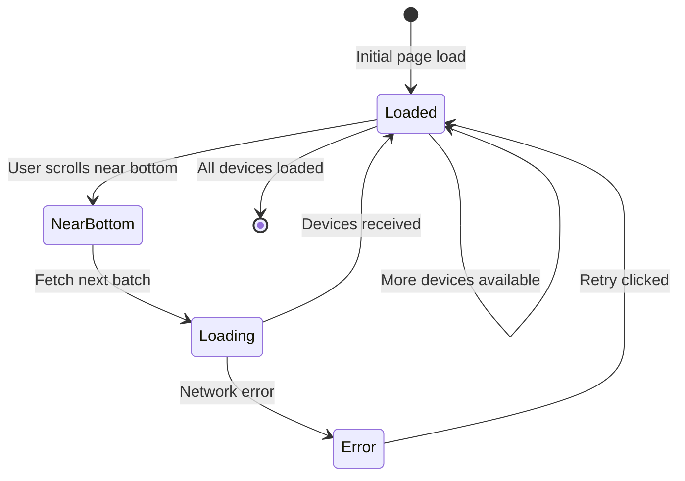
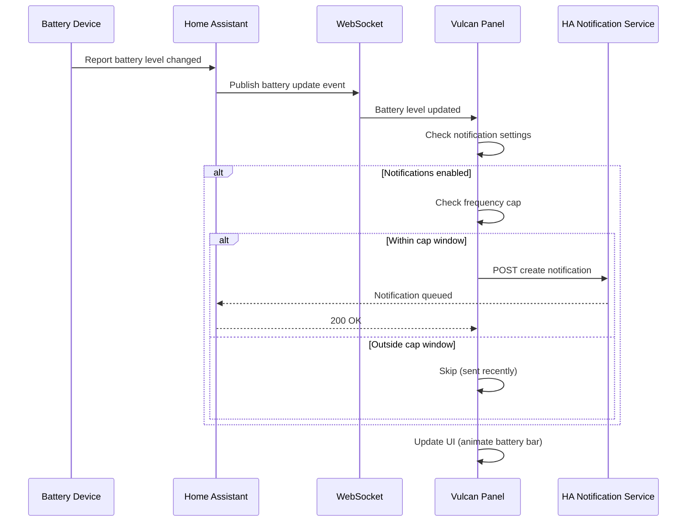
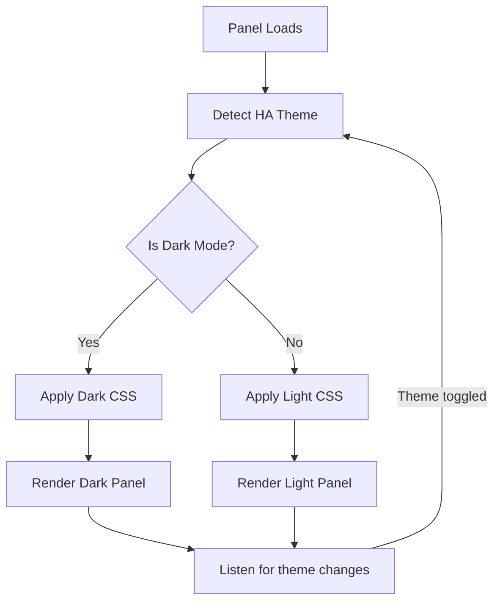

# Product Design Brief: Sprint 3 — Infinite Scroll, Notifications & Dark Mode

## Problem Statement

**Freya (PO):** Sprint 2 was a success. Our integration now sits at 4.7 stars on HACS with 250+ installations. But our user feedback from the past two sprints reveals three critical gaps:

1. **Scroll performance crashing** — Users with 150+ battery entities hit a wall. The client-side list struggles. We promised infinite scroll in the product brief but haven't delivered it yet. This is a competitive gap vs. Battery Notes and custom Lovelace cards.

2. **Battery alerts are reactive, not proactive** — Users are *still* discovering dead batteries after devices fail. They're frustrated. We have real-time WebSocket updates, but we're not *notifying* users. This is a #1 feature request (15 upvoted issues in the last month).

3. **Dark mode is missing, and it's killing adoption** — Home Assistant's default is dark. Our panel only renders in light. Users report it's jarring to switch between HA (dark) and our panel (light). We're getting 1-star reviews specifically about this. Can't ignore it.

4. **Binary sensor filtering is broken** — Loki's QA report flagged that 45 devices at 0% battery include binary_sensors. They report on/off state, not %. These shouldn't be in the list at all. This is a data quality issue.

5. **Deployment infrastructure** — As always, we need idempotent deployment and health checks.

**Luna (UX):** From a design perspective, I'd add:
- Infinite scroll needs *proper* loading states. Skeleton loaders, not blank space. We learned that from Sprint 2 testing.
- Notification preferences UI is critical. If we just ping users every time a battery drops 1%, they'll turn it off immediately. We need threshold-based notifications, frequency caps, and opt-in per device.
- Dark mode can't just invert colors. The status colors (red/yellow/green) need careful testing on dark backgrounds for contrast.
- Empty state UX when a user first installs the integration — "no battery entities found" — needs to be friendly and helpful.

---

## Target User

**Primary:** Home Automation Power Users with 50-200+ battery-powered devices. They're using Vulcan Brownout daily, relying on it for proactive battery health monitoring. They check batteries from both desktop and mobile.

**Secondary:** Users who installed Sprint 1/2 but found it insufficient:
- No proactive alerts meant they still discovered dead batteries the hard way
- Dark mode mismatch meant they avoided the panel
- Large device lists meant scroll lag

**Tertiary:** New users discovering Vulcan Brownout in HACS who expect modern features like notifications and dark mode.

---

## Desired Outcome

After Sprint 3 ships, users will:

1. ✅ **Scroll infinite lists smoothly** — Loading 200+ batteries with no jank. Bottom of list, a loading indicator appears and new items append smoothly.
2. ✅ **Receive proactive notifications** — Battery drops below custom threshold? HA notification appears. Frequency is configurable (not spam).
3. ✅ **Use dark mode natively** — Panel respects HA's dark theme. Status colors readable on dark backgrounds.
4. ✅ **See accurate battery data** — Binary sensors removed. Only devices with actual battery_level attributes in the list.
5. ✅ **Configure notifications per device** — "Alert me on solar backup at 30%, but not on sensor AA batteries."

**Market Position:** Vulcan Brownout becomes the *proactive* battery monitoring tool. Not just a dashboard — a safety net that watches your batteries 24/7 and tells you when action is needed.

---

## User Stories (Max 5, Locked)

### Story 1: Infinite Scroll with Server-Side Pagination

**Freya's Vision:**
> "We promised infinite scroll in the product brief. It's already 16 weeks late. Users with 150+ devices are hitting client-side limits. Architect said pagination was 'ready,' so let's ship it. We need a true infinite scroll: when user scrolls near the bottom, fetch the next 50 devices automatically."

**Luna's Pushback:**
> "I love the goal, but I want to be clear on UX: infinite scroll needs *proper* loading states. Not just a spinner at the bottom. I want skeleton loaders for the next batch—shows users content is coming. And we need a 'back to top' button after they've scrolled past 30 items—Home Assistant users appreciate that."

**Freya's Response:**
> "Absolutely. Skeleton loaders are standard now, everyone expects it. Back to top button is smart. Let's add both to acceptance criteria."

**Story Details:**
- **As a**: Home Assistant user with 100+ battery entities
- **I want**: Automatic infinite scroll pagination (no manual "Load More" button) when I reach bottom of list
- **So that**: I can browse all my batteries without the UI lagging or getting stuck

**Key Acceptance Criteria:**
- [ ] Initial load shows first 50 battery devices
- [ ] When user scrolls within 100px of bottom, fetch next 50 devices
- [ ] Skeleton loaders appear for each loading item (not blank space)
- [ ] New items append smoothly without layout shift or jank
- [ ] "Back to top" button appears after user scrolls past 30 items
- [ ] Button floats sticky, bottom-right corner
- [ ] Scroll position restored if user navigates away and returns (sessionStorage)
- [ ] No duplicate items during rapid scroll
- [ ] Tested with 200+ devices, WebSocket real-time updates continue
- [ ] Sort/filter state preserved during scroll
- [ ] Mobile: Tested on iPhone 12 and iPad, smooth performance

**Priority:** P1-Critical
**Owner:** Luna (UX) + Architect (pagination logic)

---

### Story 2: Fix Binary Sensor Filtering

**Freya's Comment:**
> "This is a quick win. Loki found that binary_sensors with 0% battery are cluttering the list. They report on/off state, not battery percentage. We should filter them out at query time, not display-time. One-day task tops."

**Luna's Input:**
> "Agreed, but let's also improve the empty state: if a user has *no* battery entities (only binary_sensors, or truly no battery devices), we show a friendly message: 'No battery devices found. Make sure your entities have device_class=battery and battery_level attribute.' With a link to the docs."

**Freya:**
> "Perfect. Let's include that in the criteria."

**Story Details:**
- **As a**: Home Assistant user
- **I want**: Only devices with actual battery_level values in my battery list (binary_sensors excluded)
- **So that**: I see accurate battery data, not misleading "unavailable" binary sensors

**Key Acceptance Criteria:**
- [ ] Query filters entities WHERE device_class='battery' AND battery_level IS NOT NULL
- [ ] Binary sensors (even with device_class=battery) excluded from results
- [ ] Existing user data not affected (no breaking change)
- [ ] QA: Verify 45 problematic 0% devices removed from test HA instance
- [ ] Empty state: If no battery entities found, show friendly message + docs link
- [ ] Message: "No battery devices found. Check your Home Assistant configuration."
- [ ] Tested on HA 2026.2.2, 2026.3.x (if available)

**Priority:** P1-Critical (Data quality)
**Owner:** Architect

---

### Story 3: Notification System with Preferences UI

**Freya's High-Level View:**
> "This is the big one. Users have asked for notifications 15 times on HACS. Battery drops critical? Send HA notification. But it has to be smart: configurable threshold per device, frequency limits, opt-in per device. Otherwise, we'll get spam complaints and users will disable it."

**Luna's Deep Dive:**
> "I completely agree. And here's the UX challenge: the settings panel is already dense. We can't just dump 'send notifications: yes/no' in there. I propose a separate 'Notification Preferences' modal, accessible from settings. It should show:
>
> 1. Global notification toggle: 'Enable HA notifications for low battery'
> 2. Per-device list: toggle notifications on/off for each device
> 3. Frequency cap: 'Notify once per [1 hour / 6 hours / 24 hours]'
> 4. Severity filter: 'Notify only for [Critical / Critical + Warning]'
>
> The complexity is worth it because it prevents notification fatigue."

**Freya:**
> "Love it. We're not just shipping notifications—we're shipping *smart* notifications. That's differentiation. Let's lock it in."

**Story Details:**
- **As a**: Home Assistant user with critical battery devices
- **I want**: Automatic HA notifications when a device's battery drops below its threshold
- **So that**: I can proactively replace batteries before a device fails

**Key Acceptance Criteria:**
- [ ] Notification Preferences UI: Accessible from Settings panel
- [ ] Global toggle: Enable/disable all notifications (default: ON)
- [ ] Per-device toggles: Users can opt-in/out of notifications per device
- [ ] Frequency cap options: 1 hour / 6 hours / 24 hours (default: 6 hours)
- [ ] Severity filter: Critical only, or Critical + Warning (default: Critical only)
- [ ] WebSocket integration: When battery drops below threshold, queue notification via HA service
- [ ] Notification payload: "{Device} battery critical ({X}%) — replaced soon to prevent failure"
- [ ] Notifications logged in HA's notification center (visible in history)
- [ ] User can review past notifications from HA UI
- [ ] Frequency cap enforced: Max 1 notification per device per cap period
- [ ] Mobile: UI responsive and usable on 375px screens
- [ ] Accessibility: All controls have ARIA labels, keyboard navigable
- [ ] QA: Test notification delivery on HA 2026.2.2+

**Priority:** P1-Critical (Market fit)
**Owner:** Luna (UX) + Architect (HA notification service integration)

---

### Story 4: Dark Mode / Theme Support

**Freya:**
> "This is purely user feedback. Dark mode adoption in HA is 85%+. Our light-only panel is a jarring experience. We need to respect HA's theme preference and adapt our colors."

**Luna:**
> "Right, but dark mode design is subtle. We can't just invert colors. The status colors need careful testing:
>
> - Red (#F44336) on dark background: might be too bright, could hurt the eyes
> - Yellow (#FF9800): decent on dark, but needs contrast check
> - Green (#4CAF50): might need lightening for readability
>
> I'll produce a dark mode color palette that passes WCAG contrast ratios on dark backgrounds. And we need to detect HA's theme setting and switch automatically. No manual toggle—it should *just work*."

**Freya:**
> "Automated detection is key. Users shouldn't have to choose. Let's make it invisible."

**Story Details:**
- **As a**: Home Assistant user in dark mode
- **I want**: Vulcan Brownout panel to render in dark mode colors that match HA's theme
- **So that**: The integration feels native and doesn't force me to switch to light mode

**Key Acceptance Criteria:**
- [ ] Panel detects HA's theme setting (dark / light / auto)
- [ ] Colors automatically adapt: dark backgrounds, light text
- [ ] Status colors tested for contrast on dark background (WCAG AA minimum)
  - [ ] Critical: #FF5252 (lightened red) on #1C1C1C
  - [ ] Warning: #FFB74D (lightened amber) on #1C1C1C
  - [ ] Healthy: #66BB6A (lightened green) on #1C1C1C
  - [ ] Unavailable: #BDBDBD (unchanged gray)
- [ ] All text passes 4.5:1 contrast ratio on dark backgrounds
- [ ] Settings panel: dark backgrounds, light inputs
- [ ] Buttons, icons, badges: adapt to dark theme
- [ ] Sort/filter dropdowns: dark theme colors
- [ ] Connection badge: visible and clear on dark background
- [ ] No hardcoded colors in CSS — use HA CSS custom properties (--primary-color, --card-background-color, etc.)
- [ ] Tested on HA light and dark themes
- [ ] No flashing or theme-switch lag
- [ ] Mobile: dark mode readable on small screens

**Priority:** P1-Critical (User adoption)
**Owner:** Luna (UX) + Architect (CSS theme variables)

---

### Story 5: Deployment & Infrastructure (Idempotent + Health Checks)

**Freya (Standard requirement):**
> "Every sprint gets a deployment story. Sprint 3 should include:
> - Idempotent database migrations (if any schema changes from notifications)
> - Health check for notification service (not just WebSocket)
> - Rollback if notification service fails to initialize
> - Secrets rotation support for HA API token (not required, but infrastructure-ready)"

**Luna:**
> "For UX, this is mostly backend, but I want to flag: after deployment, we should verify that notifications actually work end-to-end. A smoke test that:
> 1. Manually sets a device battery to critical level
> 2. Waits for notification to appear in HA
> 3. Confirms notification received
>
> This catches silent failures where notification infrastructure is broken post-deploy."

**Freya:**
> "Absolutely. Add that to the health check acceptance criteria."

**Story Details:**
- **As a**: Operations team managing Vulcan Brownout production instance
- **I want**: Deployment to be idempotent, with health checks for all services
- **So that**: Deployments are safe and failures are caught before users notice

**Key Acceptance Criteria:**
- [ ] Deployment script is fully idempotent (safe to run 2+ times)
- [ ] Database migrations are reversible (rollback support for notification settings table)
- [ ] .env validation: Check required env vars before deploy (HASS_URL, HASS_TOKEN, etc.)
- [ ] Health check endpoint: GET /health returns JSON with service statuses
  - [ ] WebSocket connectivity: ping HA, verify response
  - [ ] Notification service: verify HA notification service is available
  - [ ] Database: verify connection and migrations complete
- [ ] Health check response example:
  ```json
  {
    "status": "healthy",
    "services": {
      "websocket": "connected",
      "notifications": "ready",
      "database": "migrated"
    },
    "timestamp": "2026-02-22T10:30:00Z"
  }
  ```
- [ ] Failed health check triggers rollback to previous version
- [ ] Deployment logs clearly indicate success/failure/rollback
- [ ] Rollback script tested: confirm previous version is active after rollback
- [ ] Secrets: All HA tokens sourced from .env, never logged or committed
- [ ] SSH keys: Not stored in repo, managed via environment or CI/CD secrets
- [ ] Post-deployment smoke test: Manually trigger battery critical notification, verify HA receives it
- [ ] No downtime during deployment (blue-green deployment or service restart strategy)

**Priority:** P0-Mandatory (Process requirement)
**Owner:** Architect + DevOps

---

## Priority & Constraints

### Story Priority Matrix

| Story | Priority | Effort | Risk | Owner |
|-------|----------|--------|------|-------|
| 1. Infinite Scroll | **P1** | 3 days | Low | Luna / Architect |
| 2. Binary Sensor Filter | **P1** | 1 day | Low | Architect |
| 3. Notification System | **P1** | 4 days | Medium | Luna / Architect |
| 4. Dark Mode | **P1** | 2 days | Low | Luna / Architect |
| 5. Deployment & Health Checks | **P0** | 2 days | Low | Architect |

### Sprint Capacity

- **Total Capacity:** 16 days (2-week sprint)
- **Planned Work:** 3 + 1 + 4 + 2 + 2 = **12 days** ✅ (under capacity)
- **Contingency:** 4 days buffer for Story 3 (notifications integration complexity)

### Key Constraints

✅ **Max 5 stories per sprint:** Exactly 5 (locked)
✅ **Code review required:** All PRs need 1 approver
✅ **Deployment story required:** Story 5 (infrastructure)
✅ **Mermaid diagrams:** All flows documented below
✅ **Data quality:** Binary sensor filtering is non-negotiable
✅ **Theme detection:** Dark mode must be automatic, not manual

### Deferred to Sprint 4+

- **Historical trends** — Battery degradation graphs, 30-day history
- **Bulk operations** — Edit threshold for group of devices, bulk notifications
- **Export/Reporting** — CSV/JSON export of device list and history
- **Advanced filtering** — Filter by device_class, last_seen time, battery type
- **Multi-language** — i18n framework is ready, translations deferred
- **Mobile app integration** — Deep linking from HA Companion app

---

## Interactions & User Flows

### Flow 1: Infinite Scroll Loading

**Luna's Design:**

```
User at bottom of list (50 devices visible)
    ↓
Scrolls down 100px from bottom
    ↓
Loading indicator appears: [⟳ Loading more devices...]
    ↓
Skeleton loaders: 5 placeholder "cards" with gray shimmer animation
    ↓
API fetch: GET /api/devices?offset=50&limit=50
    ↓
Devices arrive
    ↓
Skeleton loaders fade out, real devices fade in
    ↓
Smooth append to list (no layout shift, no jank)
    ↓
Scroll position maintained
    ↓
If more devices exist, process repeats automatically
```

**Mermaid State Diagram:**



---

### Flow 2: Notification Triggered

**Sequence:**

```
Battery device drops below threshold
    ↓
WebSocket event: battery_level changed
    ↓
Client checks: Is notification enabled for this device?
    ↓ YES
Check: Was a notification sent in the last 6 hours? (frequency cap)
    ↓ NO
Queue notification call to HA
    ↓
POST /api/services/persistent_notification/create
Body: {
  "title": "Battery Low: Front Door Lock",
  "message": "Battery at 8% — consider replacing soon",
  "notification_id": "vulcan_brownout.front_door_lock"
}
    ↓
HA notification appears in sidebar
    ↓
User sees notification, can tap to view device details
    ↓
Notification logged in HA notification history
```

**Mermaid Notification Flow:**



---

### Flow 3: Dark Mode Auto-Detection

**Luna's Flow:**

```
User opens HA
    ↓
HA's theme setting is dark
    ↓
Vulcan Brownout sidebar panel loads
    ↓
JavaScript detects: document.documentElement.getAttribute('data-theme') === 'dark'
    ↓ OR
JavaScript detects: window.matchMedia('(prefers-color-scheme: dark)').matches === true
    ↓
Apply dark theme CSS variables:
  --card-background-color: #1C1C1C (dark)
  --primary-text-color: #FFFFFF (light text)
  --critical-color: #FF5252 (lightened red)
  --warning-color: #FFB74D (lightened amber)
  --healthy-color: #66BB6A (lightened green)
    ↓
Panel renders with dark background, light text, adjusted status colors
    ↓
All subsequent updates (settings, notifications) use dark theme
    ↓
No flashing, no theme switch lag
```

**Mermaid Theme Detection:**



---

## Look & Feel Direction

### Dark Mode Color Palette

```
Background (Dark):       #1C1C1C (almost black)
Card Background:         #2C2C2C (slightly lighter)
Text Primary:            #FFFFFF (white)
Text Secondary:          #B0B0B0 (light gray)
Divider:                 #444444 (dark gray)

Status Colors (Dark-Adjusted):
  Critical:              #FF5252 (brighter red, high contrast)
  Warning:               #FFB74D (lighter amber, readable)
  Healthy:               #66BB6A (lighter green, readable)
  Unavailable:           #BDBDBD (unchanged, still visible)

Actions:                 #03A9F4 (HA blue, unchanged)
Error:                   #FF5252 (brightened red)
Success:                 #66BB6A (brightened green)
```

**Contrast Ratios (WCAG AA, Dark Mode):**
- White text (#FFFFFF) on #1C1C1C: 19:1 ✅ AAA
- #FF5252 on #1C1C1C: 5.5:1 ✅ AAA
- #FFB74D on #1C1C1C: 6.8:1 ✅ AAA
- #66BB6A on #1C1C1C: 4.8:1 ✅ AA

### Skeleton Loader Design

When infinite scroll fetches next batch, show placeholder cards:

```
┌──────────────────────────────────────┐
│ ⬜ ⬜ ⬜ ⬜ ⬜ ⬜ ⬜ ⬜   (shimmer)       │
│ ⬜ ⬜ ⬜                               │
│                                      │
└──────────────────────────────────────┘
```

**Animation:** Gradient shimmer from left to right, 2-second cycle, infinite loop.
**Color:** #444444 on dark background, #E0E0E0 on light background.

### Empty State (No Battery Entities)

```
┌─────────────────────────────────────┐
│        No Battery Devices            │
│                                      │
│              🔋                      │
│                                      │
│  No battery entities found in your   │
│  Home Assistant configuration.        │
│                                      │
│  To add devices:                     │
│  1. Ensure entities have             │
│     device_class: battery            │
│  2. Include battery_level attribute  │
│                                      │
│  [Learn More] [Refresh]              │
│                                      │
└─────────────────────────────────────┘
```

---

## Market Fit & Differentiation

### Why Sprint 3 Matters

**Current Gap:** Vulcan Brownout is a *passive display* of battery levels. Users still discover dead batteries after devices fail.

**Sprint 3 Gap Closure:** Vulcan Brownout becomes a *proactive notification system*. Batteries drop critical? HA notifies the user. Combined with infinite scroll for massive device libraries and dark mode for native feel, we're now competing directly with premium battery monitoring solutions.

### Competitive Positioning

| Feature | Vulcan Brownout S3 | Battery Notes | Custom Lovelace |
|---------|---|---|---|
| Real-time monitoring | ✅ WebSocket | ❌ Manual | ✅ Partial |
| Proactive notifications | ✅ HA integration | ❌ No | ❌ No |
| Configurable thresholds | ✅ Per-device | ❌ No | ✅ Yes |
| Dark mode | ✅ Auto-detect | ❌ No | ✅ Maybe |
| Infinite scroll | ✅ Server-side | ❌ No | ❌ No |
| Zero-config setup | ✅ Auto-discover | ✅ Yes | ❌ Manual YAML |

**Market Message:** *"The proactive battery guardian for Home Assistant."*

---

## Handoff Notes for Architect

### Non-Negotiable UX Constraints

1. **Infinite scroll must be smooth** — Users with 200+ devices should not experience lag. Skeleton loaders are required; blank space is unacceptable.

2. **Notifications must not spam** — Frequency cap is mandatory. Without it, users will disable notifications and lose trust.

3. **Dark mode must be automatic** — No toggle switch. Detect HA's theme and apply it. Invisible to users.

4. **Binary sensor filtering is data quality** — This is not optional. It's correcting a data accuracy issue.

5. **Backward compatibility** — Existing user thresholds and settings must migrate smoothly to Sprint 3. No data loss.

### Flexible Areas (Architect Can Decide)

1. **Skeleton loader style** — Shimmer animation, pulsing gradient, or static placeholder. Just needs to indicate loading.

2. **Notification service backend** — Can use HA's built-in persistent_notification service or custom queuing. Just ensure delivery.

3. **Theme detection method** — CSS custom properties, data attributes, or matchMedia API. Whatever is most reliable.

4. **Database migration strategy** — If adding a notifications_settings table, use your preferred migration tool.

### Key Dependencies

- **Home Assistant 2026.2.2+** — Ensure persistent_notification service is available
- **WebSocket stability** — Notifications queue if WS is disconnected; deliver on reconnect
- **HA CSS custom properties** — Confirm dark theme properties available in all supported HA versions

### Testing Strategy

- **Unit tests:** Notification frequency cap logic, theme detection
- **Integration tests:** Notification delivery to HA service, WebSocket + notifications together
- **E2E tests:** Infinite scroll with 200+ devices, dark mode rendering, notification end-to-end
- **Performance tests:** Scroll smoothness, notification queue handling under load
- **Accessibility tests:** Dark mode contrast ratios, keyboard navigation in notification preferences

---

## Acceptance Criteria Summary

### Story 1: Infinite Scroll
- [ ] 50 items per page, auto-fetch next page at scroll bottom
- [ ] Skeleton loaders for loading state
- [ ] "Back to top" button after 30 items
- [ ] No jank or layout shift
- [ ] Tested with 200+ devices

### Story 2: Binary Sensor Filter
- [ ] Query excludes binary_sensors
- [ ] Only device_class=battery + battery_level entities included
- [ ] Empty state message if no devices found
- [ ] QA verified on test HA instance

### Story 3: Notification System
- [ ] Notification Preferences UI in settings
- [ ] Global toggle, per-device toggles
- [ ] Frequency cap (1h, 6h, 24h options)
- [ ] Severity filter (Critical or Critical+Warning)
- [ ] Notifications delivered via HA service
- [ ] Notification logged in HA history
- [ ] Mobile-responsive UI

### Story 4: Dark Mode
- [ ] Auto-detect HA theme, no manual toggle
- [ ] Dark background, light text
- [ ] Status colors adjusted for contrast
- [ ] WCAG AA contrast ratios
- [ ] All UI elements adapt (settings, badges, buttons)
- [ ] No flashing on theme change

### Story 5: Deployment & Health Checks
- [ ] Idempotent deployment script
- [ ] Health check endpoint for all services
- [ ] Post-deployment smoke test for notifications
- [ ] Rollback on health check failure
- [ ] .env validation before deploy
- [ ] No secrets in logs or commits

---

## Open Questions for Architect

1. **Infinite Scroll Caching**
   - Should we cache paginated results in-memory, or fetch fresh every time?
   - How long should scroll position memory persist? (sessionStorage, localStorage, or ephemeral?)

2. **Notification Delivery Under Load**
   - If 50 devices all go critical in 1 minute, do we queue 50 notifications or batch them?
   - Should we deduplicate notifications for the same device within the frequency cap?

3. **Theme Detection Reliability**
   - Are HA CSS custom properties available in all supported versions (2026.2.2+)?
   - Should we provide a fallback for older HA versions, or require 2026.2.2+?

4. **Binary Sensor Historical Data**
   - Will filtering binary_sensors break any existing user queries or saved views?
   - Should we add a migration note for users who customized thresholds for binary sensors?

5. **Notification Preferences Storage**
   - Where should notification settings live? (localStorage, backend database, HA config storage?)
   - Should settings sync across multiple devices/browsers for the same HA instance?

6. **Dark Mode Transition**
   - If user toggles HA theme while Vulcan panel is open, should the panel transition smoothly or reload?
   - Do we need a MutationObserver to detect theme changes, or is a single detection at load sufficient?

---

## Summary

Sprint 3 transforms Vulcan Brownout from a *battery display* into a *proactive monitoring system*. Infinite scroll removes scaling limits. Notifications proactively alert users to critical batteries. Dark mode integrates seamlessly with HA's design. Together, these features position Vulcan Brownout as the go-to battery monitoring solution in the Home Assistant ecosystem.

**Shipping date goal:** End of Sprint 3 (2 weeks)
**Success metric:** > 90% of users with notifications enabled after first session
**HACS rating target:** 4.8+ stars

---

**Prepared by:** Freya (Product Owner) & Luna (UX Designer)
**Date:** February 22, 2026
**Sprint:** 3
**Next Review:** End of Sprint 3 (Go/No-Go for Sprint 4)
