# Product Design Brief — Sprint 4

**By**: Freya (PO) + Luna (UX) | **Status**: IN PROGRESS

## Problem Statement

**Theme Detection Gap**: The current implementation detects dark/light mode via DOM sniffing (`data-theme` attribute) and OS preference (`prefers-color-scheme`), but **ignores the user's explicit theme selection from their Home Assistant profile**. Home Assistant exposes `hass.themes.darkMode` (boolean) and `hass.themes.name` (string: "default", "Google - Dark", "Solarized Dark", etc.) which represent the authoritative source of truth for the user's theme preference.

Users who have set a named theme in their HA profile (Settings → Person → Theme) expect the Vulcan Brownout panel to respect that choice. Currently, if their HA theme doesn't set the `data-theme` attribute on the DOM, our detection fails and defaults to the OS preference — potentially showing the wrong theme.

## Target User

 HA users with:
- Multiple named themes configured in their Home Assistant setup
- An explicit theme selected in their profile
- Expectation that all HA integrations respect their theme choice

## Desired Outcome

After this ships, the Vulcan Brownout panel will:
1. **Use `hass.themes.darkMode` as the primary source** of truth for dark/light mode
2. **Fall back gracefully** to DOM detection and OS preference only if `hass.themes` is unavailable
3. **Respond in real-time** to theme changes in the HA UI (via `hass_themes_updated` event)
4. **Apply theme with smooth 300ms transition** (preserve existing dark-mode UX)
5. **Pass the full UX review** — Freya + Luna assess overall flow, information density, modal discoverability, scroll performance, empty state clarity, and card layout

## UX Review Scope

Luna conducted a user flow audit. Questions for the design brief:

### Q1: Scroll Performance & Infinite Scroll Feel
**Current state**: Skeleton loaders, IntersectionObserver, debounced scroll tracking, back-to-top after 30 items scrolled.

**Luna's assessment**:
- Scroll feels smooth in testing, but we should verify the sentinel element placement doesn't cause layout shifts
- Back-to-top fade-in/out at 300ms feels responsive
- **Recommendation**: Skeleton loaders are good, but card heights should be consistent (currently approx 68px per card)
- **Acceptance**: No jank on 50-device list, smooth append of new items on pagination

### Q2: Notification Modal Discoverability
**Current state**: "[🔔 Notifications]" button in header next to Settings.

**Luna's assessment**:
- Button is visible but competes with Settings for attention
- Modal structure (toggle → frequency → severity → per-device list) is sound
- Per-device checkbox list is searchable and good UX
- **Question**: Should we reduce modal sections or add a "Quick Disable All" shortcut?
- **Freya's call**: Keep current structure — per-device control is core. No shortcuts.
- **Recommendation**: Keep as-is. Modal is already comprehensive.

### Q3: Empty State Messaging & CTA
**Current state**: "No battery devices found" + [🔄 Refresh] [⚙️ Settings] [📖 Docs] buttons.

**Luna's assessment**:
- Message is clear, but we could be more helpful
- Current wording doesn't explain *why* no devices were found
- **Recommendation**: Update message to: "No battery entities found. Check that your devices have a `battery_level` attribute and are not binary sensors."
- **Acceptance**: Message explains the root cause, [Docs] link is discoverable

### Q4: Card Density & Information Hierarchy
**Current state**: Device name + status (critical/warning/healthy) + battery % + 300ms dark-mode transition.

**Luna's assessment**:
- Card layout is clean, single-column on mobile, good line-height
- Status colors are WCAG AA compliant in both light/dark
- *Should we add "last updated" timestamp to cards or keep minimal?*
- **Freya's call**: No timestamps on cards — too much clutter. Last update time is in the footer.
- **Recommendation**: Keep minimal. Footer shows "Updated Xs ago" globally.

### Q5: Dark Mode Transition Smoothness
**Current state**: MutationObserver on `data-theme`, 300ms CSS transition on colors.

**Luna's assessment**:
- Current CSS transition is smooth
- *Question: Should theme detection trigger on `hass_themes_updated` event (more accurate) or rely on DOM mutation (simpler)?*
- **Freya's call**: Use `hass_themes_updated` event. It's the proper HA way, and more reliable than DOM sniffing.
- **Recommendation**: New flow: Listen to `hass.connection.addEventListener("hass_themes_updated", ...)` → call `_detect_theme()` → apply CSS. Fall back to current MutationObserver if event unavailable.

## Interactions & User Flow

### Theme Detection & Application (NEW for Sprint 4)

### Full User Flow: Opening Panel → Viewing Devices → Changing Theme

```mermaid
stateDiagram-v2
    [*] --> Loading: Panel opens, connectedCallback()
    Loading --> Loaded: _load_devices() success
    Loaded --> Loaded: Real-time updates (device_changed events)
    Loaded --> Loaded: User changes HA theme
    Loaded --> Refreshing: hass_themes_updated event fires
    Refreshing --> Loaded: _detect_theme() applies new colors (300ms)
    Loaded --> SettingsOpen: User clicks [⚙️ Settings]
    SettingsOpen --> Loaded: Save or Cancel
    Loaded --> NotificationOpen: User clicks [🔔 Notifications]
    NotificationOpen --> Loaded: Save or Cancel
    Loaded --> Scrolling: User scrolls device list
    Scrolling --> ShowBackToTop: scrolled > 30 items
    ShowBackToTop --> Scrolling: Back to Top button visible
    Loaded --> Error: Connection lost
    Error --> Reconnecting: Auto-retry (exponential backoff)
    Reconnecting --> Loaded: Connection restored
```

## Look & Feel Direction

### Theme Handling
- **Primary source**: `hass.themes.darkMode` boolean
- **Colors**: Apply CSS custom properties for smooth transition (no hardcoded colors)
- **Transition**: 300ms ease on background, text, button, card colors
- **Fallback chain**: `hass.themes.darkMode` → DOM `data-theme` → `prefers-color-scheme` → default light

### Information Hierarchy (No Changes from Sprint 3)
1. **Critical devices** (battery ≤ threshold): Red/orange, top of list
2. **Warning devices** (threshold to threshold+15%): Yellow/amber
3. **Healthy devices** (> threshold+15%): Green
4. **Unavailable**: Grey, separated section or badge

### Modal & Empty State Clarity
- Notification modal sections should flow top-to-bottom without scrolling on desktop (max-height: 80vh)
- Empty state message should explicitly mention `battery_level` attribute requirement
- All buttons (Settings, Notifications, Refresh, Docs) should have 44px touch targets

## Acceptance Criteria

- [ ] `hass.themes.darkMode` is the primary theme detection source (not DOM sniffing)
- [ ] Theme updates via `hass_themes_updated` event are detected and applied within 300ms
- [ ] Fallback to DOM `data-theme` + `prefers-color-scheme` if `hass.themes` unavailable
- [ ] No theme flickering or double-renders during theme switch
- [ ] All CSS custom properties (--vb-*) respond to theme changes
- [ ] Scroll performance remains smooth with 150+ devices (no jank on pagination or theme switch)
- [ ] Empty state message mentions `battery_level` attribute + link to docs
- [ ] Notification modal is fully discoverable (button visible, CTA clear)
- [ ] All interactive elements meet 44px touch target minimum
- [ ] WCAG AA contrast ratios maintained in both light/dark themes
- [ ] Back-to-top button fade-in/out smooth (300ms, no sudden appearance)
- [ ] Card layout consistent (no height variance between items)

## Color Tokens (Unchanged from Sprint 3)

All light/dark colors remain WCAG AA compliant per system-design.md.

**Light mode**:
- Background: #FFFFFF, Card: #F5F5F5, Text: #212121

**Dark mode**:
- Background: #1C1C1C, Card: #2C2C2C, Text: #FFFFFF
- Critical: #FF5252, Warning: #FFB74D, Healthy: #66BB6A

## Priority & Constraints

- **Priority**: P1 (Theme detection fix) + P2 (UX review & polish)
- **Sprint Target**: Sprint 4
- **Dependencies**: None (uses existing HA APIs)
- **Max Stories**: 5 (theme fix + UX polish items)
- **Deployment**: Requires HomeAssistant 2023.2+ (for hass_themes_updated event support)

## Handoff Notes for FiremanDecko (Architect)

### Key Product Decisions
1. **`hass.themes.darkMode` is authoritative** — Use this as primary source of truth, not DOM sniffing. This respects user's explicit HA profile theme choice.
2. **Event-driven theme updates** — Listen to `hass_themes_updated` event, not MutationObserver. More reliable, faster, less resource-intensive.
3. **Graceful fallback** — If `hass.themes` unavailable, fall back to DOM `data-theme` + `prefers-color-scheme` for backward compatibility.
4. **UX polish** — Empty state message should be more helpful; notification modal should remain comprehensive; scroll performance must stay smooth.

### UX Constraints (Non-Negotiable)
- 300ms CSS transition on theme change (smooth, not instant)
- No double-renders or flickering during theme switch
- Scroll performance unchanged (smooth infinite scroll, no layout shift on pagination)
- All touch targets ≥ 44px
- WCAG AA contrast in both themes

### Technical Feasibility Questions for Architecture Review
1. Is `hass_themes_updated` event available in our minimum HA version? If not, can we use a different approach (e.g., polling `hass.themes.darkMode`)?
2. Should we debounce `hass_themes_updated` listener to avoid re-renders if event fires multiple times in rapid succession?
3. Will theme switching interfere with real-time device updates (WebSocket messages during theme transition)?
4. Are there any memory leaks with the new event listener if the panel is opened/closed repeatedly?

### Areas with Technical Flexibility
- **Event listener cleanup**: Architect can choose when/how to unsubscribe from `hass_themes_updated`
- **CSS variable application**: Can be done via inline styles, CSS class toggle, or shadow DOM injection — architect's choice
- **Fallback detection order**: If `hass.themes` unavailable, exact fallback sequence is flexible

### Implementation Handoff Checklist
- [ ] Update `_detect_theme()` to check `hass.themes.darkMode` first
- [ ] Add `hass_themes_updated` event listener in `connectedCallback()`
- [ ] Remove/deprecate MutationObserver theme detection (or keep as fallback)
- [ ] Test theme switching with real HA instance (light → dark → custom theme)
- [ ] Verify no layout shift or flicker during transition
- [ ] Update empty state message with `battery_level` attribute hint
- [ ] QA: Scroll performance test with 150+ devices during theme switch
- [ ] QA: Theme switch speed measurement (should be <300ms visible transition)

## Design Artifacts

- **Wireframes**: See wireframes.md for all screen states (main panel, notifications modal, settings, empty state, loading state, error state)
- **Interactions**: See interactions.md for theme detection flow, infinite scroll behavior, modal interactions, accessibility specs
- **Theme Colors**: See system-design.md for WCAG AA verified color tables (light/dark)

---

# Product Design Brief — Sprint 5

**By**: Freya (PO) + Luna (UX) | **Status**: IN PROGRESS | **Date**: 2026-02-22

## Sprint 5 Problem Statement

**Filtering Gap at Scale**: The current panel displays all battery devices in a single scrollable list with only status-based toggle filters (critical/warning/healthy/unavailable). These client-side toggles operate on the already-loaded page of results, not the full device set.

As Home Assistant installations grow to 50+ battery-powered devices spanning multiple manufacturers (Aqara, Hue, IKEA), device classes, and rooms (Living Room, Kitchen, Bedroom), users cannot efficiently locate the specific subset of devices they care about. A user troubleshooting battery failures in the kitchen has no way to isolate those devices without manually scanning a list that may span several scroll pages. A user who owns only IKEA Tradfri devices cannot filter to them without reading every card label.

Client-side filtering is architecturally insufficient at this scale: if the device set exceeds one page (100 items with cursor-based pagination), filtering on the client only applies to the fetched page, silently hiding devices on subsequent pages that would match the filter. Server-side filtering is the only correct solution.

## Sprint 5 Target User

HA users with:
- **50+ battery-powered devices** spread across multiple rooms and manufacturers
- **Mixed device ecosystem** (Aqara sensors, Philips Hue bulbs, IKEA Tradfri remotes, Z-Wave locks)
- **Room-based mental model** — they think of their devices by physical location first, brand second
- **Triage workflow** — they open the panel specifically to find problem devices, not to browse all devices
- Existing expectation that other HA views support area-based filtering

## Sprint 5 Desired Outcome

After Sprint 5 ships, the Vulcan Brownout panel will:
1. **Filter by manufacturer** (from device registry) — e.g., show only Aqara devices
2. **Filter by device class** (from entity attributes) — e.g., show only "battery" class sensors
3. **Filter by status** (critical, warning, healthy, unavailable) — server-side, replacing the current client-side toggle approach
4. **Filter by room/area** (from HA area registry) — e.g., show only Living Room devices
5. **Support AND logic** across all active filters simultaneously
6. **Show active filter chips** with per-chip [x] removal and a global "Clear all" button
7. **Persist filter state** to localStorage across panel reloads
8. **Reset cursor and reload** device list when any filter changes
9. **Handle empty filter results** gracefully with a "No devices match your filters" empty state and a "Clear filters" CTA
10. **Populate filter dropdowns dynamically** from a new `vulcan-brownout/get_filter_options` WebSocket command

## Sprint 5 UX Review Scope

### Q1: Filter Bar Placement & Discoverability
**Current state**: A sort/filter control bar exists below the header, with sort dropdowns only. Status filter is currently a set of small toggle chips in the control bar.

**Luna's assessment**:
- The existing control bar is the correct location for the expanded filter UI. Users expect filtering controls directly below the header, above the content list.
- Adding four filter categories (manufacturer, device_class, status, room) requires a rethink of the bar layout. A single horizontal row becomes crowded on desktop and untenable on mobile.
- **Recommendation**: Replace the current minimal bar with a dedicated "Filter Bar" row. Desktop: four labeled dropdown trigger buttons side by side. Mobile: a single "Filter" button that opens a bottom sheet presenting all four filter categories.
- The filter bar should be visually distinct from the header but subordinate in visual weight — use a slightly recessed background (`--vb-bg-secondary`) rather than the primary header blue.

### Q2: Active Filter Visibility & Removal
**Current state**: No chip-based active filter display exists.

**Luna's assessment**:
- When one or more filters are active, a second row should appear below the filter bar showing chips for each active filter value. Each chip shows the filter category label + value and an inline [x] button.
- A "Clear all" button at the end of the chip row provides a single-action escape hatch.
- The chip row should not appear when no filters are active (no wasted vertical space).
- **Freya's call**: Chip row is mandatory. Users must always see which filters are active without opening a dropdown. This is table stakes for any filter UI.
- **Recommendation**: Chip row slides in (200ms) when the first filter is applied, slides out (200ms) when the last filter is cleared.

### Q3: Multi-Select vs. Single-Select Per Filter
**Current state**: N/A — no such filters exist yet.

**Luna's assessment**:
- Users commonly want "Living Room OR Kitchen" (multi-select room) or "Aqara OR IKEA" (multi-select manufacturer).
- Single-select would force multiple separate filter changes and lose the previous selection.
- **Freya's call**: All four filter categories support multi-select (checkboxes inside dropdown). AND logic applies across categories; OR logic applies within a category.
- **Recommendation**: Dropdown expands as a panel below the trigger button showing a checkbox list. Checked items accumulate. Dropdown closes on outside click or Escape. Selected count shown in trigger button label (e.g., "Room (2)").

### Q4: Empty State for Filtered Results vs. No Devices
**Current state**: A single empty state exists for "no battery devices at all."

**Luna's assessment**:
- We need to distinguish between "you have no battery devices in HA" and "your filters matched nothing." These require different messages and CTAs.
- A filtered empty state should not suggest checking device configuration — the devices exist, they just don't match.
- **Freya's call**: Two distinct empty states. The existing state (Wireframe 6) is unchanged for zero devices. A new state (Wireframe 16) handles the filtered-zero-results case with a "Clear filters" CTA.
- **Recommendation**: Filtered empty state uses the same visual structure (centered icon, message, CTA button) but different copy and a single "[Clear Filters]" button.

### Q5: Mobile Filter UX
**Current state**: Mobile layout collapses the control bar to a single row. Adding four filter dropdowns would overflow.

**Luna's assessment**:
- On mobile (< 768px), the four individual dropdown triggers must not appear. Instead, a single "Filter" button in the filter bar row indicates the presence of filtering capability.
- Tapping "Filter" opens a bottom sheet (full-width, slides up from bottom, 300ms) containing all four filter categories as expandable accordion sections, each with its checkbox list.
- Active filter count shown as a badge on the "Filter" button (e.g., "Filter (3)" when 3 values are selected across all categories).
- **Freya's call**: Bottom sheet is required on mobile. No exceptions. The desktop multi-dropdown pattern does not translate to touch.
- **Recommendation**: Bottom sheet has a sticky header ("Filters | [Clear All] | [X]") and a sticky footer ("[Apply Filters]"). Changes in the sheet are staged and applied on tap of "[Apply Filters]", not immediately, to avoid jarring real-time list updates while the sheet is open.

### Q6: Filter State Persistence
**Current state**: Sort state is persisted to localStorage. Filter state (the existing status toggles) is managed in `filter_state` property but not documented as persisted.

**Luna's assessment**:
- All four new filter categories must persist to localStorage alongside sort state.
- Key: `vulcan_brownout_filters` — stores a JSON object `{ manufacturer: [], device_class: [], status: [], area: [] }`.
- On panel load, restore filters from localStorage before issuing the first `query_devices` call to avoid a visible flash of unfiltered content.
- **Freya's call**: Persist all filter state. Users who filter by room every time they open the panel should not have to re-select that filter on each visit.

### Q7: Dynamic Filter Population
**Current state**: No mechanism exists to populate dynamic filter values (which manufacturers, which rooms, which device classes are present in the user's HA instance).

**Luna's assessment**:
- Filter dropdown values must reflect what exists in the user's actual device registry, not a hardcoded list. A user with no Hue devices should not see "Hue" as a manufacturer option.
- A new WebSocket command `vulcan-brownout/get_filter_options` should return all available filter values.
- This command should be called once on panel load (after connection) and cached for the session. It does not need to be real-time — if a user adds a new device, they can refresh.
- **Freya's call**: Dynamic population is non-negotiable. Static lists would be wrong for every installation.
- **Recommendation**: Show a loading state in filter dropdowns while options are being fetched. If fetch fails, show "Unable to load filter options [Retry]" inside the dropdown.

## Sprint 5 Interactions & User Flow

### Filter Application Flow

### Filter Clear Flow

### Full Sprint 5 Panel State Machine

## Sprint 5 Look & Feel Direction

### Filter Bar Design
- **Placement**: Below the existing header, above the device list. Replaces/extends the current sort/filter control bar.
- **Desktop layout**: Horizontal row of four labeled dropdown trigger buttons — "Manufacturer", "Device Class", "Status", "Room". Each button shows selected count when active (e.g., "Room (2)").
- **Mobile layout**: Single "Filter" row with a "Filter" button (shows badge count of total active filter values) and the sort control. No individual category dropdowns on mobile.
- **Visual weight**: Uses `--vb-bg-secondary` background (slightly darker than page, lighter than header). Subtle 1px bottom border using `--vb-border-color`.
- **Active state**: Active filter trigger buttons receive an accent color fill (`--vb-color-accent`) to signal they have selections.

### Filter Chip Row Design
- **Placement**: Below the filter bar row. Visible only when at least one filter is active.
- **Layout**: Horizontal scrolling row of chips. Overflow scrolls horizontally on small viewports.
- **Chip anatomy**: `[Category Label: Value  x]` — pill shape, 32px height, 8px horizontal padding, 12px font size.
- **"Clear all" button**: Appears at end of chip row. Text link style (no border), 32px touch target minimum.
- **Animation**: Chip row slides in (200ms ease-out) when first chip appears; slides out (200ms ease-in) when last chip is removed.

### Mobile Bottom Sheet Design
- **Trigger**: "Filter" button in mobile filter bar.
- **Sheet structure**: Full-width from bottom, max-height 85vh with internal scroll.
- **Sticky header**: "Filters" title | "[Clear All]" link | "[X]" close button.
- **Body**: Four accordion sections (Manufacturer, Device Class, Status, Room). Each expands to show checkbox list.
- **Sticky footer**: "[Apply Filters]" primary button spanning full width.
- **Overlay**: Semi-transparent overlay behind sheet (`opacity: 0.5`, `background: #000`).
- **Animation**: Sheet slides up from bottom (300ms ease-out). Closes by sliding down (300ms ease-in).

### Empty State for Filtered Results
- **Icon**: Filter/funnel icon (48px), not the battery icon (battery icon reserved for "no devices at all").
- **Title**: "No devices match your filters."
- **Subtitle**: "Try removing one or more filters, or clear all filters to see the full device list."
- **CTA**: Single button "[Clear Filters]" — primary style, links to clear-all action.
- **No docs or settings links**: These are irrelevant when devices do exist but are filtered out.

## Sprint 5 Acceptance Criteria

### Filter Bar
- [ ] Filter bar renders below the header with four category dropdowns on desktop (manufacturer, device_class, status, room)
- [ ] On mobile (< 768px), filter bar shows a single "Filter" button instead of four dropdowns
- [ ] Each dropdown trigger button shows the count of selected values when active (e.g., "Room (2)")
- [ ] Filter trigger buttons are visually distinct (accent color fill) when they have active selections
- [ ] All filter trigger buttons have 44px minimum touch targets

### Filter Dropdowns
- [ ] Each dropdown expands below its trigger on click, showing a checkbox list of available values
- [ ] Dropdown values are dynamically populated from the `vulcan-brownout/get_filter_options` WebSocket response
- [ ] Multiple values can be selected within a single filter category (multi-select)
- [ ] Dropdown closes on outside click or Escape key
- [ ] Loading state shown inside dropdown while filter options are being fetched
- [ ] Error state shown inside dropdown if filter options fetch fails, with [Retry] button

### Filter Chips
- [ ] Active filter chip row appears when at least one filter value is selected
- [ ] Each active filter value renders as a chip: "Category: Value [x]"
- [ ] Clicking [x] on a chip removes that specific filter value
- [ ] "Clear all" button appears at end of chip row and removes all active filters
- [ ] Chip row slides in when first filter is applied and slides out when last filter is cleared (200ms animation)
- [ ] Chip row scrolls horizontally on viewports too narrow to show all chips

### Server-Side Filtering
- [ ] Applying any filter resets the cursor to null before issuing a new `query_devices` request
- [ ] Filter parameters are passed to `query_devices` as server-side filter params (not client-side)
- [ ] AND logic across categories: selecting manufacturer=Aqara AND room=Kitchen returns only Aqara devices in Kitchen
- [ ] OR logic within a category: selecting manufacturer=[Aqara, Hue] returns devices from either manufacturer
- [ ] Total device count shown in UI reflects the filtered total (from server response), not the unfiltered count

### Filter Persistence
- [ ] Filter state is saved to localStorage under key `vulcan_brownout_filters` on every filter change
- [ ] On panel load, filter state is restored from localStorage before the first `query_devices` call
- [ ] No unfiltered flash: restored filters are applied to the first query, not applied after the initial unfiltered query

### Empty State
- [ ] When filtered query returns zero devices, the "No devices match your filters" empty state is shown
- [ ] Filtered empty state is visually distinct from the "no battery devices at all" empty state (different icon and copy)
- [ ] "[Clear Filters]" button in filtered empty state clears all filters and re-queries

### Mobile Bottom Sheet
- [ ] Tapping "Filter" on mobile opens a bottom sheet (slides up from bottom, 300ms)
- [ ] Bottom sheet shows all four filter categories as accordion sections with checkbox lists
- [ ] Changes in the bottom sheet are staged (not immediately applied to the device list)
- [ ] "Apply Filters" button in bottom sheet sticky footer commits changes and closes the sheet
- [ ] "[X]" button and outside-tap dismiss the sheet without applying staged changes
- [ ] "Clear All" in the sheet header clears all staged selections (not yet committed)
- [ ] Active filter count badge on "Filter" button reflects committed (applied) filters, not staged

### Accessibility
- [ ] All filter dropdowns are keyboard accessible (Tab to focus trigger, Enter/Space to open, arrow keys to navigate options, Space to toggle checkboxes, Escape to close)
- [ ] Mobile bottom sheet is keyboard accessible (Tab cycles through accordion sections and checkboxes)
- [ ] All filter chips are keyboard accessible ([x] button reachable by Tab, activated by Enter/Space)
- [ ] WCAG AA contrast maintained for chip text, dropdown labels, and filter trigger button text in both light and dark themes
- [ ] Active filter chip row has `aria-label="Active filters"` for screen readers
- [ ] Filter dropdown has `role="listbox"` or `role="group"` with appropriate aria attributes
- [ ] Mobile bottom sheet has `role="dialog"` and `aria-modal="true"`

### Dynamic Filter Population
- [ ] `vulcan-brownout/get_filter_options` is called once on panel load after WebSocket connection established
- [ ] Filter option values reflect only manufacturers, device classes, areas, and statuses present in the user's actual HA device/entity registry
- [ ] Empty categories (e.g., no devices with a known room) show "No options available" inside the dropdown rather than an empty list

## Sprint 5 Color Tokens (Unchanged)

All existing color tokens from Sprint 3/4 remain unchanged. New tokens for filter UI:

**New CSS custom properties (theme-aware)**:
- `--vb-bg-secondary`: Filter bar background (slightly recessed from primary bg)
- `--vb-filter-chip-bg`: Chip background (accent-tinted)
- `--vb-filter-chip-text`: Chip text color
- `--vb-filter-chip-border`: Chip border color
- `--vb-filter-active-bg`: Active filter trigger button background (accent)
- `--vb-filter-active-text`: Active filter trigger button text (contrast on accent)
- `--vb-overlay-bg`: Bottom sheet overlay (`rgba(0,0,0,0.5)`)

Light mode values:
- `--vb-bg-secondary`: #F0F0F0
- `--vb-filter-chip-bg`: #E3F2FD
- `--vb-filter-chip-text`: #0D47A1
- `--vb-filter-chip-border`: #90CAF9
- `--vb-filter-active-bg`: #03A9F4
- `--vb-filter-active-text`: #FFFFFF

Dark mode values:
- `--vb-bg-secondary`: #252525
- `--vb-filter-chip-bg`: #1A3A5C
- `--vb-filter-chip-text`: #90CAF9
- `--vb-filter-chip-border`: #1E5080
- `--vb-filter-active-bg`: #0288D1
- `--vb-filter-active-text`: #FFFFFF

## Sprint 5 Priority & Constraints

- **Priority**: P1 (Server-side filtering infrastructure + filter bar UI)
- **Sprint Target**: Sprint 5
- **Dependencies**: New `vulcan-brownout/get_filter_options` WebSocket command (backend); updated `query_devices` to accept filter params (backend)
- **Max Stories**: 5 (filter bar + chips + persistence + mobile bottom sheet + empty state)
- **Min HA Version**: 2026.2.0 (unchanged)
- **Manifest version**: Bump to 5.0.0 on ship

## Sprint 5 Handoff Notes for FiremanDecko (Architect)

### Key Product Decisions
1. **Server-side filtering is mandatory** — Client-side filtering on a paginated dataset silently excludes devices on unpaged results. The `query_devices` WebSocket command must accept `filter_manufacturer`, `filter_device_class`, `filter_status`, and `filter_area` parameters.
2. **New `get_filter_options` command required** — A separate WebSocket command returns available filter values from the device registry and area registry. This prevents stale hardcoded lists. See ADR-008 for context on client-vs-server filter strategy.
3. **AND logic across categories, OR within category** — This maps to: `WHERE (manufacturer IN ['Aqara', 'Hue']) AND (area IN ['Living Room'])`. The backend query must implement this correctly.
4. **Cursor resets on filter change** — Any change to active filters must reset the pagination cursor to null and re-fetch from page 1. Failing to reset would return a page of results from the middle of a different (pre-filter) result set.
5. **Filter state persisted to localStorage before first query** — The panel must read `vulcan_brownout_filters` from localStorage and include those values in the very first `query_devices` call. Do not issue an unfiltered query first.
6. **Mobile bottom sheet stages changes** — On mobile, filter changes in the bottom sheet are not applied to the device list until the user taps "Apply Filters". This prevents jarring list refreshes while the user is still making selections. Desktop dropdowns apply changes immediately on close.

### Filter Bar Layout Decisions
- Desktop: Four `<button>` elements in a horizontal flex row, each triggering a `
` positioned dropdown below it (not a native `<select>`)
- Mobile: A single `<button class="filter-trigger">` that opens the bottom sheet. Sort control remains visible on mobile (it's a single dropdown, manageable)
- The filter bar row and the chip row are separate DOM elements. The chip row is conditionally rendered (not just hidden) to avoid layout space reservation when empty.

### New WebSocket Commands Required

**`vulcan-brownout/get_filter_options`**:
- Request: `{ type: "vulcan-brownout/get_filter_options" }`
- Response: `{ manufacturers: string[], device_classes: string[], areas: { id: string, name: string }[], statuses: ["critical","warning","healthy","unavailable"] }`
- Called once on load, result cached in panel JS for the session.

**Updated `vulcan-brownout/query_devices`** (add filter params):
- New optional params: `filter_manufacturer: string[]`, `filter_device_class: string[]`, `filter_status: string[]`, `filter_area: string[]`
- All filter params are optional (omitting = no filter on that category)
- Empty array `[]` is treated the same as omitting the param (no filter)
- Existing cursor/pagination params unchanged

### UX Constraints (Non-Negotiable)
- 44px minimum touch targets on all filter controls
- WCAG AA contrast on all filter UI elements in both light and dark themes
- Chip row must not occupy vertical space when no filters are active
- Mobile bottom sheet must not apply changes until "[Apply Filters]" is tapped
- Cursor must reset to null on every filter change before re-querying

### Implementation Handoff Checklist
- [ ] Add `get_filter_options` command to `websocket_api.py`
- [ ] Add filter query logic to `battery_monitor.py` (`query_devices` with AND/OR filter semantics)
- [ ] Add filter param constants to `const.py`
- [ ] Update `vulcan-brownout-panel.js`: add filter bar, dropdown components, chip row
- [ ] Implement mobile bottom sheet with staged apply logic
- [ ] Implement `vulcan_brownout_filters` localStorage read/write
- [ ] Restore filters from localStorage before first `query_devices` call
- [ ] Add filtered empty state (Wireframe 16 layout)
- [ ] Add new CSS custom properties for filter UI tokens (see color tokens above)
- [ ] Bump manifest version to 5.0.0
- [ ] QA: Test AND logic (manufacturer + room combined)
- [ ] QA: Test cursor reset on filter change
- [ ] QA: Test localStorage persistence across panel reloads
- [ ] QA: Test mobile bottom sheet staged apply vs. cancel
- [ ] QA: Test filtered empty state and "Clear Filters" CTA
- [ ] QA: Test dynamic population from `get_filter_options`
- [ ] QA: Keyboard accessibility for all filter controls

## Sprint 5 Design Artifacts

- **Wireframes**: See wireframes.md — Wireframes 12–16 for Sprint 5 filter UI layouts
- **Interactions**: See interactions.md — Interactions 11–13 for Sprint 5 filter behavior specs
- **API Contract**: See architecture/api-contracts.md for `get_filter_options` and updated `query_devices` specs
