# Product Design Brief — Sprint 4

**By**: Freya (PO) + Luna (UX) | **Status**: IN PROGRESS

## Problem Statement

**Theme Detection Gap**: The current implementation detects dark/light mode via DOM sniffing (`data-theme` attribute) and OS preference (`prefers-color-scheme`), but **ignores the user's explicit theme selection from their Home Assistant profile**. Home Assistant exposes `hass.themes.darkMode` (boolean) and `hass.themes.name` (string: "default", "Google - Dark", "Solarized Dark", etc.) which represent the authoritative source of truth for the user's theme preference.

Users who have set a named theme in their HA profile (Settings → Person → Theme) expect the Vulcan Brownout panel to respect that choice. Currently, if their HA theme doesn't set the `data-theme` attribute on the DOM, our detection fails and defaults to the OS preference — potentially showing the wrong theme.

## Target User

HA users with:
- Multiple named themes configured in their Home Assistant setup
- An explicit theme selected in their profile
- Expectation that all HA integrations respect their theme choice

## Desired Outcome

After this ships, the Vulcan Brownout panel will:
1. **Use `hass.themes.darkMode` as the primary source** of truth for dark/light mode
2. **Fall back gracefully** to DOM detection and OS preference only if `hass.themes` is unavailable
3. **Respond in real-time** to theme changes in the HA UI (via `hass_themes_updated` event)
4. **Apply theme with smooth 300ms transition** (preserve existing dark-mode UX)
5. **Pass the full UX review** — Freya + Luna assess overall flow, information density, modal discoverability, scroll performance, empty state clarity, and card layout

## UX Review Scope

Luna conducted a user flow audit. Questions for the design brief:

### Q1: Scroll Performance & Infinite Scroll Feel
**Current state**: Skeleton loaders, IntersectionObserver, debounced scroll tracking, back-to-top after 30 items scrolled.

**Luna's assessment**:
- Scroll feels smooth in testing, but we should verify the sentinel element placement doesn't cause layout shifts
- Back-to-top fade-in/out at 300ms feels responsive
- **Recommendation**: Skeleton loaders are good, but card heights should be consistent (currently approx 68px per card)
- **Acceptance**: No jank on 50-device list, smooth append of new items on pagination

### Q2: Notification Modal Discoverability
**Current state**: "[🔔 Notifications]" button in header next to Settings.

**Luna's assessment**:
- Button is visible but competes with Settings for attention
- Modal structure (toggle → frequency → severity → per-device list) is sound
- Per-device checkbox list is searchable and good UX
- **Question**: Should we reduce modal sections or add a "Quick Disable All" shortcut?
- **Freya's call**: Keep current structure — per-device control is core. No shortcuts.
- **Recommendation**: Keep as-is. Modal is already comprehensive.

### Q3: Empty State Messaging & CTA
**Current state**: "No battery devices found" + [🔄 Refresh] [⚙️ Settings] [📖 Docs] buttons.

**Luna's assessment**:
- Message is clear, but we could be more helpful
- Current wording doesn't explain *why* no devices were found
- **Recommendation**: Update message to: "No battery entities found. Check that your devices have a `battery_level` attribute and are not binary sensors."
- **Acceptance**: Message explains the root cause, [Docs] link is discoverable

### Q4: Card Density & Information Hierarchy
**Current state**: Device name + status (critical/warning/healthy) + battery % + 300ms dark-mode transition.

**Luna's assessment**:
- Card layout is clean, single-column on mobile, good line-height
- Status colors are WCAG AA compliant in both light/dark
- *Should we add "last updated" timestamp to cards or keep minimal?*
- **Freya's call**: No timestamps on cards — too much clutter. Last update time is in the footer.
- **Recommendation**: Keep minimal. Footer shows "Updated Xs ago" globally.

### Q5: Dark Mode Transition Smoothness
**Current state**: MutationObserver on `data-theme`, 300ms CSS transition on colors.

**Luna's assessment**:
- Current CSS transition is smooth
- *Question: Should theme detection trigger on `hass_themes_updated` event (more accurate) or rely on DOM mutation (simpler)?*
- **Freya's call**: Use `hass_themes_updated` event. It's the proper HA way, and more reliable than DOM sniffing.
- **Recommendation**: New flow: Listen to `hass.connection.addEventListener("hass_themes_updated", ...)` → call `_detect_theme()` → apply CSS. Fall back to current MutationObserver if event unavailable.

## Interactions & User Flow

### Theme Detection & Application (NEW for Sprint 4)

### Full User Flow: Opening Panel → Viewing Devices → Changing Theme

```mermaid
stateDiagram-v2
    [*] --> Loading: Panel opens, connectedCallback()
    Loading --> Loaded: _load_devices() success
    Loaded --> Loaded: Real-time updates (device_changed events)
    Loaded --> Loaded: User changes HA theme
    Loaded --> Refreshing: hass_themes_updated event fires
    Refreshing --> Loaded: _detect_theme() applies new colors (300ms)
    Loaded --> SettingsOpen: User clicks [⚙️ Settings]
    SettingsOpen --> Loaded: Save or Cancel
    Loaded --> NotificationOpen: User clicks [🔔 Notifications]
    NotificationOpen --> Loaded: Save or Cancel
    Loaded --> Scrolling: User scrolls device list
    Scrolling --> ShowBackToTop: scrolled > 30 items
    ShowBackToTop --> Scrolling: Back to Top button visible
    Loaded --> Error: Connection lost
    Error --> Reconnecting: Auto-retry (exponential backoff)
    Reconnecting --> Loaded: Connection restored
```

## Look & Feel Direction

### Theme Handling
- **Primary source**: `hass.themes.darkMode` boolean
- **Colors**: Apply CSS custom properties for smooth transition (no hardcoded colors)
- **Transition**: 300ms ease on background, text, button, card colors
- **Fallback chain**: `hass.themes.darkMode` → DOM `data-theme` → `prefers-color-scheme` → default light

### Information Hierarchy (No Changes from Sprint 3)
1. **Critical devices** (battery ≤ threshold): Red/orange, top of list
2. **Warning devices** (threshold to threshold+15%): Yellow/amber
3. **Healthy devices** (> threshold+15%): Green
4. **Unavailable**: Grey, separated section or badge

### Modal & Empty State Clarity
- Notification modal sections should flow top-to-bottom without scrolling on desktop (max-height: 80vh)
- Empty state message should explicitly mention `battery_level` attribute requirement
- All buttons (Settings, Notifications, Refresh, Docs) should have 44px touch targets

## Acceptance Criteria

- [ ] `hass.themes.darkMode` is the primary theme detection source (not DOM sniffing)
- [ ] Theme updates via `hass_themes_updated` event are detected and applied within 300ms
- [ ] Fallback to DOM `data-theme` + `prefers-color-scheme` if `hass.themes` unavailable
- [ ] No theme flickering or double-renders during theme switch
- [ ] All CSS custom properties (--vb-*) respond to theme changes
- [ ] Scroll performance remains smooth with 150+ devices (no jank on pagination or theme switch)
- [ ] Empty state message mentions `battery_level` attribute + link to docs
- [ ] Notification modal is fully discoverable (button visible, CTA clear)
- [ ] All interactive elements meet 44px touch target minimum
- [ ] WCAG AA contrast ratios maintained in both light/dark themes
- [ ] Back-to-top button fade-in/out smooth (300ms, no sudden appearance)
- [ ] Card layout consistent (no height variance between items)

## Color Tokens (Unchanged from Sprint 3)

All light/dark colors remain WCAG AA compliant per system-design.md.

**Light mode**:
- Background: #FFFFFF, Card: #F5F5F5, Text: #212121

**Dark mode**:
- Background: #1C1C1C, Card: #2C2C2C, Text: #FFFFFF
- Critical: #FF5252, Warning: #FFB74D, Healthy: #66BB6A

## Priority & Constraints

- **Priority**: P1 (Theme detection fix) + P2 (UX review & polish)
- **Sprint Target**: Sprint 4
- **Dependencies**: None (uses existing HA APIs)
- **Max Stories**: 5 (theme fix + UX polish items)
- **Deployment**: Requires HomeAssistant 2023.2+ (for hass_themes_updated event support)

## Handoff Notes for FiremanDecko (Architect)

### Key Product Decisions
1. **`hass.themes.darkMode` is authoritative** — Use this as primary source of truth, not DOM sniffing. This respects user's explicit HA profile theme choice.
2. **Event-driven theme updates** — Listen to `hass_themes_updated` event, not MutationObserver. More reliable, faster, less resource-intensive.
3. **Graceful fallback** — If `hass.themes` unavailable, fall back to DOM `data-theme` + `prefers-color-scheme` for backward compatibility.
4. **UX polish** — Empty state message should be more helpful; notification modal should remain comprehensive; scroll performance must stay smooth.

### UX Constraints (Non-Negotiable)
- 300ms CSS transition on theme change (smooth, not instant)
- No double-renders or flickering during theme switch
- Scroll performance unchanged (smooth infinite scroll, no layout shift on pagination)
- All touch targets ≥ 44px
- WCAG AA contrast in both themes

### Technical Feasibility Questions for Architecture Review
1. Is `hass_themes_updated` event available in our minimum HA version? If not, can we use a different approach (e.g., polling `hass.themes.darkMode`)?
2. Should we debounce `hass_themes_updated` listener to avoid re-renders if event fires multiple times in rapid succession?
3. Will theme switching interfere with real-time device updates (WebSocket messages during theme transition)?
4. Are there any memory leaks with the new event listener if the panel is opened/closed repeatedly?

### Areas with Technical Flexibility
- **Event listener cleanup**: Architect can choose when/how to unsubscribe from `hass_themes_updated`
- **CSS variable application**: Can be done via inline styles, CSS class toggle, or shadow DOM injection — architect's choice
- **Fallback detection order**: If `hass.themes` unavailable, exact fallback sequence is flexible

### Implementation Handoff Checklist
- [ ] Update `_detect_theme()` to check `hass.themes.darkMode` first
- [ ] Add `hass_themes_updated` event listener in `connectedCallback()`
- [ ] Remove/deprecate MutationObserver theme detection (or keep as fallback)
- [ ] Test theme switching with real HA instance (light → dark → custom theme)
- [ ] Verify no layout shift or flicker during transition
- [ ] Update empty state message with `battery_level` attribute hint
- [ ] QA: Scroll performance test with 150+ devices during theme switch
- [ ] QA: Theme switch speed measurement (should be <300ms visible transition)

## Design Artifacts

- **Wireframes**: See wireframes.md for all screen states (main panel, notifications modal, settings, empty state, loading state, error state)
- **Interactions**: See interactions.md for theme detection flow, infinite scroll behavior, modal interactions, accessibility specs
- **Theme Colors**: See system-design.md for WCAG AA verified color tables (light/dark)
