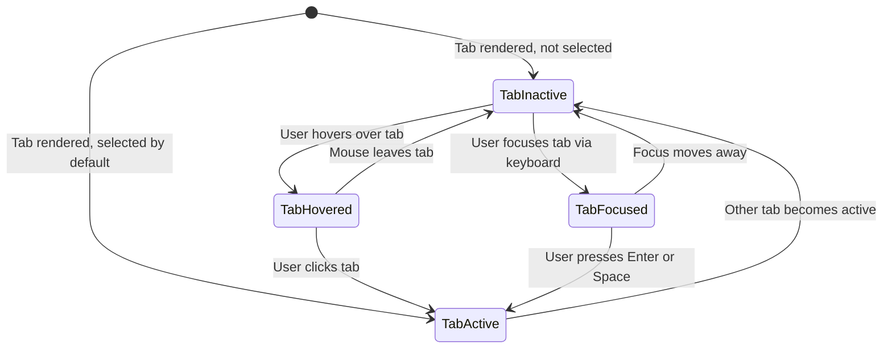

# Wireframes — Sprint 6

**By**: Luna (UX) | **Status**: Current | **Date**: 2026-02-23

Sprint 6 introduces tab-based navigation: a Low Battery tab (existing table) and an Unavailable Devices tab (same table format, Status column replaces % Remaining). Three wireframes cover the two tab states and the full set of tab visual states.

> **Tooling convention**: All wireframes and specs use **WireMD** syntax. The only Mermaid diagram in this file is the tab state machine — a genuine UML diagram. See `vulcan-brownout-team/wireframe/SKILL.md`.

---

## Wireframe 17: Main Panel with Tab Bar — Low Battery Tab Active

The tab bar renders immediately below the 56px header and above the entity table. Two tabs are present. The Low Battery tab is active (default on first load). The existing entity table is rendered below.

```wiremd
<!-- Wireframe 17: Low Battery Tab Active — Luna | Sprint 6 | 2026-02-23 -->

# 🔋 Battery Monitoring | Connected 🟢

[[ Low Battery* | Unavailable Devices ]]

---

| Last Seen | Entity | Area | Mfr / Model | % |
|-----------|--------|------|-------------|---|
| 2m ago | Front Door Lock | Entrance | Schlage BE469 | **8%** |
| 5m ago | Motion Sensor Kitchen | Kitchen | Aqara MS-S02 | **12%** |
| 8m ago | Patio Door Sensor | Outside | Sonoff SNZB-04 | **14%** |
```

### Tab Bar — Spacing & Sizing

```wiremd
| Property | Value |
|----------|-------|
| Row height | 40px |
| Left padding | 16px |
| Gap between tabs | 24px |
| Active tab border | 2px solid --primary-color (bottom only) |
| Active tab text | --primary-color, font-weight: 600 |
| Inactive tab text | --secondary-text-color, font-weight: 400 |
| Min tab width | 80px |
| Touch target height | Full 40px row |
```

---

## Wireframe 18: Unavailable Devices Tab Selected

When the user clicks the Unavailable Devices tab, the active indicator moves to that tab and the table renders unavailable/unknown entities. The % Remaining column is replaced by a Status column showing grey pill badges.

```wiremd
<!-- Wireframe 18: Unavailable Devices Tab Active — Luna | Sprint 6 | 2026-02-23 -->

# 🔋 Battery Monitoring | Connected 🟢

[[ Low Battery | Unavailable Devices* ]]

---

| Last Seen | Entity | Area | Mfr / Model | Status |
|-----------|--------|------|-------------|--------|
| 1h ago | Garage Door Sensor | Garage | Aqara | [unavailable]{.badge} |
| 3h ago | Back Door Lock | Yard | Schlage | [unknown]{.badge} |
| 6h ago | Attic Humidity Sensor | Attic | Sonoff | [unavailable]{.badge} |
```

### Column Comparison: Low Battery vs Unavailable

```wiremd
| # | Low Battery Tab | Unavailable Tab |
|---|-----------------|-----------------|
| 1 | Last Seen | Last Seen |
| 2 | Entity Name | Entity Name |
| 3 | Area | Area |
| 4 | Manufacturer and Model | Manufacturer and Model |
| 5 | **% Remaining** — red number | **Status** — grey pill badge |
```

---

## Wireframe 19: Tab Visual States

Documents all visual states for the tab bar: active, inactive, hover, focus, and the two empty states.

### Tab State Machine



### Tab State — Visual Specs

```wiremd
| State | Color | Font Weight | Bottom Border |
|-------|-------|-------------|---------------|
| Active | --primary-color (#03A9F4) | 600 | 2px solid --primary-color |
| Inactive | --secondary-text-color (grey) | 400 | none |
| Hover (on inactive) | slightly darker grey | 400 | 2px dashed --secondary-text-color |
| Focus (keyboard) | — | — | outline: 2px solid --primary-color, offset: 2px (focus-visible only) |
```

### Empty States

```wiremd
<!-- Wireframe 19a: Low Battery Empty State — Luna | Sprint 6 | 2026-02-23 -->

# 🔋 Battery Monitoring | Connected 🟢

[[ Low Battery* | Unavailable Devices ]]

---

> :battery: **All batteries above 15%**
> No low battery devices found.
```

```wiremd
<!-- Wireframe 19b: Unavailable Devices Empty State — Luna | Sprint 6 | 2026-02-23 -->

# 🔋 Battery Monitoring | Connected 🟢

[[ Low Battery | Unavailable Devices* ]]

---

> :check: **No unavailable devices.**
> All monitored devices are responding.
```

### Status Badge — Component Specification

```wiremd
| Property | Value |
|----------|-------|
| background | rgba(158,158,158,0.12) |
| border | 1px solid #9E9E9E |
| color | --secondary-text-color |
| border-radius | 12px (pill shape) |
| padding | 2px 8px |
| font-size | 12px |
| font-weight | 400 (regular) |
| text content | `unavailable` or `unknown` (lowercase) |
| display | inline-block |
```

---

## Design Consistency Rules

1. **Tab bar position**: Always between the 56px header and the entity table.
2. **Active tab indicator**: 2px solid bottom border using `--primary-color` only. No filled background, no rounded corners, no shadow.
3. **No animation on tab switch**: Active indicator moves instantly. No CSS transition.
4. **Tab count**: Exactly two tabs in Sprint 6. Additional tabs require a new ADR.
5. **Status badge**: Grey pill used only in the Unavailable Devices tab Status column.
6. **Empty state icons**: Low Battery = battery icon; Unavailable = checkmark/ok icon. Must be visually distinct.
7. **Lazy data load**: Unavailable tab data is never fetched on panel startup — only on first tab activation.
8. **No filter bar**: Removed as part of v6.0.0 simplification.

---

## Implementation Checklist (for Architect)

- [ ] Add `_activeTab` property (String, default "low-battery") to Lit element
- [ ] Add `_unavailableEntities` and `_unavailableTotal` properties (default null)
- [ ] Read `sessionStorage.getItem("vulcan_brownout_active_tab")` in `connectedCallback()` before first fetch
- [ ] Render tab bar: `<div role="tablist">` with two `<button role="tab">` elements
- [ ] Apply `active` CSS class to the currently active tab button; remove from the other
- [ ] CSS `.tab.active`: `color: var(--primary-color); font-weight: 600; border-bottom: 2px solid var(--primary-color)`
- [ ] CSS `.tab:not(.active)`: `color: var(--secondary-text-color); font-weight: 400; border-bottom: none`
- [ ] Conditional table render based on `_activeTab` value
- [ ] On Unavailable tab click: if `_unavailableEntities === null`, call `vulcan-brownout/query_unavailable`; cache result
- [ ] Unavailable table renders same row template as Low Battery, substituting Status badge for % column
- [ ] Add status badge CSS: grey pill per component spec above
- [ ] Add Low Battery empty state: battery icon + "All batteries above 15%"
- [ ] Add Unavailable empty state: ok icon + "No unavailable devices."
- [ ] Save tab on switch: `sessionStorage.setItem("vulcan_brownout_active_tab", this._activeTab)`
- [ ] Add ARIA: tablist, tab, aria-selected, tabpanel, aria-labelledby, aria-controls
- [ ] Keyboard: Tab focuses tabs, Enter/Space activates focused tab
- [ ] Verify WCAG AA contrast for active tab text in both light and dark themes
- [ ] Verify WCAG AA contrast for inactive tab text in both themes
- [ ] Verify status badge text contrast in both themes
