# Wireframes — Sprint 4

**By**: Luna (UX) | **Status**: IN PROGRESS

All wireframes below are complete screen layouts for Vulcan Brownout. Mermaid diagrams define structure, layout, and component relationships. Refer to these as source of truth for visual hierarchy and component positioning.

---

## Wireframe 1: Main Panel Layout (Default State)

The main panel shows the battery device list with header, sort/filter controls, device cards grouped by status, and footer.

```mermaid
graph TD
    classDef headerBg fill:#03A9F4,stroke:#0288D1,color:#FFF
    classDef cardBg fill:#F5F5F5,stroke:#E0E0E0,color:#212121
    classDef darkCardBg fill:#2C2C2C,stroke:#444444,color:#FFF
    classDef criticalColor fill:#F44336,stroke:#D32F2F,color:#FFF
    classDef warningColor fill:#FF9800,stroke:#F57C00,color:#FFF
    classDef healthyColor fill:#4CAF50,stroke:#388E3C,color:#FFF
    classDef unavailableColor fill:#9E9E9E,stroke:#757575,color:#FFF
    classDef actionBg fill:#03A9F4,stroke:#0288D1,color:#FFF

    Root[("Panel Container<br/>(100% width, flex column)")]

    Header["HEADER<br/>─────────────────<br/>🔋 Battery Monitoring | Connected 🟢 | ⚙️ Settings | 🔔 Notifications"]

    ControlBar["SORT/FILTER BAR<br/>─────────────────<br/>[▼ Priority] [▼ All Batteries N] [×]"]

    DeviceList["DEVICE LIST CONTAINER<br/>(scrollable, flex 1)"]

    Critical["CRITICAL SECTION (N items)<br/>─────────────────"]
    CritCard1["[🔋 Front Door Lock | 8% | ⚠️ CRITICAL]"]
    CritCard2["[🔋 Garage Door Sensor | 12% | ⚠️ CRITICAL]"]

    Warning["WARNING SECTION (N items)<br/>─────────────────"]
    WarnCard1["[🔋 Motion Sensor Kitchen | 24% | ⚡ WARNING]"]

    Healthy["HEALTHY SECTION (N items)<br/>─────────────────"]
    HealthCard1["[🔋 Window Sensor Bedroom | 78% | ✓ HEALTHY]"]
    HealthCard2["[🔋 Smart Lock Foyer | 92% | ✓ HEALTHY]"]

    Unavail["UNAVAILABLE SECTION (N items)<br/>─────────────────"]
    UnavailCard1["[🔋 Old Sensor Attic | N/A | ❌ UNAVAILABLE]"]

    Footer["FOOTER<br/>─────────────────<br/>🔄 Updated 2m ago | ↑ Back to Top"]

    BackToTop["BACK TO TOP BUTTON<br/>(fixed, bottom-right, 48×48px)<br/>↑"]

    Root --> Header
    Root --> ControlBar
    Root --> DeviceList
    Root --> Footer
    Root --> BackToTop

    Header --> class headerBg
    DeviceList --> Critical
    Critical --> CritCard1
    CritCard1 --> class criticalColor
    Critical --> CritCard2
    CritCard2 --> class criticalColor
    DeviceList --> Warning
    Warning --> WarnCard1
    WarnCard1 --> class warningColor
    DeviceList --> Healthy
    Healthy --> HealthCard1
    HealthCard1 --> class healthyColor
    Healthy --> HealthCard2
    HealthCard2 --> class healthyColor
    DeviceList --> Unavail
    Unavail --> UnavailCard1
    UnavailCard1 --> class unavailableColor
    Footer --> class headerBg
    BackToTop --> class actionBg
```

### Main Panel — Component Details

```mermaid
graph LR
    classDef primary fill:#03A9F4,stroke:#0288D1,color:#FFF
    classDef neutral fill:#F5F5F5,stroke:#E0E0E0,color:#212121

    Panel["Panel Container"]
    Header["Header (56px)"]
    Title["🔋 Battery Monitoring"]
    Controls["Control Group"]
    Badge["Connection Badge"]
    SettingsBtn["⚙️ Settings Button (44px)"]
    NotifyBtn["🔔 Notifications Button (44px)"]

    Panel --> Header
    Header --> Title
    Header --> Controls
    Controls --> Badge
    Controls --> SettingsBtn
    Controls --> NotifyBtn

    class Header primary
    class Badge neutral
    class SettingsBtn primary
    class NotifyBtn primary
```



---

## Wireframe 2: Device Card Anatomy

Each battery device is displayed as a card. Card layout is consistent across all status levels.


### Device Card States

```mermaid
stateDiagram-v2
    [*] --> Critical: battery ≤ threshold
    [*] --> Warning: threshold < battery ≤ threshold+15%
    [*] --> Healthy: battery > threshold+15%
    [*] --> Unavailable: available === false

    Critical --> CritCard: Display red card, "CRITICAL" label
    Warning --> WarnCard: Display amber card, "WARNING" label
    Healthy --> HealthCard: Display green card, "HEALTHY" label
    Unavailable --> UnavailCard: Display grey card, "N/A", 0.6 opacity

    CritCard --> [*]
    WarnCard --> [*]
    HealthCard --> [*]
    UnavailCard --> [*]
```



---

## Wireframe 3: Skeleton Loaders (Loading State)

When fetching the initial device list or paginating, skeleton loaders appear.

```mermaid
graph TD
    classDef skeletonBg fill:#E0E0E0,stroke:#C0C0C0,color:#757575
    classDef darkSkeletonBg fill:#444444,stroke:#333333,color:#B0B0B0

    Container["Skeleton Container (scrollable)"]

    Skeleton1["Skeleton Loader 1 (64px height)"]
    Skeleton2["Skeleton Loader 2 (64px height)"]
    Skeleton3["Skeleton Loader 3 (64px height)"]
    Skeleton4["Skeleton Loader 4 (64px height)"]
    Skeleton5["Skeleton Loader 5 (64px height)"]

    Loading["SHIMMER ANIMATION<br/>(2s cycle, left-to-right gradient)"]

    Container --> Skeleton1
    Container --> Skeleton2
    Container --> Skeleton3
    Container --> Skeleton4
    Container --> Skeleton5

    Skeleton1 --> class skeletonBg
    Skeleton1 --> Loading
    Skeleton2 --> class skeletonBg
    Skeleton2 --> Loading
    Skeleton3 --> class skeletonBg
    Skeleton3 --> Loading
    Skeleton4 --> class skeletonBg
    Skeleton4 --> Loading
    Skeleton5 --> class skeletonBg
    Skeleton5 --> Loading
```

---

## Wireframe 4: Notification Preferences Modal

Modal slides from bottom on mobile, from right on desktop. Contains multiple sections: global toggle, frequency cap, severity filter, per-device list, and history.

```mermaid
graph TD
    classDef modalHeader fill:#03A9F4,stroke:#0288D1,color:#FFF
    classDef modalBg fill:#FFFFFF,stroke:#E0E0E0,color:#212121
    classDef darkModalBg fill:#1C1C1C,stroke:#444444,color:#FFF
    classDef sectionBg fill:#F5F5F5,stroke:#E0E0E0,color:#212121
    classDef primaryBtn fill:#03A9F4,stroke:#0288D1,color:#FFF
    classDef secondaryBtn fill:#9E9E9E,stroke:#757575,color:#FFF

    Modal["Modal Container<br/>(600px max-width, 80vh max-height)"]
    Header["Modal Header<br/>🔔 Notification Preferences | [×]"]
    Body["Modal Body (scrollable)"]

    Section1["SECTION 1: Global Toggle<br/>☐ Enable Notifications"]
    Section2["SECTION 2: Frequency Cap<br/>Dropdown: [1h | 6h | 24h ▾]"]
    Section3["SECTION 3: Severity Filter<br/>◉ Critical Only  ○ Critical & Warning"]
    Section4["SECTION 4: Per-Device List<br/>Search: [device name .........]<br/>☐ Front Door Lock<br/>☐ Motion Sensor Kitchen<br/>☐ Window Sensor Bedroom<br/>☐ Smart Lock Foyer<br/>[Show more...]"]
    Section5["SECTION 5: Notification History<br/>Last 5 notifications:<br/>Front Door Lock | 8% | 2h ago<br/>Motion Sensor | 24% | 1d ago"]

    Footer["Modal Footer<br/>[💾 Save] [Cancel]"]

    Modal --> Header
    Modal --> Body
    Modal --> Footer

    Body --> Section1
    Body --> Section2
    Body --> Section3
    Body --> Section4
    Body --> Section5

    class Modal modalBg
    class Header modalHeader
    class Section1 sectionBg
    class Section2 sectionBg
    class Section3 sectionBg
    class Section4 sectionBg
    class Section5 sectionBg
    class Footer modalHeader
```



### Notification Modal — Interaction Flow

```mermaid
sequenceDiagram
    participant User
    participant Modal as Notification Modal
    participant Panel as Panel JS
    participant API as HA WebSocket API

    User->>Modal: Open modal (click 🔔 button)
    Modal->>Panel: Load current preferences
    Panel->>API: GET_NOTIFICATION_PREFERENCES
    API-->>Panel: {enabled, frequency_cap_hours, severity_filter, per_device, history}
    Panel-->>Modal: Display current state

    User->>Modal: Toggle Enable Notifications
    Modal->>Panel: Update local state

    User->>Modal: Change Frequency Cap dropdown
    Modal->>Panel: Update local state

    User->>Modal: Select Severity radio button
    Modal->>Panel: Update local state

    User->>Modal: Search per-device list
    Modal->>Panel: Filter visible devices

    User->>Modal: Click [💾 Save]
    Modal->>Panel: Validate changes
    Panel->>API: SET_NOTIFICATION_PREFERENCES
    API-->>Panel: Preferences saved
    Panel-->>Modal: Show toast "Preferences saved"
    Modal->>User: Close modal
```



---

## Wireframe 5: Settings Panel (Threshold Configuration)

Settings modal allows users to configure the global battery threshold and per-device overrides.

```mermaid
graph TD
    classDef modalHeader fill:#03A9F4,stroke:#0288D1,color:#FFF
    classDef modalBg fill:#FFFFFF,stroke:#E0E0E0,color:#212121
    classDef inputBg fill:#F5F5F5,stroke:#E0E0E0,color:#212121
    classDef primaryBtn fill:#03A9F4,stroke:#0288D1,color:#FFF
    classDef secondaryBtn fill:#9E9E9E,stroke:#757575,color:#FFF

    Modal["Modal Container<br/>(600px max-width, 80vh max-height)"]
    Header["Modal Header<br/>⚙️ Threshold Settings | [×]"]
    Body["Modal Body"]

    GlobalSection["GLOBAL THRESHOLD<br/>Label: Global Threshold (%)<br/>Input: [________ ] (5-100)"]
    PerDeviceSection["PER-DEVICE OVERRIDES<br/>(Future Sprint 4 enhancement)<br/>Currently disabled"]

    Footer["Modal Footer<br/>[💾 Save] [Cancel]"]

    Modal --> Header
    Modal --> Body
    Modal --> Footer

    Body --> GlobalSection
    Body --> PerDeviceSection

    class Modal modalBg
    class Header modalHeader
    class GlobalSection inputBg
    class PerDeviceSection inputBg
    class Footer modalHeader
```



---

## Wireframe 6: Empty State (No Battery Devices)

When the query returns zero battery entities, show a helpful empty state.

```mermaid
graph TD
    classDef container fill:#FFFFFF,stroke:#E0E0E0,color:#212121
    classDef icon fill:none,stroke:none,color:#212121
    classDef text fill:none,stroke:none,color:#757575
    classDef primaryBtn fill:#03A9F4,stroke:#0288D1,color:#FFF
    classDef linkBtn fill:none,stroke:#0288D1,color:#0288D1

    EmptyState["Empty State Container<br/>(center, padding 40px)"]

    IconSection["Icon Section<br/>🔋 (48px)"]

    MessageSection["Message Section"]
    Title["No battery entities found"]
    Subtitle["Check that your devices have a battery_level attribute<br/>and are not binary sensors."]

    RequirementsList["REQUIREMENTS:<br/>✓ Device has battery_level attribute<br/>✓ Device is not a binary sensor<br/>✓ Device is available in Home Assistant"]

    CTASection["Call-to-Action Buttons"]
    DocsBtn["[📖 Docs]"]
    RefreshBtn["[🔄 Refresh]"]
    SettingsBtn["[⚙️ Settings]"]

    EmptyState --> IconSection
    EmptyState --> MessageSection
    MessageSection --> Title
    MessageSection --> Subtitle
    EmptyState --> RequirementsList
    EmptyState --> CTASection
    CTASection --> DocsBtn
    CTASection --> RefreshBtn
    CTASection --> SettingsBtn

    class EmptyState container
    class Title text
    class DocsBtn primaryBtn
    class RefreshBtn primaryBtn
    class SettingsBtn primaryBtn
```



---

## Wireframe 7: Error State (Connection Lost)

When WebSocket connection is lost, show error message with retry button.

```mermaid
graph TD
    classDef errorContainer fill:#FFF3E0,stroke:#FF9800,color:#E65100
    classDef errorText fill:none,stroke:none,color:#E65100
    classDef retryBtn fill:#FF9800,stroke:#F57C00,color:#FFF

    ErrorState["Error Container<br/>(top of panel, 16px padding)"]

    ErrorIcon["⚠️ Icon"]
    ErrorMsg["Connection lost. Retrying..."]
    RetryBtn["[🔄 RETRY]"]

    ErrorState --> ErrorIcon
    ErrorState --> ErrorMsg
    ErrorState --> RetryBtn

    class ErrorState errorContainer
    class ErrorMsg errorText
    class RetryBtn retryBtn
```



---

## Wireframe 8: Back-to-Top Button

Fixed position button appears after scrolling past ~30 items (≈1000px). Fades in/out smoothly.


---

## Wireframe 9: Dark Mode Theme Detection & Transition

Shows how theme detection and CSS variable switching works. No visual change to layout, only color values update.


---

## Wireframe 10: Mobile Layout (< 768px)

On mobile, the panel adapts: single-column device list, full-width modals slide from bottom.

```mermaid
graph TD
    classDef mobile fill:#F5F5F5,stroke:#E0E0E0,color:#212121
    classDef header fill:#03A9F4,stroke:#0288D1,color:#FFF

    Mobile["Mobile Panel (100% width)"]

    HeaderMobile["HEADER (56px)<br/>🔋 Battery Monitoring<br/>[⚙️] [🔔] Connection Badge"]

    FilterBarMobile["FILTER BAR (single row)<br/>[▼ Priority] [All ▾]"]

    ListMobile["DEVICE LIST (scrollable)<br/>Single-column device cards<br/>(full width, 44px min touch target)"]

    ModalMobile["NOTIFICATION MODAL (mobile)<br/>Slides from bottom (full height)<br/>Max-width: 100vw<br/>Animation: slideUp 300ms"]

    Mobile --> HeaderMobile
    Mobile --> FilterBarMobile
    Mobile --> ListMobile
    Mobile --> ModalMobile

    class Mobile mobile
    class HeaderMobile header
```



---

## Wireframe 11: Component Color Palette & Token Application

All components use CSS custom properties for theme switching.

```mermaid
graph TD
    classDef lightMode fill:#FFFFFF,stroke:#E0E0E0,color:#212121
    classDef darkMode fill:#1C1C1C,stroke:#444444,color:#FFF

    Host["Host Element<br/>(:host CSS variables)"]

    Light["LIGHT MODE<br/>────────────<br/>--vb-bg-primary: #FFFFFF<br/>--vb-bg-card: #F5F5F5<br/>--vb-text-primary: #212121<br/>--vb-color-critical: #F44336<br/>--vb-color-warning: #FF9800<br/>--vb-color-healthy: #4CAF50"]

    Dark["DARK MODE<br/>────────────<br/>--vb-bg-primary: #1C1C1C<br/>--vb-bg-card: #2C2C2C<br/>--vb-text-primary: #FFFFFF<br/>--vb-color-critical: #FF5252<br/>--vb-color-warning: #FFB74D<br/>--vb-color-healthy: #66BB6A"]

    Host --> Light
    Host --> Dark

    class Light lightMode
    class Dark darkMode
```



---

## Design Consistency Rules (All Screens)

1. **Layout**: Flexbox, 16px padding, full-height panel
2. **Typography**: System font stack (SF Pro Display / Segoe UI), 14px body, 12px secondary, 18px modal headers
3. **Touch targets**: All buttons, checkboxes, radios ≥ 44px
4. **Transitions**: 300ms ease on colors, 0.3s opacity on buttons/modals
5. **Icons**: Battery icon for devices, connection dot (green/orange/red), emoji-based (🔋🟢⚙️🔔↑)
6. **Spacing**: 8px grid, 16px sections, 12px gaps between elements
7. **Colors**: Use CSS custom properties only (no hardcoded hex values)
8. **Dark mode**: Applies to all backgrounds, text, shadows, skeleton loaders

---

## Responsive Breakpoints

- **Desktop** (≥ 1024px): Multi-column potential (future), full modals slide from right, settings advanced
- **Tablet** (600–1024px): Single-column, comfortable spacing, full-width modals slide from bottom
- **Mobile** (< 600px): Compact mode, single-column, touch-optimized spacing, full-height modals

---

## Implementation Checklist (for Architect)

- [ ] Implement all wireframe layouts using Lit template syntax
- [ ] Apply CSS custom properties to every themed element
- [ ] Ensure all touch targets meet 44px minimum
- [ ] Test skeleton loaders animate smoothly (no jank)
- [ ] Test modals slide smoothly on mobile/desktop
- [ ] Test back-to-top fade in/out (300ms, smooth)
- [ ] Test empty state message clarity on first load
- [ ] Test error state display + retry button
- [ ] Test dark/light mode switch via `hass.themes.darkMode`
- [ ] Verify color contrast (WCAG AA) in both themes
