# Wireframes — Sprint 4

**By**: Luna (UX) | **Status**: IN PROGRESS

All wireframes below are complete screen layouts for Vulcan Brownout. Mermaid diagrams define structure, layout, and component relationships. Refer to these as source of truth for visual hierarchy and component positioning.

---

## Wireframe 1: Main Panel Layout (Default State)

The main panel shows the battery device list with header, sort/filter controls, device cards grouped by status, and footer.

```mermaid
graph TD
    classDef headerBg fill:#03A9F4,stroke:#0288D1,color:#FFF
    classDef cardBg fill:#F5F5F5,stroke:#E0E0E0,color:#212121
    classDef darkCardBg fill:#2C2C2C,stroke:#444444,color:#FFF
    classDef criticalColor fill:#F44336,stroke:#D32F2F,color:#FFF
    classDef warningColor fill:#FF9800,stroke:#F57C00,color:#FFF
    classDef healthyColor fill:#4CAF50,stroke:#388E3C,color:#FFF
    classDef unavailableColor fill:#9E9E9E,stroke:#757575,color:#FFF
    classDef actionBg fill:#03A9F4,stroke:#0288D1,color:#FFF

    Root[("Panel Container<br/>(100% width, flex column)")]

    Header["HEADER<br/>─────────────────<br/>🔋 Battery Monitoring | Connected 🟢 | ⚙️ Settings | 🔔 Notifications"]

    ControlBar["SORT/FILTER BAR<br/>─────────────────<br/>[▼ Priority] [▼ All Batteries N] [×]"]

    DeviceList["DEVICE LIST CONTAINER<br/>(scrollable, flex 1)"]

    Critical["CRITICAL SECTION (N items)<br/>─────────────────"]
    CritCard1["[🔋 Front Door Lock | 8% | ⚠️ CRITICAL]"]
    CritCard2["[🔋 Garage Door Sensor | 12% | ⚠️ CRITICAL]"]

    Warning["WARNING SECTION (N items)<br/>─────────────────"]
    WarnCard1["[🔋 Motion Sensor Kitchen | 24% | ⚡ WARNING]"]

    Healthy["HEALTHY SECTION (N items)<br/>─────────────────"]
    HealthCard1["[🔋 Window Sensor Bedroom | 78% | ✓ HEALTHY]"]
    HealthCard2["[🔋 Smart Lock Foyer | 92% | ✓ HEALTHY]"]

    Unavail["UNAVAILABLE SECTION (N items)<br/>─────────────────"]
    UnavailCard1["[🔋 Old Sensor Attic | N/A | ❌ UNAVAILABLE]"]

    Footer["FOOTER<br/>─────────────────<br/>🔄 Updated 2m ago | ↑ Back to Top"]

    BackToTop["BACK TO TOP BUTTON<br/>(fixed, bottom-right, 48×48px)<br/>↑"]

    Root --> Header
    Root --> ControlBar
    Root --> DeviceList
    Root --> Footer
    Root --> BackToTop

    Header --> class headerBg
    DeviceList --> Critical
    Critical --> CritCard1
    CritCard1 --> class criticalColor
    Critical --> CritCard2
    CritCard2 --> class criticalColor
    DeviceList --> Warning
    Warning --> WarnCard1
    WarnCard1 --> class warningColor
    DeviceList --> Healthy
    Healthy --> HealthCard1
    HealthCard1 --> class healthyColor
    Healthy --> HealthCard2
    HealthCard2 --> class healthyColor
    DeviceList --> Unavail
    Unavail --> UnavailCard1
    UnavailCard1 --> class unavailableColor
    Footer --> class headerBg
    BackToTop --> class actionBg
```

### Main Panel — Component Details

```mermaid
graph LR
    classDef primary fill:#03A9F4,stroke:#0288D1,color:#FFF
    classDef neutral fill:#F5F5F5,stroke:#E0E0E0,color:#212121

    Panel["Panel Container"]
    Header["Header (56px)"]
    Title["🔋 Battery Monitoring"]
    Controls["Control Group"]
    Badge["Connection Badge"]
    SettingsBtn["⚙️ Settings Button (44px)"]
    NotifyBtn["🔔 Notifications Button (44px)"]

    Panel --> Header
    Header --> Title
    Header --> Controls
    Controls --> Badge
    Controls --> SettingsBtn
    Controls --> NotifyBtn

    class Header primary
    class Badge neutral
    class SettingsBtn primary
    class NotifyBtn primary
```

---

## Wireframe 2: Device Card Anatomy

Each battery device is displayed as a card. Card layout is consistent across all status levels.


### Device Card States

```mermaid
stateDiagram-v2
    [*] --> Critical: battery ≤ threshold
    [*] --> Warning: threshold < battery ≤ threshold+15%
    [*] --> Healthy: battery > threshold+15%
    [*] --> Unavailable: available === false

    Critical --> CritCard: Display red card, "CRITICAL" label
    Warning --> WarnCard: Display amber card, "WARNING" label
    Healthy --> HealthCard: Display green card, "HEALTHY" label
    Unavailable --> UnavailCard: Display grey card, "N/A", 0.6 opacity

    CritCard --> [*]
    WarnCard --> [*]
    HealthCard --> [*]
    UnavailCard --> [*]
```

---

## Wireframe 3: Skeleton Loaders (Loading State)

When fetching the initial device list or paginating, skeleton loaders appear.

```mermaid
graph TD
    classDef skeletonBg fill:#E0E0E0,stroke:#C0C0C0,color:#757575
    classDef darkSkeletonBg fill:#444444,stroke:#333333,color:#B0B0B0

    Container["Skeleton Container (scrollable)"]

    Skeleton1["Skeleton Loader 1 (64px height)"]
    Skeleton2["Skeleton Loader 2 (64px height)"]
    Skeleton3["Skeleton Loader 3 (64px height)"]
    Skeleton4["Skeleton Loader 4 (64px height)"]
    Skeleton5["Skeleton Loader 5 (64px height)"]

    Loading["SHIMMER ANIMATION<br/>(2s cycle, left-to-right gradient)"]

    Container --> Skeleton1
    Container --> Skeleton2
    Container --> Skeleton3
    Container --> Skeleton4
    Container --> Skeleton5

    Skeleton1 --> class skeletonBg
    Skeleton1 --> Loading
    Skeleton2 --> class skeletonBg
    Skeleton2 --> Loading
    Skeleton3 --> class skeletonBg
    Skeleton3 --> Loading
    Skeleton4 --> class skeletonBg
    Skeleton4 --> Loading
    Skeleton5 --> class skeletonBg
    Skeleton5 --> Loading
```

---

## Wireframe 4: Notification Preferences Modal

Modal slides from bottom on mobile, from right on desktop. Contains multiple sections: global toggle, frequency cap, severity filter, per-device list, and history.

```mermaid
graph TD
    classDef modalHeader fill:#03A9F4,stroke:#0288D1,color:#FFF
    classDef modalBg fill:#FFFFFF,stroke:#E0E0E0,color:#212121
    classDef darkModalBg fill:#1C1C1C,stroke:#444444,color:#FFF
    classDef sectionBg fill:#F5F5F5,stroke:#E0E0E0,color:#212121
    classDef primaryBtn fill:#03A9F4,stroke:#0288D1,color:#FFF
    classDef secondaryBtn fill:#9E9E9E,stroke:#757575,color:#FFF

    Modal["Modal Container<br/>(600px max-width, 80vh max-height)"]
    Header["Modal Header<br/>🔔 Notification Preferences | [×]"]
    Body["Modal Body (scrollable)"]

    Section1["SECTION 1: Global Toggle<br/>☐ Enable Notifications"]
    Section2["SECTION 2: Frequency Cap<br/>Dropdown: [1h | 6h | 24h ▾]"]
    Section3["SECTION 3: Severity Filter<br/>◉ Critical Only  ○ Critical & Warning"]
    Section4["SECTION 4: Per-Device List<br/>Search: [device name .........]<br/>☐ Front Door Lock<br/>☐ Motion Sensor Kitchen<br/>☐ Window Sensor Bedroom<br/>☐ Smart Lock Foyer<br/>[Show more...]"]
    Section5["SECTION 5: Notification History<br/>Last 5 notifications:<br/>Front Door Lock | 8% | 2h ago<br/>Motion Sensor | 24% | 1d ago"]

    Footer["Modal Footer<br/>[💾 Save] [Cancel]"]

    Modal --> Header
    Modal --> Body
    Modal --> Footer

    Body --> Section1
    Body --> Section2
    Body --> Section3
    Body --> Section4
    Body --> Section5

    class Modal modalBg
    class Header modalHeader
    class Section1 sectionBg
    class Section2 sectionBg
    class Section3 sectionBg
    class Section4 sectionBg
    class Section5 sectionBg
    class Footer modalHeader
```

### Notification Modal — Interaction Flow

```mermaid
sequenceDiagram
    participant User
    participant Modal as Notification Modal
    participant Panel as Panel JS
    participant API as HA WebSocket API

    User->>Modal: Open modal (click 🔔 button)
    Modal->>Panel: Load current preferences
    Panel->>API: GET_NOTIFICATION_PREFERENCES
    API-->>Panel: {enabled, frequency_cap_hours, severity_filter, per_device, history}
    Panel-->>Modal: Display current state

    User->>Modal: Toggle Enable Notifications
    Modal->>Panel: Update local state

    User->>Modal: Change Frequency Cap dropdown
    Modal->>Panel: Update local state

    User->>Modal: Select Severity radio button
    Modal->>Panel: Update local state

    User->>Modal: Search per-device list
    Modal->>Panel: Filter visible devices

    User->>Modal: Click [💾 Save]
    Modal->>Panel: Validate changes
    Panel->>API: SET_NOTIFICATION_PREFERENCES
    API-->>Panel: Preferences saved
    Panel-->>Modal: Show toast "Preferences saved"
    Modal->>User: Close modal
```

---

## Wireframe 5: Settings Panel (Threshold Configuration)

Settings modal allows users to configure the global battery threshold and per-device overrides.

```mermaid
graph TD
    classDef modalHeader fill:#03A9F4,stroke:#0288D1,color:#FFF
    classDef modalBg fill:#FFFFFF,stroke:#E0E0E0,color:#212121
    classDef inputBg fill:#F5F5F5,stroke:#E0E0E0,color:#212121
    classDef primaryBtn fill:#03A9F4,stroke:#0288D1,color:#FFF
    classDef secondaryBtn fill:#9E9E9E,stroke:#757575,color:#FFF

    Modal["Modal Container<br/>(600px max-width, 80vh max-height)"]
    Header["Modal Header<br/>⚙️ Threshold Settings | [×]"]
    Body["Modal Body"]

    GlobalSection["GLOBAL THRESHOLD<br/>Label: Global Threshold (%)<br/>Input: [________ ] (5-100)"]
    PerDeviceSection["PER-DEVICE OVERRIDES<br/>(Future Sprint 4 enhancement)<br/>Currently disabled"]

    Footer["Modal Footer<br/>[💾 Save] [Cancel]"]

    Modal --> Header
    Modal --> Body
    Modal --> Footer

    Body --> GlobalSection
    Body --> PerDeviceSection

    class Modal modalBg
    class Header modalHeader
    class GlobalSection inputBg
    class PerDeviceSection inputBg
    class Footer modalHeader
```

---

## Wireframe 6: Empty State (No Battery Devices)

When the query returns zero battery entities, show a helpful empty state.

```mermaid
graph TD
    classDef container fill:#FFFFFF,stroke:#E0E0E0,color:#212121
    classDef icon fill:none,stroke:none,color:#212121
    classDef text fill:none,stroke:none,color:#757575
    classDef primaryBtn fill:#03A9F4,stroke:#0288D1,color:#FFF
    classDef linkBtn fill:none,stroke:#0288D1,color:#0288D1

    EmptyState["Empty State Container<br/>(center, padding 40px)"]

    IconSection["Icon Section<br/>🔋 (48px)"]

    MessageSection["Message Section"]
    Title["No battery entities found"]
    Subtitle["Check that your devices have a battery_level attribute<br/>and are not binary sensors."]

    RequirementsList["REQUIREMENTS:<br/>✓ Device has battery_level attribute<br/>✓ Device is not a binary sensor<br/>✓ Device is available in Home Assistant"]

    CTASection["Call-to-Action Buttons"]
    DocsBtn["[📖 Docs]"]
    RefreshBtn["[🔄 Refresh]"]
    SettingsBtn["[⚙️ Settings]"]

    EmptyState --> IconSection
    EmptyState --> MessageSection
    MessageSection --> Title
    MessageSection --> Subtitle
    EmptyState --> RequirementsList
    EmptyState --> CTASection
    CTASection --> DocsBtn
    CTASection --> RefreshBtn
    CTASection --> SettingsBtn

    class EmptyState container
    class Title text
    class DocsBtn primaryBtn
    class RefreshBtn primaryBtn
    class SettingsBtn primaryBtn
```

---

## Wireframe 7: Error State (Connection Lost)

When WebSocket connection is lost, show error message with retry button.

```mermaid
graph TD
    classDef errorContainer fill:#FFF3E0,stroke:#FF9800,color:#E65100
    classDef errorText fill:none,stroke:none,color:#E65100
    classDef retryBtn fill:#FF9800,stroke:#F57C00,color:#FFF

    ErrorState["Error Container<br/>(top of panel, 16px padding)"]

    ErrorIcon["⚠️ Icon"]
    ErrorMsg["Connection lost. Retrying..."]
    RetryBtn["[🔄 RETRY]"]

    ErrorState --> ErrorIcon
    ErrorState --> ErrorMsg
    ErrorState --> RetryBtn

    class ErrorState errorContainer
    class ErrorMsg errorText
    class RetryBtn retryBtn
```

---

## Wireframe 8: Back-to-Top Button

Fixed position button appears after scrolling past ~30 items (≈1000px). Fades in/out smoothly.


---

## Wireframe 9: Dark Mode Theme Detection & Transition

Shows how theme detection and CSS variable switching works. No visual change to layout, only color values update.


---

## Wireframe 10: Mobile Layout (< 768px)

On mobile, the panel adapts: single-column device list, full-width modals slide from bottom.

```mermaid
graph TD
    classDef mobile fill:#F5F5F5,stroke:#E0E0E0,color:#212121
    classDef header fill:#03A9F4,stroke:#0288D1,color:#FFF

    Mobile["Mobile Panel (100% width)"]

    HeaderMobile["HEADER (56px)<br/>🔋 Battery Monitoring<br/>[⚙️] [🔔] Connection Badge"]

    FilterBarMobile["FILTER BAR (single row)<br/>[▼ Priority] [All ▾]"]

    ListMobile["DEVICE LIST (scrollable)<br/>Single-column device cards<br/>(full width, 44px min touch target)"]

    ModalMobile["NOTIFICATION MODAL (mobile)<br/>Slides from bottom (full height)<br/>Max-width: 100vw<br/>Animation: slideUp 300ms"]

    Mobile --> HeaderMobile
    Mobile --> FilterBarMobile
    Mobile --> ListMobile
    Mobile --> ModalMobile

    class Mobile mobile
    class HeaderMobile header
```

---

## Wireframe 11: Component Color Palette & Token Application

All components use CSS custom properties for theme switching.

```mermaid
graph TD
    classDef lightMode fill:#FFFFFF,stroke:#E0E0E0,color:#212121
    classDef darkMode fill:#1C1C1C,stroke:#444444,color:#FFF

    Host["Host Element<br/>(:host CSS variables)"]

    Light["LIGHT MODE<br/>────────────<br/>--vb-bg-primary: #FFFFFF<br/>--vb-bg-card: #F5F5F5<br/>--vb-text-primary: #212121<br/>--vb-color-critical: #F44336<br/>--vb-color-warning: #FF9800<br/>--vb-color-healthy: #4CAF50"]

    Dark["DARK MODE<br/>────────────<br/>--vb-bg-primary: #1C1C1C<br/>--vb-bg-card: #2C2C2C<br/>--vb-text-primary: #FFFFFF<br/>--vb-color-critical: #FF5252<br/>--vb-color-warning: #FFB74D<br/>--vb-color-healthy: #66BB6A"]

    Host --> Light
    Host --> Dark

    class Light lightMode
    class Dark darkMode
```

---

## Design Consistency Rules (All Screens)

1. **Layout**: Flexbox, 16px padding, full-height panel
2. **Typography**: System font stack (SF Pro Display / Segoe UI), 14px body, 12px secondary, 18px modal headers
3. **Touch targets**: All buttons, checkboxes, radios ≥ 44px
4. **Transitions**: 300ms ease on colors, 0.3s opacity on buttons/modals
5. **Icons**: Battery icon for devices, connection dot (green/orange/red), emoji-based (🔋🟢⚙️🔔↑)
6. **Spacing**: 8px grid, 16px sections, 12px gaps between elements
7. **Colors**: Use CSS custom properties only (no hardcoded hex values)
8. **Dark mode**: Applies to all backgrounds, text, shadows, skeleton loaders

---

## Responsive Breakpoints

- **Desktop** (≥ 1024px): Multi-column potential (future), full modals slide from right, settings advanced
- **Tablet** (600–1024px): Single-column, comfortable spacing, full-width modals slide from bottom
- **Mobile** (< 600px): Compact mode, single-column, touch-optimized spacing, full-height modals

---

## Implementation Checklist (for Architect)

- [ ] Implement all wireframe layouts using Lit template syntax
- [ ] Apply CSS custom properties to every themed element
- [ ] Ensure all touch targets meet 44px minimum
- [ ] Test skeleton loaders animate smoothly (no jank)
- [ ] Test modals slide smoothly on mobile/desktop
- [ ] Test back-to-top fade in/out (300ms, smooth)
- [ ] Test empty state message clarity on first load
- [ ] Test error state display + retry button
- [ ] Test dark/light mode switch via `hass.themes.darkMode`
- [ ] Verify color contrast (WCAG AA) in both themes

---

# Wireframes — Sprint 5

**By**: Luna (UX) | **Status**: IN PROGRESS | **Date**: 2026-02-22

Sprint 5 adds five new wireframes covering the Simple Filtering feature: filter bar, filter dropdown, active chips, mobile bottom sheet, and the filtered empty state.

---

## Wireframe 12: Filter Bar Layout (Desktop)

The filter bar renders below the header and above the device list on desktop (>= 768px). It replaces and extends the existing sort/filter control bar. Four labeled dropdown trigger buttons appear side by side. Active buttons are visually accented. A chip row conditionally appears below when at least one filter is active.


### Filter Bar — Spacing & Sizing Rules


---

## Wireframe 13: Filter Dropdown (Expanded State)

When a filter trigger button is clicked, a positioned dropdown panel opens below it. The dropdown is not a native `<select>` — it is a custom `<div>` panel with a checkbox list for multi-select. This wireframe shows the "Room" dropdown expanded with two values checked.


### Dropdown — Interaction States

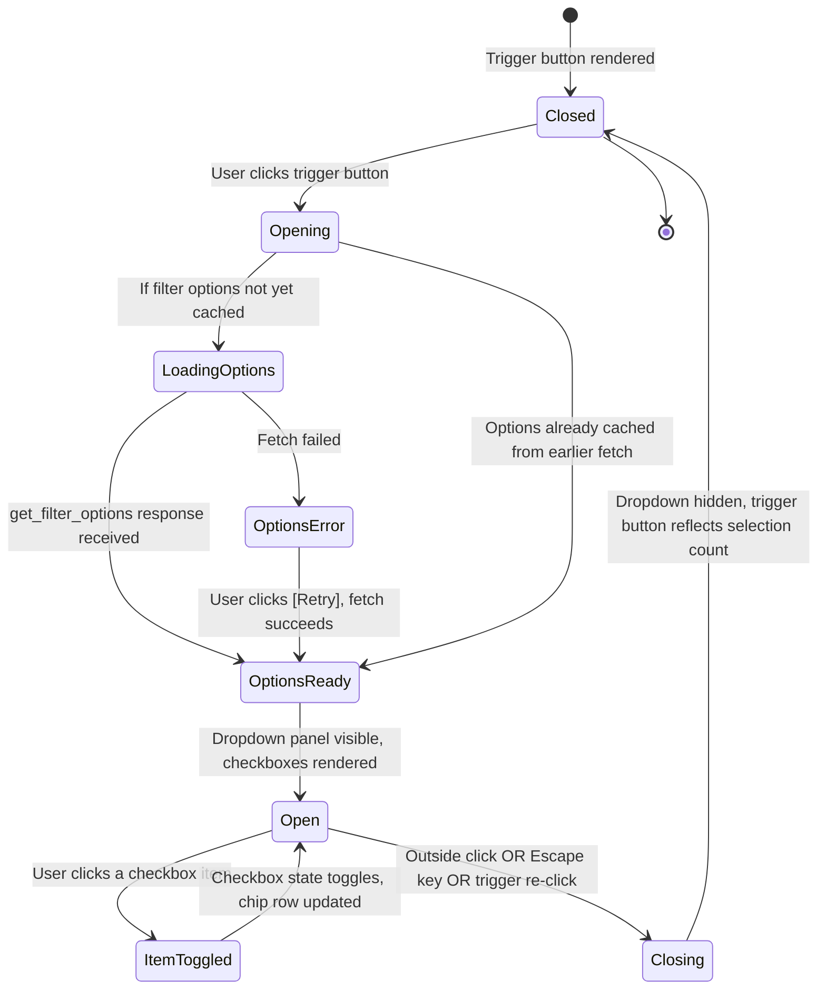

### Dropdown — Positioning Rules


---

## Wireframe 14: Active Filter Chips Row

The chip row renders below the filter bar row and is conditionally present (not just hidden) when at least one filter value is active. Each chip represents one selected filter value. Multiple chips appear when multiple values are selected. A "Clear all" text link appears at the end of the chip row.

```mermaid
graph TD
    classDef chipRowContainer fill:#E3F2FD,stroke:#90CAF9,color:#0D47A1
    classDef chip fill:#E3F2FD,stroke:#90CAF9,color:#0D47A1
    classDef clearAllBtn fill:none,stroke:none,color:#0288D1
    classDef chipLabel fill:none,stroke:none,color:#0D47A1
    classDef xBtn fill:none,stroke:none,color:#0D47A1

    ChipRow["CHIP ROW CONTAINER<br/>display: flex | flex-wrap: nowrap | overflow-x: auto<br/>padding: 6px 16px | gap: 8px | align-items: center<br/>background: --vb-bg-primary<br/>border-bottom: 1px solid --vb-border-color<br/>animation: slideDown 200ms ease-out on appear<br/>animation: slideUp 200ms ease-in on remove"]

    ChipA["CHIP: Manufacturer: Aqara<br/>[ Manufacturer: Aqara  × ]<br/>height: 32px | padding: 0 8px | border-radius: 16px<br/>background: --vb-filter-chip-bg<br/>border: 1px solid --vb-filter-chip-border"]

    ChipB["CHIP: Room: Living Room<br/>[ Room: Living Room  × ]"]

    ChipC["CHIP: Room: Kitchen<br/>[ Room: Kitchen  × ]"]

    ChipD["CHIP: Status: Critical<br/>[ Status: Critical  × ]"]

    ClearAll["[ Clear all ]<br/>text link style | color: --vb-color-accent<br/>min-width: 44px touch target via padding<br/>margin-left: auto (right-aligned)"]

    ChipRow --> ChipA
    ChipRow --> ChipB
    ChipRow --> ChipC
    ChipRow --> ChipD
    ChipRow --> ClearAll

    class ChipRow chipRowContainer
    class ChipA chip
    class ChipB chip
    class ChipC chip
    class ChipD chip
    class ClearAll clearAllBtn
```

### Chip Row — Anatomy of a Single Chip

```mermaid
graph LR
    classDef chipPart fill:#E3F2FD,stroke:#90CAF9,color:#0D47A1
    classDef xPart fill:#BBDEFB,stroke:#90CAF9,color:#0D47A1

    Chip["Chip Element (32px height, pill)"]
    CategoryLabel["Category prefix (12px, medium weight)<br/>e.g., 'Manufacturer: '"]
    ValueLabel["Value (12px, regular weight)<br/>e.g., 'Aqara'"]
    Separator["  (non-breaking space)"]
    XButton["[×] remove button (16px icon)<br/>padding: 4px (extends touch target)<br/>aria-label: 'Remove Manufacturer: Aqara filter'"]

    Chip --> CategoryLabel
    Chip --> ValueLabel
    Chip --> Separator
    Chip --> XButton

    class Chip chipPart
    class CategoryLabel chipPart
    class ValueLabel chipPart
    class XButton xPart
```

### Chip Row — Scroll Behavior (Overflow)

```mermaid
graph TD
    classDef scroll fill:#F5F5F5,stroke:#E0E0E0,color:#212121

    ScrollNote["CHIP ROW OVERFLOW BEHAVIOR"]
    Rule1["flex-wrap: nowrap — chips never wrap to second line"]
    Rule2["overflow-x: auto — chip row scrolls horizontally when chips overflow viewport"]
    Rule3["scrollbar-width: thin (desktop) | hidden on mobile (touch scroll)"]
    Rule4["Clear all is NOT pinned — it scrolls with the chip row on overflow"]
    Rule5["On very wide viewports, chip row is left-aligned, not stretched"]

    ScrollNote --> Rule1
    ScrollNote --> Rule2
    ScrollNote --> Rule3
    ScrollNote --> Rule4
    ScrollNote --> Rule5

    class Rule1 scroll
    class Rule2 scroll
    class Rule3 scroll
    class Rule4 scroll
    class Rule5 scroll
```

---

## Wireframe 15: Mobile Filter Bottom Sheet

On mobile (< 768px), the four individual filter dropdowns are replaced by a single "Filter" button. Tapping it opens a full-width bottom sheet that slides up from the bottom of the viewport. The sheet presents all four filter categories as accordion sections. Changes inside the sheet are staged and not applied until the user taps "Apply Filters".

```mermaid
graph TD
    classDef mobileHeader fill:#03A9F4,stroke:#0288D1,color:#FFF
    classDef filterBarMobile fill:#F0F0F0,stroke:#E0E0E0,color:#212121
    classDef filterBtnMobile fill:#03A9F4,stroke:#0288D1,color:#FFF
    classDef overlay fill:#000000,stroke:none,color:#FFF,opacity:0.5
    classDef sheetContainer fill:#FFFFFF,stroke:#E0E0E0,color:#212121
    classDef sheetHeader fill:#F5F5F5,stroke:#E0E0E0,color:#212121
    classDef accordionSection fill:#FFFFFF,stroke:#E0E0E0,color:#212121
    classDef accordionExpanded fill:#F0F7FF,stroke:#90CAF9,color:#0D47A1
    classDef sheetFooter fill:#FFFFFF,stroke:#E0E0E0,color:#212121
    classDef applyBtn fill:#03A9F4,stroke:#0288D1,color:#FFF

    MobilePanel["MOBILE PANEL (100% width)"]

    MobileHeader["HEADER (56px)"]

    MobileFilterBar["MOBILE FILTER BAR (48px)<br/>display: flex | align-items: center | padding: 0 16px"]
    SortDropdown["[▼ Sort: Priority]<br/>(left side)"]
    FilterBtn["[Filter (3) ▼]<br/>(right side, badge shows 3 active)<br/>background: --vb-filter-active-bg (accent)<br/>color: white"]

    Overlay["OVERLAY<br/>position: fixed | inset: 0<br/>background: rgba(0,0,0,0.5)<br/>z-index: 200<br/>fade in 200ms"]

    BottomSheet["BOTTOM SHEET CONTAINER<br/>position: fixed | bottom: 0 | left: 0 | right: 0<br/>max-height: 85vh | overflow-y: auto<br/>background: --vb-bg-primary<br/>border-radius: 16px 16px 0 0<br/>box-shadow: 0 -4px 20px rgba(0,0,0,0.2)<br/>z-index: 201<br/>animation: slideUp 300ms ease-out"]

    SheetHeader["SHEET HEADER (sticky, 56px)<br/>display: flex | align-items: center | padding: 0 16px<br/>border-bottom: 1px solid --vb-border-color"]
    SheetTitle["'Filters' (18px, bold, flex-1)"]
    ClearAllLink["[Clear All]<br/>(text link, color: --vb-color-accent)"]
    CloseBtn["[X]<br/>(44px touch target)"]

    SheetBody["SHEET BODY (scrollable)"]

    AccMfr["ACCORDION: Manufacturer (collapsed)<br/>[Manufacturer ▶]<br/>height: 48px | padding: 0 16px"]
    AccClass["ACCORDION: Device Class (collapsed)<br/>[Device Class ▶]<br/>height: 48px | padding: 0 16px"]
    AccStatus["ACCORDION: Status (expanded)<br/>[Status ▼]<br/>─────────────────<br/>☑ Critical (accent bg)<br/>☐ Warning<br/>☑ Healthy (accent bg)<br/>☐ Unavailable"]
    AccRoom["ACCORDION: Room (collapsed)<br/>[Room ▶]<br/>height: 48px | padding: 0 16px"]

    SheetFooter["SHEET FOOTER (sticky, 64px)<br/>padding: 8px 16px<br/>border-top: 1px solid --vb-border-color"]
    ApplyBtn["[Apply Filters]<br/>full-width primary button<br/>height: 48px | border-radius: 4px"]

    MobilePanel --> MobileHeader
    MobilePanel --> MobileFilterBar
    MobileFilterBar --> SortDropdown
    MobileFilterBar --> FilterBtn
    MobilePanel --> Overlay
    MobilePanel --> BottomSheet

    BottomSheet --> SheetHeader
    SheetHeader --> SheetTitle
    SheetHeader --> ClearAllLink
    SheetHeader --> CloseBtn
    BottomSheet --> SheetBody
    SheetBody --> AccMfr
    SheetBody --> AccClass
    SheetBody --> AccStatus
    SheetBody --> AccRoom
    BottomSheet --> SheetFooter
    SheetFooter --> ApplyBtn

    class MobileHeader mobileHeader
    class MobileFilterBar filterBarMobile
    class SortDropdown filterBarMobile
    class FilterBtn filterBtnMobile
    class Overlay overlay
    class BottomSheet sheetContainer
    class SheetHeader sheetHeader
    class AccMfr accordionSection
    class AccClass accordionSection
    class AccStatus accordionExpanded
    class AccRoom accordionSection
    class SheetFooter sheetHeader
    class ApplyBtn applyBtn
```

### Mobile Bottom Sheet — Accordion Item Anatomy

```mermaid
graph LR
    classDef collapsed fill:#FFFFFF,stroke:#E0E0E0,color:#212121
    classDef expanded fill:#F0F7FF,stroke:#90CAF9,color:#0D47A1
    classDef checkboxRow fill:#FFFFFF,stroke:none,color:#212121
    classDef checkboxChecked fill:#E3F2FD,stroke:#90CAF9,color:#0D47A1

    Collapsed["COLLAPSED ACCORDION ITEM (48px)<br/>[ Category Label         (N selected) ▶ ]<br/>border-bottom: 1px solid --vb-border-color<br/>padding: 0 16px | display: flex | align-items: center"]

    Expanded["EXPANDED ACCORDION ITEM<br/>[ Category Label         (N selected) ▼ ]<br/>─────────────────────────────<br/>Checkbox list (44px per row)"]

    CheckRow1["[ ☐  Option A ]  (44px height, unchecked)"]
    CheckRow2["[ ☑  Option B ]  (44px height, checked, accent bg)"]
    CheckRow3["[ ☐  Option C ]  (44px height, unchecked)"]

    Collapsed -->|User taps header| Expanded
    Expanded --> CheckRow1
    Expanded --> CheckRow2
    Expanded --> CheckRow3
    Expanded -->|User taps header again| Collapsed

    class Collapsed collapsed
    class Expanded expanded
    class CheckRow1 checkboxRow
    class CheckRow2 checkboxChecked
    class CheckRow3 checkboxRow
```

### Mobile Bottom Sheet — Stage vs. Apply Logic

```mermaid
sequenceDiagram
    participant User
    participant Sheet as Bottom Sheet
    participant Panel as Panel JS

    User->>Sheet: Taps "Filter" button
    Panel->>Sheet: Open sheet, copy current active filters to staged state
    Sheet->>Sheet: Render staged state in accordion checkboxes

    User->>Sheet: Checks "Manufacturer: Aqara" checkbox
    Sheet->>Sheet: Update staged state only (no API call)

    User->>Sheet: Unchecks "Status: Healthy"
    Sheet->>Sheet: Update staged state only

    User->>Sheet: Taps "Apply Filters"
    Sheet->>Panel: Commit staged filters as new active filters
    Panel->>Panel: Update chip row, reset cursor
    Panel->>Panel: Save to localStorage
    Panel->>Panel: Issue query_devices with new filters
    Sheet->>Sheet: Close (slide down 300ms)

    User->>Sheet: Taps [X] without applying
    Sheet->>Sheet: Discard staged state
    Sheet->>Sheet: Close (slide down 300ms)
    Panel->>Panel: No change to active filters or device list
```

---

## Wireframe 16: Empty State with Active Filters

When the server returns zero devices because the active filters match nothing, a dedicated filtered empty state is shown. This is visually and contextually different from the "no battery devices at all" empty state (Wireframe 6). The battery icon is replaced with a filter/funnel icon. Copy explains that filters are the cause. The single CTA clears all filters.

```mermaid
graph TD
    classDef container fill:#FFFFFF,stroke:#E0E0E0,color:#212121
    classDef filterIconStyle fill:none,stroke:none,color:#9E9E9E
    classDef titleStyle fill:none,stroke:none,color:#212121
    classDef subtitleStyle fill:none,stroke:none,color:#757575
    classDef clearBtn fill:#03A9F4,stroke:#0288D1,color:#FFF

    FilterBar["FILTER BAR (still visible with active chips)<br/>Chip row: [ Manufacturer: Aqara × ] [ Room: Garage × ] | [Clear all]"]

    Divider["─────────────────────────────────"]

    FilteredEmptyState["FILTERED EMPTY STATE CONTAINER<br/>display: flex | flex-direction: column | align-items: center<br/>padding: 48px 24px | text-align: center"]

    FilterIcon["FILTER ICON (48px)<br/>(funnel/filter SVG icon, color: --vb-text-secondary)<br/>margin-bottom: 16px"]

    EmptyTitle["No devices match your filters.<br/>(18px, bold, --vb-text-primary)<br/>margin-bottom: 8px"]

    EmptySubtitle["Try removing one or more filters,<br/>or clear all filters to see the full device list.<br/>(14px, --vb-text-secondary)<br/>max-width: 320px | margin-bottom: 24px"]

    ClearFiltersBtn["[ Clear Filters ]<br/>primary button style<br/>height: 44px | padding: 0 24px<br/>font-size: 14px"]

    FilteredEmptyState --> FilterIcon
    FilteredEmptyState --> EmptyTitle
    FilteredEmptyState --> EmptySubtitle
    FilteredEmptyState --> ClearFiltersBtn

    FilterBar --> Divider
    Divider --> FilteredEmptyState

    class FilteredEmptyState container
    class FilterIcon filterIconStyle
    class EmptyTitle titleStyle
    class EmptySubtitle subtitleStyle
    class ClearFiltersBtn clearBtn
```

### Filtered Empty State vs. No-Devices Empty State — Comparison

```mermaid
graph LR
    classDef noDevices fill:#FFF3E0,stroke:#FFB74D,color:#212121
    classDef filtered fill:#E3F2FD,stroke:#90CAF9,color:#212121

    NoDevices["WIREFRAME 6: No Battery Devices<br/>─────────────────<br/>Icon: 🔋 Battery (48px)<br/>Title: No battery entities found<br/>Subtitle: Check battery_level attribute...<br/>CTAs: [Docs] [Refresh] [Settings]<br/>Cause: No battery devices in HA<br/>Filter bar: N/A (no filters active)"]

    Filtered["WIREFRAME 16: Filtered — No Results<br/>─────────────────<br/>Icon: Funnel/Filter (48px, grey)<br/>Title: No devices match your filters.<br/>Subtitle: Try removing filters...<br/>CTA: [Clear Filters] (single button)<br/>Cause: Filters too restrictive<br/>Filter bar: Visible with active chip row"]

    NoDevices <--> Filtered

    class NoDevices noDevices
    class Filtered filtered
```

---

## Sprint 5 Design Consistency Additions

The following rules extend the existing Design Consistency Rules for all filter UI components:

1. **Filter bar**: Always visible when devices exist; hidden only on the no-devices empty state (Wireframe 6)
2. **Chip row**: Conditionally rendered (not just hidden) — removed from DOM when no filters active to avoid empty space
3. **Dropdown z-index**: 100 (above device list cards, below modal overlays at z-index 200+)
4. **Bottom sheet z-index**: 201 (above overlay at 200)
5. **Filter options**: All four categories (manufacturer, device_class, status, area) populated dynamically; hardcoded values never used
6. **Active filter count**: Filter trigger buttons show `(N)` suffix when N > 0 values selected
7. **Staging on mobile**: Bottom sheet always stages — never applies mid-selection to avoid UX disruption
8. **Chip category prefix**: Always shows category name before value for clarity (`Room: Living Room`, not just `Living Room`)

---

## Sprint 5 Implementation Checklist (for Architect)

- [ ] Implement filter bar row with four dropdown trigger buttons (desktop)
- [ ] Implement mobile filter bar with single "Filter" button
- [ ] Implement dropdown panels (positioned, custom div, not native select)
- [ ] Implement checkbox lists inside dropdowns (multi-select per category)
- [ ] Implement chip row as separate conditionally-rendered DOM element
- [ ] Implement chip [x] removal and "Clear all" functionality
- [ ] Implement chip row slide-in/slide-out animation (200ms)
- [ ] Implement mobile bottom sheet (slide-up 300ms, overlay, accordion sections)
- [ ] Implement staged filter state in bottom sheet vs. committed filter state
- [ ] Implement "Apply Filters" and discard-on-close behavior for bottom sheet
- [ ] Implement filtered empty state (Wireframe 16) distinct from no-devices state (Wireframe 6)
- [ ] Apply new CSS custom properties (--vb-bg-secondary, --vb-filter-chip-*, --vb-filter-active-*, --vb-overlay-bg)
- [ ] Verify all filter UI elements meet 44px touch target minimum
- [ ] Verify WCAG AA contrast on chips, dropdown items, and filter trigger buttons in both themes
- [ ] Test dropdown positioning (right-edge overflow and bottom-edge overflow correction)
- [ ] Test chip row horizontal scroll on narrow viewports
- [ ] Test bottom sheet accordion expand/collapse on real mobile device
