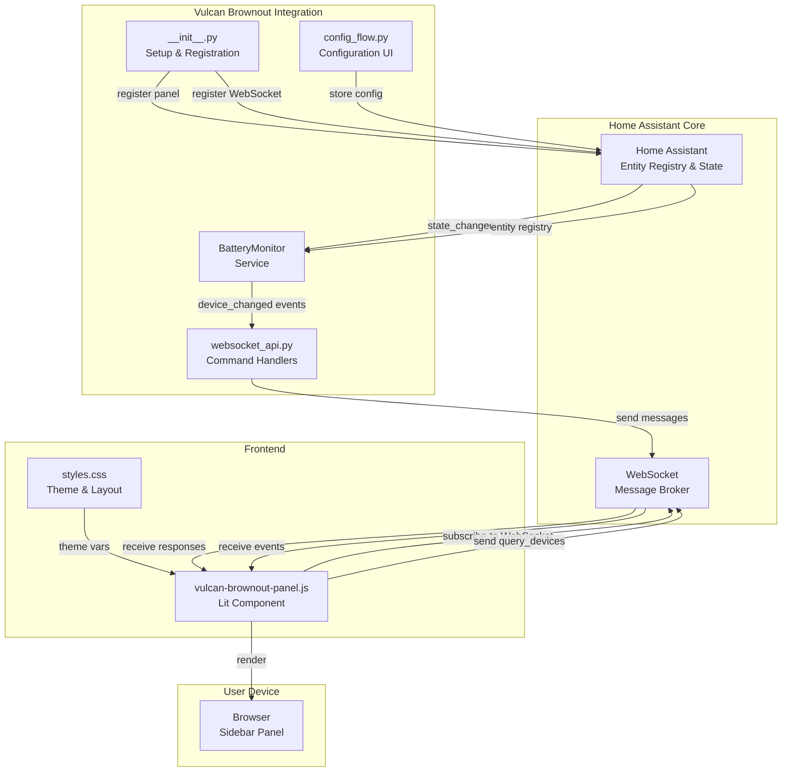

# Vulcan Brownout: System Design

## Overview

Vulcan Brownout is a custom Home Assistant integration that provides real-time monitoring of low-battery devices and unavailable entities through a dedicated sidebar panel. The system consists of:

1. **Backend Integration** — Python service managing battery device state and WebSocket API
2. **Frontend Panel** — Lit-based custom sidebar panel with infinite scroll
3. **WebSocket API** — Real-time bidirectional communication protocol
4. **Configuration System** — User preferences (battery threshold, device classes)

The system is designed for scalability (1000+ devices), minimal entity footprint (no sensor entity pollution), and real-time responsiveness (sub-second updates).

---

## Architecture

### Component Diagram



### Component Responsibilities

#### Backend Components

**`__init__.py` (Integration Entry Point)**
- Registers the custom integration with HA
- Creates config entry and options flows
- Initializes `BatteryMonitor` service
- Registers WebSocket command `vulcan-brownout/query_devices`
- Registers event listeners for state changes
- Registers sidebar panel via `panel_custom`

**`config_flow.py` (Configuration UI)**
- Initial setup: User enters battery threshold (default 15%)
- Device class selection: Which types of devices to track (battery, smoke, temperature, etc.)
- Options flow: Runtime changes without restarting HA
- Validation: Ensure threshold is 0-100%

**`BatteryMonitor` Service (`battery_monitor.py`)**
- Maintains in-memory cache of filtered battery devices
- Listens for entity state changes via HA's event system
- Implements filtering logic: `device_class=battery` AND `battery_level < threshold`
- Provides async method `query_devices(limit, offset, sort_key, sort_order)` for pagination
- Broadcasts `device_changed` events to subscribed WebSocket connections
- Handles unavailable entities (tracks both battery level and availability state)

**`websocket_api.py` (WebSocket Message Handler)**
- Registers WebSocket command `vulcan-brownout/query_devices`
- Parses incoming request, validates parameters (limit, offset, sort_key)
- Calls `BatteryMonitor.query_devices()` with request parameters
- Builds response payload with pagination metadata
- Sends response back to client with proper message ID
- Manages client subscriptions (tracks which entities each client is viewing)
- Handles connection lifecycle (on_connect, on_disconnect)

#### Frontend Components

**`vulcan-brownout-panel.js` (Lit Custom Element)**
- Extends `LitElement` and `LocalizeMixin` for i18n support
- Manages component state: `battery_devices[]`, `isLoading`, `hasMore`, `totalItems`, `currentOffset`, `sortKey`, `sortOrder`
- Connects to HA's WebSocket (via `getAuth()` from `hass` object)
- Sends `vulcan-brownout/query_devices` requests when:
  - Panel first loads
  - User changes sort order
  - User scrolls to bottom (infinite scroll)
- Listens for `vulcan-brownout/device_changed` events and updates local state
- Implements Intersection Observer API for infinite scroll detection
- Renders device list with battery icons, levels, availability status
- Handles WebSocket disconnection with reconnection logic

**`styles.css` (Theming & Layout)**
- Shadow DOM styles (encapsulated)
- CSS custom properties for HA theme colors (dark/light mode support)
- Responsive layout: mobile-first approach
- Infinite scroll container with fixed header
- Battery status visual indicators (color-coded: green > yellow > red)

---

## Data Flow

### User Interaction: Initial Load

```
1. User opens sidebar → Panel loads
2. Panel component mounts
   └─→ Call: this._connect_websocket()
   └─→ Listen: vulcan-brownout/status event

3. Backend sends: { type: 'vulcan-brownout/status', data: { status: 'connected' } }
   └─→ Frontend: sets isConnected = true

4. Frontend sends: {
     type: 'vulcan-brownout/query_devices',
     data: { limit: 20, offset: 0, sort_key: 'battery_level', sort_order: 'asc' }
   }

5. Backend processes:
   └─→ Get all entities from entity_registry
   └─→ Filter: device_class=battery AND battery_level < threshold
   └─→ Sort: by battery_level (ascending)
   └─→ Paginate: limit 20, offset 0
   └─→ Build response

6. Backend sends response: {
     type: 'result',
     id: '<msg_id>',
     data: {
       devices: [...20 devices...],
       total: 127,
       offset: 0,
       limit: 20
     }
   }

7. Frontend renders: 20 device rows in the list
   └─→ Set: hasMore = (0 + 20) < 127 = true
```

### User Interaction: Scroll to Bottom (Infinite Scroll)

```
1. User scrolls → IntersectionObserver detects bottom element

2. Frontend sends: {
     type: 'vulcan-brownout/query_devices',
     data: { limit: 20, offset: 20, sort_key: 'battery_level', sort_order: 'asc' }
   }

3. Backend responds with devices [20-40] + total=127

4. Frontend appends 20 new items to battery_devices[]
   └─→ Re-render: adds 20 new rows (does NOT re-render existing 20)

5. If offset + limit >= total:
   └─→ Set: hasMore = false
   └─→ Remove: infinite scroll sentinel element
   └─→ Show: "End of list" message
```

### Real-Time Update: Battery Level Changes

```
1. Device battery level changes (e.g., phone battery drops from 15% to 10%)
   └─→ HA fires: state_changed event (entity_id=sensor.phone_battery)

2. Backend BatteryMonitor listens for state_changed
   └─→ Check: Is sensor.phone_battery in our filtered set?
   └─→ Check: Is it currently visible to any WebSocket client?

3. For each connected client viewing this device:
   └─→ Send: {
       type: 'vulcan-brownout/device_changed',
       data: {
         entity_id: 'sensor.phone_battery',
         battery_level: 10,
         available: true,
         last_changed: '2026-02-22T...'
       }
     }

4. Frontend receives event
   └─→ Find device in battery_devices[] by entity_id
   └─→ Update: device.battery_level = 10
   └─→ Trigger re-render (Lit automatically detects property change)
   └─→ UI updates: battery icon color changes to red, % value updates
```

### User Interaction: Sort Change

```
1. User clicks sort header (e.g., "Name" column)
   └─→ Call: this._on_sort_click('name')

2. Frontend updates state:
   └─→ sortKey = 'name'
   └─→ sortOrder = (sortOrder === 'asc' ? 'desc' : 'asc')
   └─→ currentOffset = 0  // RESET pagination
   └─→ battery_devices = []  // Clear existing list

3. Frontend sends: {
     type: 'vulcan-brownout/query_devices',
     data: { limit: 20, offset: 0, sort_key: 'name', sort_order: 'asc' }
   }

4. Backend responds with sorted results

5. Frontend renders new list (sorted by name)
```

### Connection Loss and Reconnection

```
1. WebSocket connection drops (network error, HA restart, etc.)
   └─→ Frontend: isConnected = false
   └─→ Display: "Connection lost..." message over list

2. Frontend starts exponential backoff reconnection:
   └─→ Attempt 1: Wait 1s, reconnect
   └─→ Attempt 2: Wait 2s, reconnect
   └─→ Attempt 3: Wait 4s, reconnect
   └─→ ... up to 30s max

3. Connection succeeds
   └─→ Send: { type: 'vulcan-brownout/query_devices', ... }
   └─→ Receive: device list
   └─→ Update: battery_devices[], hasMore, totalItems
   └─→ Display: full list (may differ from before disconnect)
   └─→ Show: "Connection restored" toast notification
```

---

## Entity Filtering Logic

### Filtering Criteria

```python
# In BatteryMonitor.query_devices()
filtered_devices = []

for entity in hass.states.async_all():
    state_dict = hass.states.get(entity.entity_id)

    # Criterion 1: Is it a battery device?
    # Check: device_class attribute from entity registry
    if get_device_class(entity.entity_id) != 'battery':
        continue

    # Criterion 2: Parse battery level (handle strings like "12%" or "12")
    try:
        battery_level = float(state_dict.state)
    except (ValueError, TypeError):
        # Invalid state (e.g., "unknown", "unavailable")
        # For unavailable entities: show with level=0, available=False
        battery_level = 0
        available = False
    else:
        available = (state_dict.state != 'unavailable')

    # Criterion 3: Is it below threshold?
    if battery_level < config['threshold']:
        filtered_devices.append({
            'entity_id': entity.entity_id,
            'battery_level': battery_level,
            'available': available,
            ...
        })

# Sort, paginate, return
return sorted_and_paginated(filtered_devices)
```

### Unavailable Entity Handling

- **Unavailable devices** (network disconnected, disabled, etc.) are included in the list
- Display as: battery level = 0%, status = "unavailable", shown in gray
- Still sorted and paginated like available devices
- Intent: Help users identify dead/offline devices

---

## Pagination and Sorting

### Supported Sort Keys

| Key | Description | Type | Example |
|-----|-------------|------|---------|
| `battery_level` | Battery percentage (default) | numeric | Lowest first (asc) or highest (desc) |
| `name` | Entity display name | string | A-Z or Z-A |
| `device_name` | Device name | string | A-Z or Z-A |
| `last_changed` | Last state change timestamp | datetime | Oldest first or newest |
| `available` | Availability status | boolean | Unavailable first or available |

### Pagination

- Default page size: 20 items per request
- Max page size: 100 (enforced to prevent abuse)
- Offset-based (not cursor-based) for simplicity
- Total count included in response for infinite scroll logic

---

## Interfaces

### WebSocket Message Format

All messages follow HA's WebSocket protocol:

```json
{
  "type": "command_type",
  "id": "unique_message_id",
  "data": { }
}
```

See `api-contracts.md` for full message schemas.

### Configuration Entry Schema

```python
# In config_flow.py
config_data = {
    'threshold': 15,  # int, 0-100
    'device_classes': ['battery'],  # list of device classes to monitor
    'enabled': True
}
```

### Event Schemas

See `api-contracts.md` for `device_changed` and `status` event schemas.

---

## Dependencies

### Backend (Python)

- `homeassistant` — HA core (no extra version beyond homeassistant's own)
- Built-in HA WebSocket API (no extra dependencies)
- Built-in HA config flow framework

### Frontend (JavaScript)

- `lit@2.x` — Already bundled in HA, no extra bundle size
- HA's `hass` object for authentication and state access
- Standard Web APIs: Fetch, WebSocket, IntersectionObserver, localStorage
- No external npm dependencies

---

## Error Handling

### Backend Errors

| Scenario | Behavior |
|----------|----------|
| Invalid sort_key | Return error message; list defaults to battery_level sort |
| offset > total | Return empty devices array (not an error) |
| threshold not set | Use default 15% |
| Entity state is non-numeric | Treat as unavailable; battery_level = 0 |
| WebSocket connection drops | HA handles; frontend auto-reconnects |

### Frontend Errors

| Scenario | Behavior |
|----------|----------|
| WebSocket timeout (10s) | Show "Connection lost" message; retry with exponential backoff |
| Invalid response from backend | Log error; show toast "Failed to load devices" |
| Browser doesn't support Intersection Observer | Fallback to "Load More" button |
| Theme variables not available | Use fallback colors (light theme) |

---

## Security & Privacy

- **Authentication:** Uses HA's WebSocket session token (no API keys)
- **Authorization:** Only shows devices the user can access (HA's entity access control)
- **No Data Persistence:** All data is ephemeral (in-memory); no logging of battery levels
- **No Telemetry:** No data sent to external services
- **HTTPS Only:** All communication through HA's existing secure WebSocket

---

## Performance Characteristics

### Memory Usage (Backend)

- In-memory cache: ~1KB per device (entity_id, name, battery_level, timestamp)
- With 1000 devices: ~1MB cache size (negligible)
- Per connection: ~500 bytes (tracking visible entities)
- With 50 concurrent connections: ~25KB (negligible)

### Network Bandwidth

- Initial query: ~3KB (20 devices × 150 bytes each)
- Subsequent pagination: ~3KB per request
- Device change event: ~200 bytes per event
- With 100 device changes/min: ~20KB/min traffic (negligible)

### Latency

- Query-to-response: ~50-100ms (local, no network)
- Device change event: ~10-20ms after state change
- Panel render: ~16ms per Lit re-render (60 FPS)

### Scalability

| Metric | Limit | Reasoning |
|--------|-------|-----------|
| Devices per instance | 5000+ | O(n) filtering; acceptable at scale |
| Concurrent panel users | 50+ | Each connection uses ~500 bytes; negligible |
| Max page size | 100 | Prevents accidental large payloads |
| Max concurrent queries | Limited by HA | Should be fine; async handling |

---

## Testing Strategy

### Unit Tests (Backend)

- `test_battery_monitor.py`: Query, filter, sort, paginate logic
- `test_websocket_api.py`: Message parsing, error handling
- `test_config_flow.py`: Validation, options flow

### Integration Tests (Backend)

- Spin up HA test instance with Vulcan Brownout
- Add mock entities with battery device_class
- Verify filtering, sorting, pagination
- Verify WebSocket communication end-to-end

### Frontend Tests

- `test_vulcan-brownout_panel.js`: State management, re-render logic
- Mock WebSocket for testing message handling
- Mock HA's `hass` object for authentication
- Test infinite scroll Intersection Observer logic

### Manual Tests

- Mobile viewport (Safari, Chrome)
- Dark/light theme switching
- Connection loss and reconnection
- Large device count (500+)
- WebSocket message handling timing

---

## Deployment

### Installation (HACS)

1. User adds Vulcan Brownout repository to HACS
2. User installs integration (downloads to `custom_components/vulcan_brownout/`)
3. User restarts HA
4. User configures integration (sets threshold, device classes)
5. Panel appears in sidebar

### Minimum HA Version

Home Assistant 2023.12 or later (for WebSocket API stability)

### File Structure

```
custom_components/vulcan_brownout/
├── __init__.py                        # 400 lines
├── manifest.json                      # Integration metadata
├── const.py                           # Constants
├── config_flow.py                     # Configuration UI (300 lines)
├── websocket_api.py                   # WebSocket handlers (250 lines)
├── battery_monitor.py                 # Core logic (350 lines)
├── translations/
│   └── en.json                        # English strings
├── frontend/
│   ├── vulcan-brownout-panel.js             # Lit component (500 lines)
│   └── styles.css                     # Styles (200 lines)
└── tests/
    ├── test_battery_monitor.py
    ├── test_websocket_api.py
    └── test_config_flow.py
```

---

## Future Extensibility

1. **Multiple Thresholds:** Different thresholds per device class
2. **Notifications:** Alert user when device drops below threshold
3. **Historical Tracking:** Graph battery level over time (requires persistent storage)
4. **Automation Hooks:** Expose battery state as virtual entities for automations
5. **Export:** Download battery report as CSV
6. **Integration with HACS Repositories:** Automatically monitor dependencies for low batteries
