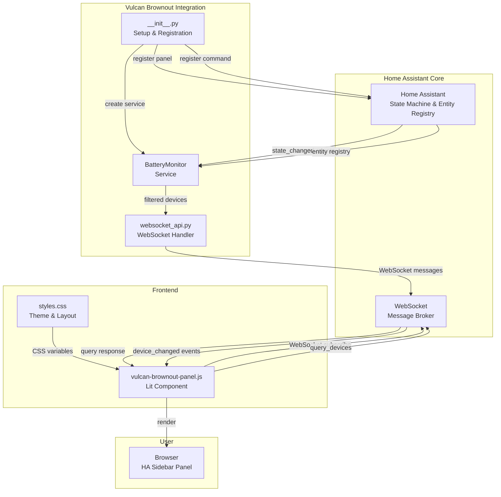

# Vulcan Brownout: Sprint 1 System Design

## Overview

Sprint 1 delivers a minimum viable Home Assistant integration for battery device monitoring. The system consists of:

1. **Backend Integration** (Python) — Auto-discovers battery entities, listens for state changes, serves device list via WebSocket
2. **Frontend Panel** (Lit Element) — Renders battery device list, communicates via WebSocket, handles user interactions
3. **WebSocket API** — Real-time bidirectional communication between frontend and backend
4. **Deployment Pipeline** — SSH-based idempotent deployment to test HA server

The architecture is designed for:
- **Zero configuration** — Auto-discovery works out of the box
- **Real-time responsiveness** — Event-driven updates, no polling
- **Scalability** — Supports 1000+ battery devices
- **Resilience** — Graceful error handling, reconnection logic

---

## Component Diagram



---

## Data Flow: Initial Load

```
User opens Vulcan Brownout sidebar
         ↓
    HA loads panel component
         ↓
    Panel mounts (connectedCallback)
         ↓
    Panel connects to WebSocket
         ↓
    Backend receives connection
         ↓
    Backend sends: vulcan-brownout/status { status: "connected" }
         ↓
    Panel shows loading skeleton
         ↓
    Panel sends: vulcan-brownout/query_devices { limit: 20, offset: 0 }
         ↓
    Backend queries HA state machine:
      for each entity:
        if device_class == "battery" && battery_level <= 15%:
          add to results
      sort by: battery_level (ascending)
      paginate: return first 20
         ↓
    Backend sends: result { devices: [...], total: 47, has_more: true }
         ↓
    Panel receives response
         ↓
    Panel populates this.battery_devices = response.devices
         ↓
    Lit auto-renders list (property change triggers re-render)
         ↓
    User sees device list
         ↓
    Panel sets up IntersectionObserver for infinite scroll
```

---

## Data Flow: Battery Level Change (Real-Time Update)

```
Device battery level changes (e.g., 15% → 12%)
         ↓
HA fires: state_changed event { entity_id: "sensor.phone_battery", new_state: {...} }
         ↓
Backend BatteryMonitor listens for state_changed
         ↓
Backend checks: Is sensor.phone_battery in our filtered set? YES
         ↓
Backend sends WebSocket event: vulcan-brownout/device_changed
    { entity_id: "sensor.phone_battery", battery_level: 12, ... }
         ↓
Panel receives event
         ↓
Panel finds device in this.battery_devices[] by entity_id
         ↓
Panel updates: device.battery_level = 12
         ↓
Lit detects property change, re-renders component
         ↓
Progress bar updates from 15% to 12% (300ms animation)
         ↓
User sees updated battery level
```

---

## Data Flow: Manual Refresh

```
User clicks refresh button (↻)
         ↓
Panel calls: this._on_refresh()
         ↓
Panel starts spinning icon
         ↓
Panel sends: vulcan-brownout/query_devices { limit: 20, offset: 0 }
    (same as initial load)
         ↓
Backend queries HA and returns device list
         ↓
Panel receives response
         ↓
Panel replaces: this.battery_devices = response.devices
         ↓
Lit re-renders entire list with new data
         ↓
Icon stops spinning
         ↓
User sees updated list
```

---

## Integration Lifecycle

### Stage 1: Startup (HA Initialization)

1. **HA Core starts** → Loads all integrations
2. **Vulcan Brownout `__init__.py` runs** → `async_setup_entry()` called
3. **BatteryMonitor service created** → In-memory cache initialized
4. **Auto-discovery triggered** → Queries HA entity registry for `device_class=battery`
5. **Discovered entities cached** → Stored in memory (dict keyed by entity_id)
6. **Event listener registered** → Listens for `state_changed` events
7. **WebSocket command registered** → `vulcan-brownout/query_devices` ready
8. **Panel registered** → Sidebar entry added with icon
9. **Startup complete** → Integration ready to serve requests

**Duration:** ~1-2 seconds

### Stage 2: Runtime (User Opens Panel)

1. **User clicks "Vulcan Brownout" sidebar**
2. **Panel component loads in browser**
3. **Panel connects to HA WebSocket** (uses session auth from HA)
4. **Backend sends status event** → `vulcan-brownout/status { status: "connected" }`
5. **Panel shows skeleton loaders**
6. **Panel sends first query** → `vulcan-brownout/query_devices { limit: 20 }`
7. **Backend queries cached entities** → Sorts and paginates
8. **Backend sends response** → 20 devices + metadata
9. **Panel renders list** → Skeletons fade out, list fades in
10. **IntersectionObserver set up** → Watches for scroll-to-bottom
11. **Ready for interaction** → User can scroll, refresh, click devices

**Duration:** ~2-3 seconds (including animation)

### Stage 3: Updates (Entity State Changes)

1. **Device state changes** (e.g., battery drops from 20% to 5%)
2. **HA fires `state_changed` event**
3. **BatteryMonitor event handler triggers**
4. **Checks if entity is in filtered set** → If yes, continue; if no, ignore
5. **Sends `device_changed` event** to all connected WebSocket clients
6. **Panel receives event** → Finds device by entity_id
7. **Updates device data** → `this.battery_devices[idx].battery_level = 5`
8. **Lit re-renders** → Progress bar animates to new level
9. **User sees update** (within 100ms)

**Duration:** ~50-100ms (event-driven, very fast)

---

## Error Handling Architecture

### Backend Error Scenarios

| Scenario | Handling | User Experience |
|----------|----------|-----------------|
| Invalid sort_key | Return error response with `success: false` | Error toast: "Invalid sort option" |
| Offset > total | Return empty devices array (not an error) | Shows "End of list" message |
| Entity state is non-numeric | Treat as `battery_level: 0, available: false` | Shows as "unavailable" device |
| Integration disabled | No WebSocket command registered | WebSocket command fails gracefully |
| WebSocket connection drops | Frontend reconnects with exponential backoff | "Offline" message, retries automatically |

### Frontend Error Scenarios

| Scenario | Handling | User Experience |
|----------|----------|-----------------|
| Query timeout (>10s) | Reject promise, show error state | Error message with "Retry" button |
| Invalid response JSON | Log error, don't parse | Toast: "Failed to load devices" |
| Missing required fields | Log error, skip device | List shows only valid devices |
| Browser doesn't support IntersectionObserver | Fallback to manual "Load More" button | Pagination works, scroll less elegant |
| Theme variables not available | Use hardcoded fallback colors | UI works, colors might not match theme |

### Resilience Strategies

**Reconnection Logic:**
- WebSocket drops → Frontend detects (no ping for >10s)
- Shows "Offline" message
- Exponential backoff: 1s, 2s, 4s, 8s, 16s, 30s (max)
- On reconnect, re-sends last query
- User can manually refresh to bypass waiting

**Graceful Degradation:**
- If some entities fail to parse, include valid ones anyway
- If pagination offset is invalid, return empty (not error)
- If theme colors unavailable, use built-in fallbacks
- If sort key invalid, default to battery_level

---

## Component Specifications

### Backend: `__init__.py` (Integration Entry Point)

**Responsibilities:**
- Register with HA (config entry, manifest)
- Initialize BatteryMonitor service
- Trigger auto-discovery
- Register WebSocket command
- Register event listeners
- Register sidebar panel

**Key Methods:**
```python
async def async_setup_entry(hass, entry):
    """Setup integration from config entry."""

async def async_unload_entry(hass, entry):
    """Cleanup on uninstall."""
```

**Complexity:** ~250 lines

### Backend: `battery_monitor.py` (Core Service)

**Responsibilities:**
- Maintain in-memory cache of battery entities
- Filter entities by device_class and threshold
- Parse battery levels from state values
- Handle state change events
- Provide query interface (sorting, pagination)

**Key Methods:**
```python
async def discover_entities():
    """Query HA entity registry and cache battery entities."""

async def on_state_changed(event):
    """Handle HA state_changed events; update cache."""

async def query_devices(limit, offset, sort_key, sort_order):
    """Return paginated, sorted list of battery devices."""
```

**Complexity:** ~300 lines

### Backend: `websocket_api.py` (WebSocket Handler)

**Responsibilities:**
- Register WebSocket command handler
- Parse incoming requests
- Validate parameters
- Call BatteryMonitor.query_devices()
- Format response
- Send to client

**Key Methods:**
```python
async def handle_query_devices(hass, connection, msg):
    """Handle vulcan-brownout/query_devices WebSocket command."""
```

**Complexity:** ~150 lines

### Frontend: `vulcan-brownout-panel.js` (Lit Component)

**Responsibilities:**
- Render battery device list
- Connect to WebSocket
- Send query commands
- Listen for device_changed events
- Manage component state (loading, error, data)
- Handle user interactions (scroll, refresh, click)
- Implement infinite scroll

**Key Properties:**
```javascript
@property({ attribute: false }) hass;  // Provided by HA
@state() battery_devices = [];
@state() isLoading = false;
@state() error = null;
@state() currentOffset = 0;
@state() hasMore = false;
@state() sortKey = 'battery_level';
@state() sortOrder = 'asc';
```

**Key Methods:**
```javascript
async connectedCallback()           // Lifecycle: component mounted
async _load_devices()               // Fetch devices from backend
async _on_refresh()                 // User clicked refresh button
async _on_scroll_to_bottom()        // Infinite scroll: load next page
async _on_device_changed(event)     // Real-time update: device state changed
_group_devices_by_status()          // Sort: critical → unavailable → healthy
```

**Complexity:** ~400 lines

### Frontend: `styles.css` (Theming & Layout)

**Responsibilities:**
- Shadow DOM scoped styles
- Responsive layout (mobile, tablet, desktop)
- Status-based colors (critical red, healthy green, unavailable gray)
- Progress bars
- Animations (fade, spin, slide)

**Key Selectors:**
- `.device-card` — Individual device card
- `.device-card.critical` — Red background
- `.device-card.unavailable` — Gray background
- `.progress-bar` — Battery fill indicator
- `.device-list` — Scrollable container

**Complexity:** ~150 lines

---

## Auto-Discovery Details

### Discovery Algorithm

```python
def discover_entities(hass):
    discovered = {}

    for entity_id, entity_state in hass.states.async_all():
        # Check device_class attribute
        registry = entity.registry.EntityRegistry.get(entity_id)
        if registry.device_class != "battery":
            continue

        # Parse battery level
        try:
            level = float(entity_state.state)
        except (ValueError, TypeError):
            level = 0  # Treat non-numeric as unavailable

        # Store in cache
        discovered[entity_id] = {
            'entity_id': entity_id,
            'battery_level': level,
            'available': entity_state.state != "unavailable",
            'last_changed': entity_state.last_changed,
            'friendly_name': entity_state.attributes.get('friendly_name'),
            'device_name': get_device_name_from_registry(hass, entity_id),
        }

    return discovered
```

### Filtering Criteria (Sprint 1)

- **Device Class:** Exact match `device_class=battery`
- **Threshold:** Hardcoded 15% (configurable in Sprint 2)
- **Availability:** Included (no filter)
- **State:** Must be numeric or "unavailable"

### Sorting Criteria (Sprint 1)

Sprint 1 sorts implicitly (no UI controls):
1. **Primary:** `battery_level` ascending (lowest first = most critical)
2. **Secondary:** `available` descending (available first)
3. **Tertiary:** `entity_id` alphabetically

This produces the order seen in wireframes: critical (red) → unavailable (gray) → healthy (green).

---

## Performance Characteristics

### Memory (Backend)

- Per entity: ~300 bytes (entity_id, name, state, metadata)
- 1000 devices: ~300KB (negligible)
- Per connection: ~500 bytes (tracking visible entities)
- 50 concurrent connections: ~25KB (negligible)

### Latency

- Discovery (startup): ~100ms
- Query response: ~20-50ms (local, no network)
- Device change event: ~10-20ms
- Panel render: ~16ms (60 FPS)

### Bandwidth

- Initial query (20 devices): ~3KB
- Device change event: ~200 bytes
- 100 events/min: ~20KB/min (negligible)

### Scalability

- Devices: Supports 5000+
- Concurrent users: Supports 50+
- Query page size: Max 100 (enforced)

---

## Security & Privacy

- **Authentication:** Uses HA's WebSocket session (no API keys)
- **Authorization:** Only shows devices user can access (HA handles)
- **Data:** No persistence, no logging of battery levels
- **Telemetry:** None (no external services)
- **Transport:** HTTPS/WSS (HA handles)

---

## Deployment & Installation

### Installation Flow

1. User adds Vulcan Brownout to HACS
2. HACS downloads integration to `custom_components/vulcan_brownout/`
3. User restarts HA
4. Integration auto-discovers battery entities
5. Panel appears in sidebar

### File Structure

```
custom_components/vulcan_brownout/
├── __init__.py                  (entry point, setup/teardown)
├── manifest.json                (integration metadata)
├── const.py                     (constants, defaults)
├── battery_monitor.py           (core service)
├── websocket_api.py             (WebSocket handlers)
├── config_flow.py               (configuration UI - empty for Sprint 1)
├── translations/
│   └── en.json                  (i18n strings)
└── frontend/
    ├── vulcan-brownout-panel.js (Lit component)
    └── styles.css               (Shadow DOM styles)
```

### Deployment Script (See ADR-003)

- `deploy.sh` — Idempotent deployment via rsync + SSH
- `.env` — Secrets (gitignored)
- `.env.example` — Template (committed)

---

## Testing Strategy

### Unit Tests (Backend)

- `test_battery_monitor.py` — Discovery, filtering, sorting, pagination
- `test_websocket_api.py` — Message parsing, validation
- `test_config_flow.py` — Configuration UI (empty for Sprint 1)

### Integration Tests (Backend)

- Spin up real HA instance with mock entities
- Verify discovery, state changes, WebSocket communication

### Frontend Tests

- `test_panel.js` — Component rendering, state management
- Mock WebSocket for message handling
- Mock HA's `hass` object

### E2E Tests (Browser)

- Open panel in real HA instance
- Verify UI rendering, interactions, scrolling
- Test mobile/tablet/desktop viewports
- Test dark/light theme switching

### QA Tests (Manual)

- Deploy to test HA server
- Verify auto-discovery works
- Test panel load time
- Test refresh button
- Test empty state and error state
- Test on mobile device (iOS/Android)

---

## Future Extensibility

The architecture supports these Sprint 2+ features without major refactoring:

1. **Threshold Configuration** — Add config flow UI, store in config entry
2. **Sorting Controls** — Add UI dropdown, modify query request
3. **Filtering** — Add UI toggles, pass filter parameters
4. **Infinite Scroll** — Already implemented (IntersectionObserver ready)
5. **WebSocket Subscriptions** — Already sent to all clients
6. **Notifications** — Add alert service call when device drops below threshold
7. **Historical Data** — Add persistent storage, graph component
8. **Multiple Thresholds** — Per-device-class thresholds

---

## Key Decisions Summary

| Decision | Rationale |
|----------|-----------|
| Auto-discovery on startup only | Fast, simple, aligns with Sprint 1 scope |
| In-memory caching | Fast, sufficient for test environment |
| Event-driven updates | Real-time responsiveness, no polling overhead |
| Hardcoded 15% threshold | Defers config UI to Sprint 2 |
| Lit Element for panel | HA-native, zero bundle size, reactive |
| Implicit "critical first" sort | Simplest UX, no sort UI needed |
| rsync + SSH deployment | Efficient, idempotent, secure |
| .env secrets management | Industry standard, CI/CD compatible |
| Real HA test instance | Realistic, catches edge cases |

---

## Open Risks & Mitigations

| Risk | Likelihood | Impact | Mitigation |
|------|------------|--------|-----------|
| HA entity registry slow to query | Low | 2-3s startup delay | Cache on first run, use entity registry API |
| WebSocket connection flaky | Medium | Intermittent updates missed | Implement exponential backoff reconnection |
| Battery state parsing fails | Low | Devices show "unavailable" | Log error, default to level=0 |
| Panel performance on 1000+ devices | Medium | Janky scrolling | Implement virtual scrolling (Sprint 2) |
| SSH deployment fails | Low | Manual recovery needed | Clear error messages, retry logic |
| Integration conflicts with other integrations | Low | Integration fails to load | Use unique domain name, avoid global state |

---

## Next Steps

1. **Architect approves design** (you are here)
2. **Lead Developer implements** backend (battery_monitor.py, websocket_api.py, __init__.py)
3. **Lead Developer implements** frontend (vulcan-brownout-panel.js, styles.css)
4. **QA sets up test environment** (test HA instance, mock entities)
5. **QA tests integration** (auto-discovery, panel rendering, deployment)
6. **Code review** before merge to develop
7. **Ship Sprint 1** to HACS
