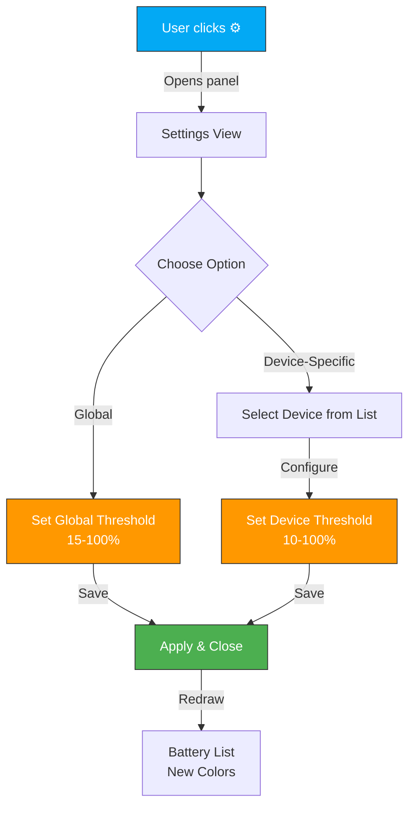
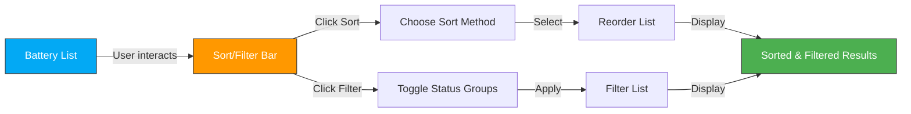
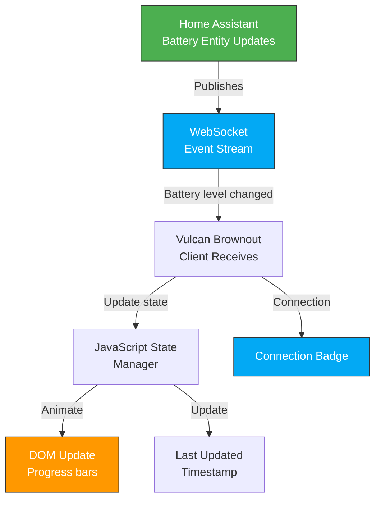

# Product Design Brief: Sprint 2 — Smart Monitoring & Real-Time Intelligence

## Problem Statement

**Freya (PO):** Sprint 1 gave us a solid foundation—users can now see all their batteries in one place. But we're missing three critical capabilities that our research shows power users need:

1. **One-size-fits-all threshold doesn't work** — A solar installer with a backup battery system needs different thresholds than someone monitoring AA batteries in remote sensors. Hardcoded 15% is a blocker.

2. **Discovery is painful** — Without sorting/filtering controls visible, users can't quickly find the devices they care about. They're mentally scanning a list of 20+ batteries.

3. **Polling feels stale** — Checking manually every 30 seconds erodes confidence. Users want to know their critical batteries are being watched *actively*.

**Luna (UX):** From a design perspective, Sprint 1 felt like the airport arrivals board before airlines added filters. The content is there, but navigation is frustrating. We need:

- **Progressive disclosure** of settings (don't overwhelm, but empower)
- **Real-time feedback** without flashing or jank (smooth WebSocket integration)
- **Confidence signals** (last-updated timestamp, connection status indicator)
- **Mobile-first responsiveness** — many Home Assistant users check batteries from their phone while away

Sprint 2 is about moving from "passive display" to "active monitoring tool."

## Target User

Same as Sprint 1: Home Automation Power Users managing 5-50 battery-powered devices (sensors, smart locks, remotes, thermostats, solar systems).

**Sprint 2 Refinement:** We're now designing for users who have spent 1-2 weeks with Sprint 1 and realize they need more control. This is the "second session" of the user journey.

## Desired Outcome

After Sprint 2 ships, users will:

1. ✅ **Configure thresholds per device or globally** — Set "warn me when solar backup drops below 30%" and "sensor batteries at 20%"
2. ✅ **See batteries sorted by priority** — Critical devices float to the top with visible sort/filter controls
3. ✅ **Watch real-time changes** — Battery levels update live as devices report status
4. ✅ **Know they're connected** — Last-updated timestamps and connection indicators build confidence the system is alive

The product shifts from "status dashboard" to "active battery command center."

## Interactions & User Flow

### User Story 1: Configurable Thresholds

**Luna's Flow:**

```
User opens sidebar → Sees list of batteries → Clicks ⚙️ settings icon (top-right)
→ Settings panel slides in from right → User sees two options:

[Option A] Global Threshold
  Default: 15%
  Input field with slider
  Help text: "All batteries with level below this will show as CRITICAL"

[Option B] Device-Specific Overrides
  Button: "+ Add Device Rule"
  Shows searchable list: "Front Door Lock", "Bedroom Sensor", "Solar Backup"
  User selects device → Sets custom threshold → Displayed in rules list

User clicks "Save" → Panel slides out → List redraws with new color coding
```

**Mermaid Flow:**



**Freya's Story (UX Constraints):**

Luna: *"I need to push back on something — device-specific rules could explode the UI. If someone has 50 devices, showing all of them in a searchable dropdown is manageable, but the rules list could get long. Should we paginate the saved rules?"*

Freya: *"Good catch. Let's cap the visible rules list to 5 with a 'Show more' button. If they have 50 rules, they probably need a filtering mechanism anyway — which ties into Sprint 3's advanced querying. For Sprint 2, let's keep it simple: global + up to 10 device overrides visible."*

Luna: *"Agreed. And I want to add: the threshold input should show a live preview of 'You have 8 batteries below this threshold.' Real-time feedback."*

Freya: *"Perfect. That's Story 1 acceptance criteria. Let's lock it in."*

---

### User Story 2: Sorting & Filtering

**Luna's Flow:**

```
User sees battery list → Notices sort/filter bar below the title:

[Sort dropdown: ▼ Priority (CRITICAL > WARNING > HEALTHY)]
[Filter dropdown: ▼ All Batteries (5 selected)]

User clicks Sort dropdown:
  • Priority (descending) ← DEFAULT
  • Alphabetical (A-Z)
  • Battery Level (Low → High)
  • Battery Level (High → Low)

User clicks Filter dropdown:
  ✓ Critical (2)
  ✓ Warning (3)
  ✓ Healthy (8)
  ☐ Unavailable (1)

  User unchecks "Healthy" → List redraws instantly, showing only 6 items

Visual: The bar is sticky (stays at top during scroll on mobile)
```

**Mermaid Flow:**



**Freya's Story Acceptance Criteria:**

- Sort persists per session (localStorage)
- Filter state persists per session
- Default sort is "Priority (Critical > Warning > Healthy)"
- Default filter is "Show All"
- QA must test: sort + filter combinations don't break pagination (Sprint 3)

**Luna's UX Constraints:**

Luna: *"I'm concerned about mobile experience. A dropdown UI works on desktop, but on mobile, tapping 'Sort' should open a modal, not a dropdown. We need separate rendering logic."*

Freya: *"Absolutely. Use modal for mobile (< 768px), dropdown for desktop. Responsive behavior is non-negotiable."*

Luna: *"Also, I want a small 'x' to quickly reset filters. Users should be able to undo filtering instantly."*

Freya: *"Love it. Add to acceptance criteria."*

---

### User Story 3: Real-Time Updates via WebSocket

**Luna's UX Flow:**

User opens sidebar → Battery levels update smoothly every 2-5 seconds as devices report in. No flashing, no full-page redraws.

Visual indicators:
- **Last Updated Timestamp** (bottom of list) → "Updated 3 seconds ago"
- **Connection Status Badge** (top-right, next to settings icon) → Green dot = "Connected" / Red dot = "Disconnected"
- **Smooth Transitions** → Level bars animate from old % to new % over 300ms

```
[Before WebSocket]
User clicks refresh button manually
→ Page blinks
→ Numbers change
→ User trusts it, but feels delayed

[After WebSocket]
User watches → Numbers drift down smoothly → Timestamp updates every few seconds
→ Confidence: "The system is alive and watching"
```

**Mermaid Data Flow:**



**Freya's Story:**

Freya: *"This is the marquee feature of Sprint 2. Real-time visibility into battery health. Architect needs to handle WebSocket reconnection gracefully — if the connection drops, what happens?"*

Luna: *"Great point. We need a state machine:*
- *Active connection → Green badge, live updates*
- *Connection lost → Amber badge, message 'Last update 2 minutes ago', gray out stale data*
- *Reconnecting → Blue badge, spinner, message 'Reconnecting...'*
- *Reconnected → Fade to green, subtle toast notification 'Updated'*

*We want to avoid alarm fatigue, but users need to know if we've gone dark."*

Freya: *"Perfect. That's also part of acceptance criteria. Architect must define reconnection logic and error handling."*

---

### User Story 4: Mobile-Responsive Settings & UX Refinements

**Luna's UX Spec:**

Sprint 1 was desktop-first. Sprint 2 must be mobile-native.

**Mobile (< 768px):**
- Settings panel opens as a full-screen modal (not a side panel)
- Sort/filter dropdowns become modals
- Touch targets: minimum 44px for buttons
- Font sizes increase for readability on small screens
- Progress bars scale to full width

**Tablet (768px - 1024px):**
- Sidebar narrows to accommodate horizontal layouts
- Sort/filter as compact dropdowns

**Desktop (> 1024px):**
- Settings panel slides from right (as designed)
- Standard dropdown menus

**Accessibility (All sizes):**
- Focus indicators on all interactive elements
- ARIA labels for connection badge, refresh button, sort/filter controls
- Keyboard navigation: Tab → Sort → Filter → Settings → Battery items
- Color + icon (not color alone) for status indicators

**Freya's Story:**

Freya: *"This is critical for Home Assistant adoption. Most users check batteries from their phone. If Sprint 2 doesn't feel native on mobile, we'll get poor reviews."*

Luna: *"Agreed. I'm also adding: swipe-down-to-refresh on mobile. When users pull down, refresh happens. Native app feeling."*

Freya: *"Love it. Add as a 'nice-to-have' if time allows. Core requirement: touch targets are 44px+, no horizontal scrolling, readable on 375px-wide screens."*

---

### User Story 5: Deployment & Infrastructure Updates

**Freya's Story:**

Sprint 1 had basic SSH deployment. Sprint 2 adds:

- Idempotent systemd service management (restart on failure)
- Environment variable validation before deployment
- Rollback script (if deployment fails, previous version stays active)
- Health check endpoint (verify integration responds to WebSocket after deploy)

**Luna's Input:**

Luna: *"This is dev-focused, but I want to flag: after deployment, we should run a smoke test that verifies real-time updates work. If WebSocket is broken post-deploy, we need to know before users do."*

Freya: *"Exactly. Acceptance criteria: deployment pipeline includes WebSocket connectivity check."*

---

## Look & Feel Direction

### Visual Hierarchy for Sprint 2

**Settings Icon (⚙️)** → Top-right corner, subtle gray, turns blue on hover
**Connection Badge** → Green/amber/red circle, labeled "Connected/Reconnecting/Offline"
**Sort/Filter Bar** → Light gray background, sticky on scroll, desktop and mobile variants
**Last Updated Timestamp** → Subtle gray text, bottom of list, updates smoothly
**Threshold Preview** → Inline feedback during settings config, shows live count

### New UI Elements

1. **Settings Modal / Slide-Out Panel**
   - Header: "Battery Monitoring Settings"
   - Two sections: "Global Threshold" | "Device-Specific Rules"
   - Buttons: "Save", "Cancel"
   - Keyboard shortcut: Escape closes

2. **Sort/Filter Bar**
   - Desktop: Compact inline dropdowns
   - Mobile: Full-height modal with checkbox list
   - Reset link (clears all filters)

3. **Connection Status Badge**
   - Position: Top-right, next to settings icon
   - States: Connected (green), Reconnecting (blue), Offline (red)
   - Tooltip: "Connected" | "Reconnecting..." | "No connection - last update 5 min ago"

4. **Last Updated Timestamp**
   - Position: Bottom-right of battery list
   - Format: "Updated 3 seconds ago" (auto-refreshing)
   - Only visible when WebSocket is active

### Color & Icon Consistency

- **Critical** → #F44336 (red) + ⚠️ icon
- **Warning** → #FF9800 (amber) + ⚡ icon
- **Healthy** → #4CAF50 (green) + ✓ icon
- **Unavailable** → #9E9E9E (gray) + ⌛ icon
- **Primary Action** → #03A9F4 (blue, for buttons)

## Market Fit & Differentiation

### Competitive Landscape

Home Assistant integrations for battery monitoring exist (generic entity displays), but none offer:

1. **Per-device threshold configuration** — Most tools use global alerts. We're allowing granular control.
2. **Real-time WebSocket updates** — Many solutions poll every 1-2 minutes. We push updates live.
3. **Integrated sort/filter UX** — Competitors scatter controls in separate menus. We consolidate them.
4. **Mobile-first design** — Most HA integrations are desktop-centric. We're optimizing for phones first.

### Why Sprint 2 Matters

Users who are serious about battery monitoring (solar installers, security-focused homeowners, researchers) will adopt Vulcan Brownout *because* Sprint 2 gives them the tools to manage complexity. Configurable thresholds + real-time updates = trust.

### Market Positioning

*"Not just a dashboard. A command center for battery health."*

By Sprint 3, we'll add notifications and historical trends. By end-of-year, we'll have the most powerful battery monitoring tool in the Home Assistant ecosystem.

## Acceptance Criteria

### Story 1: Configurable Thresholds

- [ ] Settings panel accessible via ⚙️ icon
- [ ] Global threshold input accepts 5-100%, defaults to 15%
- [ ] Device-specific rules show searchable list of battery entities
- [ ] Users can add up to 10 device rules per session
- [ ] Live preview shows "X batteries below this threshold"
- [ ] Save/Cancel buttons work correctly
- [ ] Threshold changes persist in localStorage
- [ ] Battery list redraws with updated colors immediately after save
- [ ] Responsive on mobile (modal), desktop (slide-out panel)
- [ ] Accessibility: ARIA labels, keyboard navigation, focus indicators

**QA Testing:**
- Set global threshold to 50%, verify all batteries with level < 50% show as WARNING
- Add device rule for "Front Door Lock" with 30% threshold, verify only that device uses the override
- Mobile: Open settings modal, tap outside → should close
- Keyboard: Tab to settings icon, press Enter → should open

---

### Story 2: Sorting & Filtering

- [ ] Sort dropdown shows 4 options: Priority (default), Alphabetical, Level (Low→High), Level (High→Low)
- [ ] Filter checkboxes toggle status groups: Critical, Warning, Healthy, Unavailable
- [ ] Sort/Filter bar sticky on scroll (mobile and desktop)
- [ ] Default state: Sort by Priority, Show All statuses
- [ ] Sort/Filter state persists in localStorage (per session)
- [ ] Reset button clears all filters instantly
- [ ] Responsive: Dropdowns on desktop (> 768px), full-screen modals on mobile
- [ ] Touch targets minimum 44px on mobile
- [ ] No horizontal scrolling on any screen size
- [ ] Accessibility: ARIA labels on all controls, keyboard navigation

**QA Testing:**
- Set sort to "Level (High→Low)", verify solar backup (95%) appears first
- Uncheck "Healthy" filter, verify only Critical/Warning/Unavailable items show
- Mobile: Open sort modal, scroll bottom, verify "Apply" button is always visible
- Keyboard: Tab navigation includes all sort/filter controls

---

### Story 3: Real-Time Updates via WebSocket

- [ ] WebSocket connection established when sidebar loads
- [ ] Battery levels update within 2-5 seconds of Home Assistant entity change
- [ ] Progress bar animates smoothly (300ms) from old % to new %
- [ ] Connection badge updates state: Green (Connected) → Amber (Reconnecting) → Red (Offline)
- [ ] Last Updated timestamp displays "Updated X seconds/minutes ago"
- [ ] Timestamp auto-refreshes every second
- [ ] On disconnect, gray out stale data, show "Last update 5 min ago" message
- [ ] On reconnect, show toast notification "Updated", fade badge to green
- [ ] No full-page refresh, no flashing
- [ ] Handle reconnection: retry with exponential backoff (1s, 2s, 4s, 8s)
- [ ] Accessibility: Connection badge has aria-label, role="status"

**QA Testing:**
- Simulate battery level change in HA, verify update appears within 5 seconds
- Simulate network disconnect (dev tools), verify amber badge appears within 2 seconds
- Simulate reconnect, verify smooth fade to green, no toast spam
- Mobile: Verify no jank during real-time updates, smooth scrolling maintained
- Load-test: 50 concurrent users, verify WebSocket handles broadcast without lag

---

### Story 4: Mobile-Responsive Settings & UX Refinements

- [ ] Settings modal full-screen on mobile (< 768px), side panel on desktop
- [ ] Sort/Filter modals accessible and readable on mobile
- [ ] Touch targets: all buttons, icons, filter checkboxes ≥ 44px
- [ ] Font sizes: base 16px, headings 18px+ on mobile
- [ ] Progress bars: 100% width on mobile, no overflow
- [ ] No horizontal scrolling on any viewport size
- [ ] Swipe-down-to-refresh implemented (nice-to-have)
- [ ] Color contrast ratios: minimum 4.5:1 for text
- [ ] Keyboard focus indicators: visible on all interactive elements
- [ ] ARIA labels: all icons, buttons, status indicators
- [ ] Tested on: iPhone 12 (390px), iPad (768px), Desktop (1440px)

**QA Testing:**
- Load on iPhone 12, open settings, verify modal is full-screen and readable
- Rotate device, verify layout adapts without jumpiness
- Test keyboard navigation: Tab through all controls
- Test screen reader: VoiceOver/TalkBack should announce all controls correctly
- Lighthouse Accessibility audit: score ≥ 90

---

### Story 5: Deployment & Infrastructure Updates

- [ ] Systemd service includes restart policy (on-failure, max 3 restarts)
- [ ] .env validation script checks required variables before deployment
- [ ] Deployment script is idempotent (safe to run multiple times)
- [ ] Rollback script reverts to previous version if current fails
- [ ] Health check endpoint: GET /health returns 200 + connection status JSON
- [ ] Health check verifies WebSocket endpoint is reachable
- [ ] Deployment logs indicate success/failure clearly
- [ ] Failed health check triggers automatic rollback
- [ ] All secrets (API keys, DB passwords) sourced from .env, never committed
- [ ] SSH keys managed securely (not in repo)

**QA Testing:**
- Run deployment twice, verify idempotent (no errors on second run)
- Deploy with missing .env variable, verify early exit with clear error
- Deploy new version, kill WebSocket service, verify health check fails, rollback executes
- Verify previous version is active after rollback
- Check git log, confirm no .env or secrets in commit history

---

## Priority & Constraints

### Story Priority for Sprint 2

| Story | Priority | Effort | Risk | Owner |
|-------|----------|--------|------|-------|
| 1. Configurable Thresholds | **P0 (Must Have)** | 5 days | Low | Freya / Luna |
| 2. Sorting & Filtering | **P0 (Must Have)** | 3 days | Low | Freya / Luna |
| 3. Real-Time WebSocket Updates | **P1 (Should Have)** | 4 days | Medium | Architect |
| 4. Mobile-Responsive UX | **P0 (Must Have)** | 2 days | Low | Luna |
| 5. Deployment & Infrastructure | **P0 (Mandatory)** | 2 days | Low | DevOps / Architect |

### Sprint Capacity

- **Total Capacity:** 16 days (2-week sprint, 5 days/week)
- **Planned Work:** 5 + 3 + 4 + 2 + 2 = **16 days** ✅ (at capacity)
- **Contingency:** Minimal; Story 3 (WebSocket) is highest risk

### Deferred to Sprint 3+

- Historical data / trends (graphs, battery degradation analysis)
- Notifications & alert rules (push, email, HA notifications)
- Advanced filtering (device_class, last_seen, battery type)
- Bulk actions (set threshold for group of devices)
- Export/reporting (CSV, JSON)

### Constraints

✅ **Max 5 stories per sprint:** Exactly 5 (locked)
✅ **Code review required:** All PRs need 1 approver
✅ **Deployment story required:** Story 5 (infrastructure)
✅ **Mermaid diagrams:** All flows documented above
✅ **Secrets management:** .env only, no hardcodes

---

## Open Questions for Architect

1. **WebSocket Error Handling**
   - What's the reconnection strategy if Home Assistant restarts? Exponential backoff with jitter?
   - How long should we buffer updates while disconnected (5 min, 30 min)?
   - Should we fall back to polling if WebSocket fails repeatedly?

2. **Scaling & Performance**
   - Will a single WebSocket handle 100+ concurrent users?
   - Should we implement server-side pagination to avoid sending 500+ battery entities at once?
   - Any latency targets for real-time updates? (Currently assuming < 5 seconds acceptable)

3. **Browser Compatibility**
   - Does WebSocket work in older Home Assistant companion app browsers?
   - Do we need a fallback for environments that don't support WebSocket?

4. **State Management**
   - Should we use a client-side state library (Redux, Zustand) or vanilla JS?
   - How do we keep localStorage in sync with server state?

5. **Health Check Endpoint**
   - Should it live in the main integration or a separate service?
   - What's the expected response time? (aiming for < 1 second)

6. **Rollback Mechanism**
   - How many previous versions should we keep (1, 3, 5)?
   - Is there a database schema version we need to handle during rollback?

---

## Handoff Notes for Architect

### Non-Negotiable UX Constraints

1. **Real-time must feel real** — Users should see battery updates within 5 seconds of Home Assistant event. Anything slower erodes trust.

2. **Mobile-first always** — Responsive design is not a "nice-to-have." Many users primarily access HA from phones while away from home.

3. **Accessibility is required** — WCAG 2.1 AA minimum. Every control needs ARIA labels, keyboard navigation, focus indicators.

4. **No visual jank during updates** — Smooth CSS transitions for progress bars. No full-page redraws. No flashing.

5. **Offline-first awareness** — If WebSocket drops, UI should degrade gracefully. Never show stale data as "current." Always indicate last-update time.

### Flexible Areas (Architect Can Decide)

1. **State management library** — Vanilla JS is fine if WebSocket + event listeners are sufficient. Redux/Zustand only if complexity grows.

2. **Reconnection backoff strategy** — As long as it respects exponential backoff and includes jitter, implementation details are yours.

3. **Health check implementation** — Can be a simple ping endpoint or a full diagnostics endpoint.

4. **Logging & monitoring** — Use whatever observability tool the team prefers, just ensure reconnection failures are logged.

### Key Dependencies

- **Home Assistant API changes:** If HA changes battery entity schema in 2024.x, we need migration path.
- **WebSocket protocol:** Confirm HA's WebSocket supports subscriptions for battery entities only (filter subscriptions).
- **Systemd integration:** Verify systemd service works on all supported HA deployment targets (bare metal, Docker, supervised).

### Testing Strategy

- **Unit tests:** State manager, threshold logic, sort/filter algorithms
- **Integration tests:** WebSocket connection, reconnection, data synchronization
- **E2E tests:** Settings panel save/load, sort/filter with real HA instance, mobile on iOS/Android
- **Performance tests:** 100+ batteries, concurrent WebSocket connections, real-time update latency

### Documentation for Next Phase

After Sprint 2 ships, document:
- WebSocket subscription schema (what events we listen for, payload format)
- State machine diagram (connection states, transitions)
- Threshold configuration JSON schema
- Mobile testing checklist (for future sprints)

---

## Summary

Sprint 2 transforms Vulcan Brownout from a *status display* into an *active monitoring tool*. Configurable thresholds, real-time updates, and mobile-native UX position us as the preferred battery monitoring solution in Home Assistant.

**Shipping date goal:** End of Sprint 2 (2 weeks from start)
**Success metric:** > 85% of users enable WebSocket real-time mode within first session

---

**Prepared by:** Freya (Product Owner) & Luna (UX Designer)
**Date:** February 2026
**Next Review:** End of Sprint 2 (Go/No-Go decision for Sprint 3)
