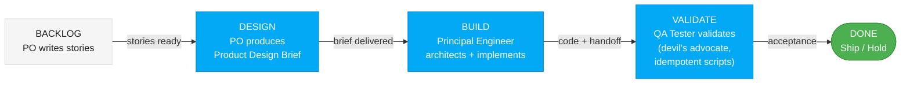

# Vulcan Brownout Team Pipeline — Kanban Workflow

This pipeline orchestrates the three Vulcan Brownout team agents in a Kanban flow. Work moves through the board from left to right, with each stage building on the previous stage's output.

## Diagrams

All diagrams produced by any team member must use Mermaid syntax following the style guide at:
`vulcan-brownout-team/ux-assets/mermaid-style-guide.md`

Every agent must read this guide before creating diagrams in any deliverable.

## Model Assignments

| Agent | Name | Model | Rationale |
|-------|------|-------|-----------|
| Product Owner | **Freya** | **Sonnet** | Product vision, UX direction, priority calls |
| Principal Engineer | **FiremanDecko** | **Sonnet** | Architecture + implementation in one pass |
| QA Tester | **Loki** | **Haiku** | Efficient test script generation, validation |

When spawning agents, use the model specified above for each role.

## Kanban Board



## Pipeline Execution

### Input
The pipeline accepts:
- A **product brief** (for initial project setup)
- A **feature request or story** (for new work)
- A **change request** (for modifications)

### Stage 1: DESIGN — Product Owner

Read: `vulcan-brownout-team/product-owner/SKILL.md`

Freya produces a **Product Design Brief** that covers:
- Problem statement and target user
- User interactions and flows
- Look and feel direction
- Market fit and differentiation
- Wireframes (ASCII)
- Acceptance criteria (testable)
- Open questions for the Principal Engineer

Freya carries the UX sensibility from prior sprints — she defines the wireframes, interaction specs, and visual direction as part of the Product Design Brief.

**Output**: Product Design Brief saved to the design directory.

### Stage 2: BUILD — Principal Engineer

Read: `vulcan-brownout-team/principal-engineer/SKILL.md`

FiremanDecko receives the Product Design Brief and produces both the technical design and the implementation in a single pass.

**Important**: If anything in the brief is ambiguous or technically concerning, the Principal Engineer asks the Product Owner directly before proceeding. Frame questions clearly with context, options, and impact.

**Output**:
- Architecture Decision Records (ADRs)
- System design with component diagrams
- API contracts (WebSocket messages, data shapes)
- Sprint stories (max 5) with technical notes
- Working code files in the project structure
- Implementation plan documenting what was built
- Code specifications for each module
- Handoff notes for QA Tester (how to deploy, what to test)

### Stage 3: VALIDATE — QA Tester

Read: `vulcan-brownout-team/qa-tester/SKILL.md`

The QA Tester validates everything from a devil's advocate perspective. Creates **idempotent, reusable scripts** for:

1. **Deployment** — Scripts to deploy the integration to a stable test environment. Safe to run repeatedly.
2. **Backend API testing** — Automated tests for every WebSocket command and API endpoint.
3. **Frontend UI testing in Chrome** — Browser automation tests for the panel UI.

All scripts must be idempotent — running them twice produces the same result with no side effects.

**Infrastructure constraints:**
- All testing runs against a **predefined Home Assistant server** (not local dev)
- Integration installation uses **SSH access** to the HA server filesystem
- All secrets (SSH keys, HA tokens, server addresses) stored in a **`.env` file** loaded at runtime
- `.env` is in `.gitignore` — never committed. A `.env.example` template is committed for reference.
- Every script validates that `.env` exists and all required variables are set before proceeding

**Output**:
- Deployment scripts (`scripts/deploy.sh`, `setup-test-env.sh`, etc.) — all loading secrets from `.env`
- Backend test suite (pytest + live WebSocket tests against HA server)
- Frontend test suite (Playwright/Selenium against HA panel in Chrome)
- Test plan and quality report
- Ship / No Ship recommendation

## Output Directory Structure

Each role writes to a single top-level folder. Git tracks history — files are overwritten each sprint with no sprint subdirectories.

```
design/                              # Freya output
├── product-design-brief.md
├── wireframes.md
├── interactions.md
└── components.md

architecture/                        # FiremanDecko output (architecture)
├── adrs/                            # ADRs accumulate (never overwritten)
│   ├── ADR-001-*.md
│   └── ADR-NNN-*.md
├── system-design.md
├── api-contracts.md
└── sprint-plan.md

development/                         # FiremanDecko output (implementation)
├── src/custom_components/vulcan_brownout/
├── scripts/deploy.sh
├── implementation-plan.md
└── qa-handoff.md

quality/                             # Loki output
├── test-plan.md
├── test-cases.md
├── quality-report.md
└── scripts/
    ├── deploy.sh
    ├── setup-test-env.sh
    └── run-all-tests.sh
```

## Kanban Rules

1. **WIP Limit**: One story moves through the pipeline at a time. Don't start the next story until the current one reaches DONE or is explicitly parked.
2. **Pull, Don't Push**: Each stage pulls work when ready, doesn't have work pushed onto it.
3. **Blocker Escalation**: If any stage is blocked, escalate to the previous stage (Principal Engineer asks PO, QA asks Principal Engineer).
4. **Max 5 Stories per Sprint**: From the product brief. The PO enforces this constraint.
5. **Definition of Done**: A story is DONE when QA signs off with a Ship recommendation and all idempotent test scripts pass.
