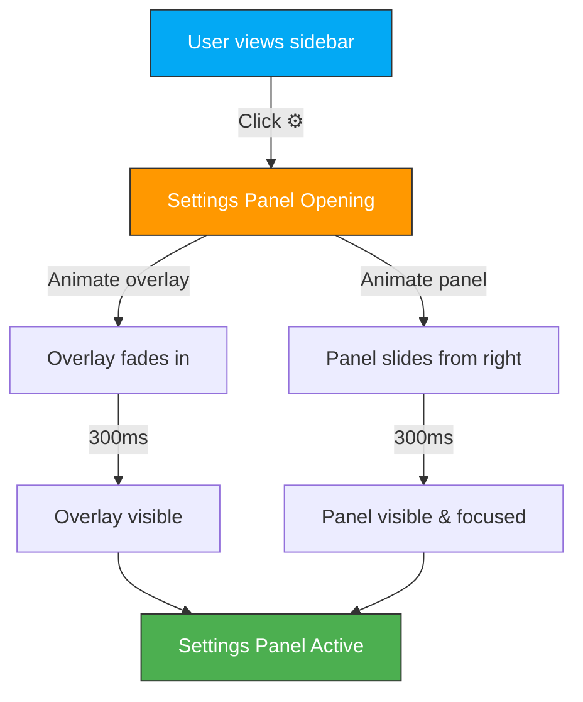
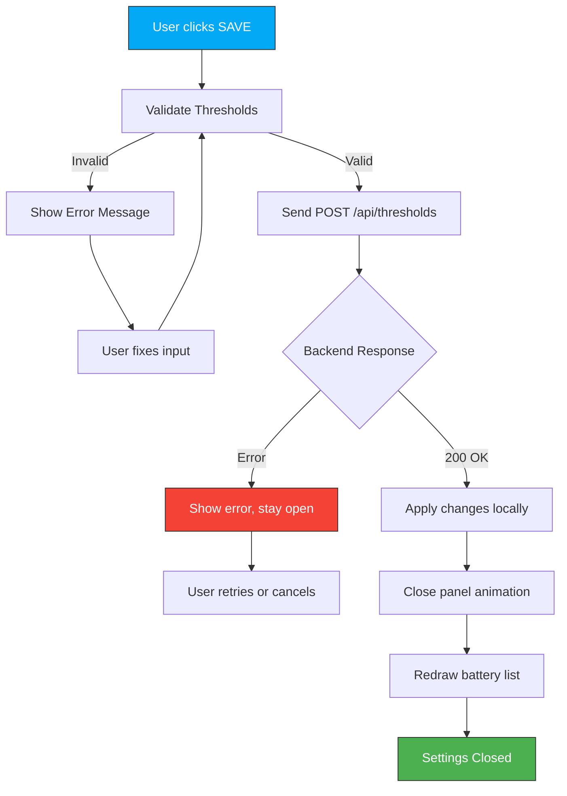
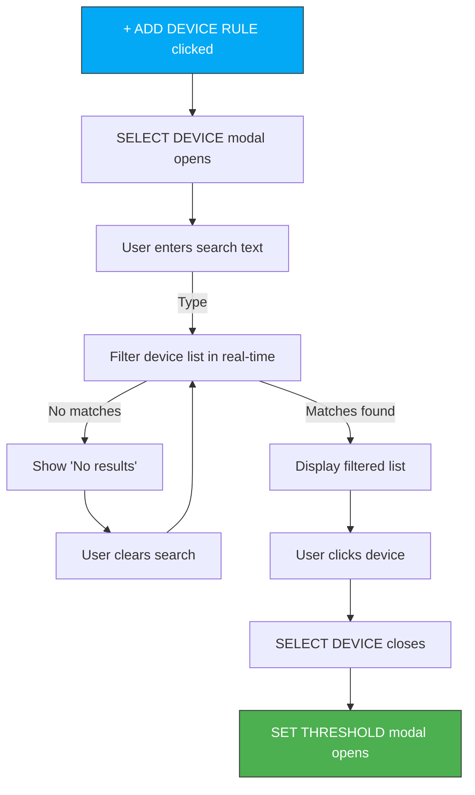
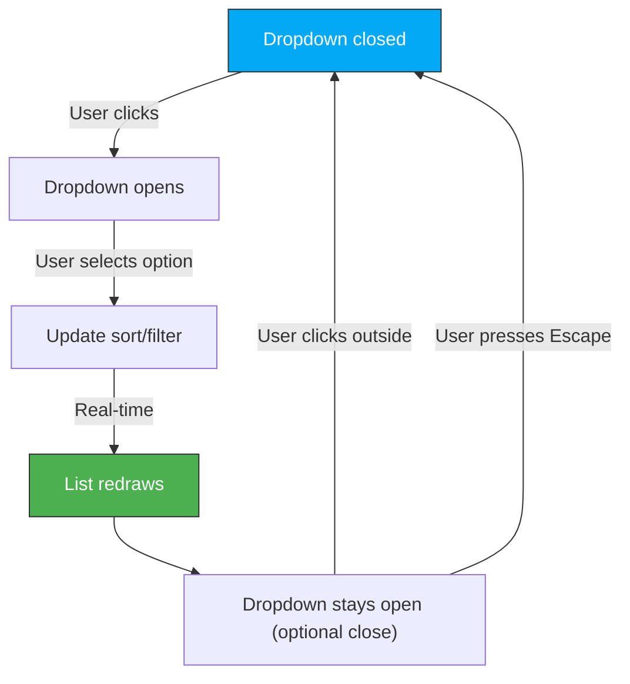
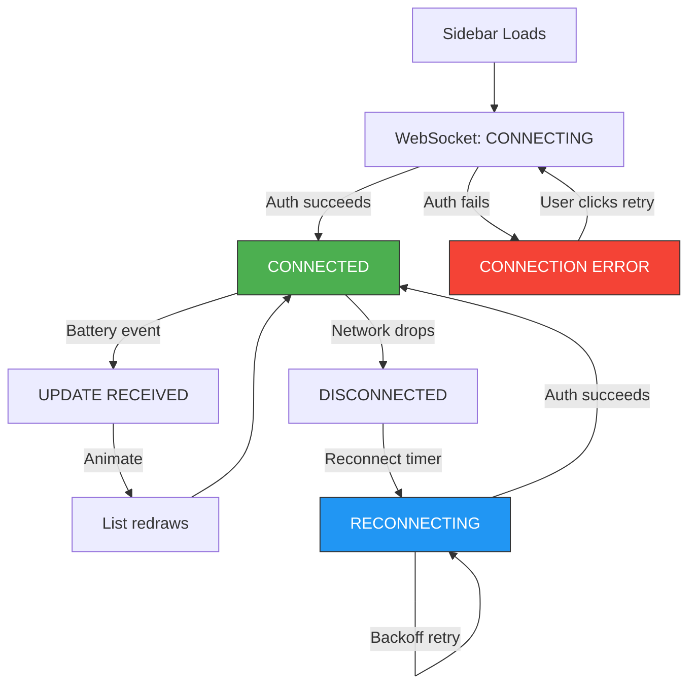
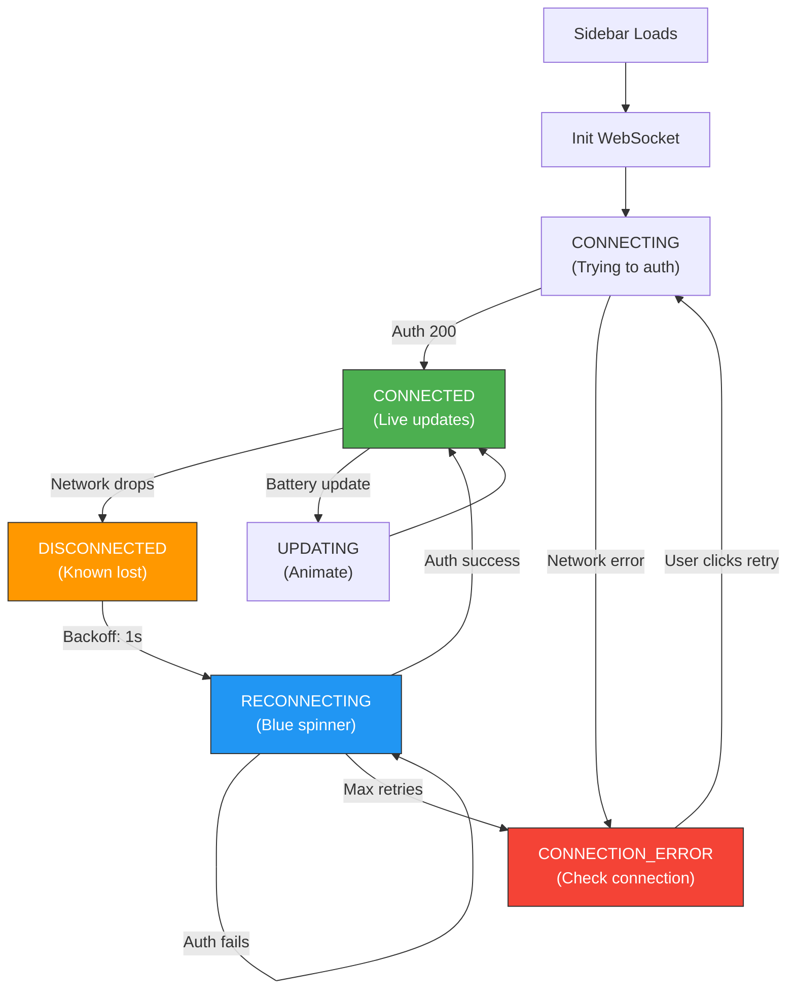

# Interaction Specifications — Sprint 2

**Designer:** Luna (UX Designer)
**Scope:** User interactions, state machines, event handlers
**Format:** Detailed step-by-step flows with state diagrams
**Last Updated:** February 2026

---

## Overview

This document defines how users interact with Sprint 2 features at a granular level. It covers:

1. **Settings Panel** — Configuration workflows
2. **Sort & Filter** — Discovery and reordering
3. **Real-Time Updates** — WebSocket state management
4. **Connection Status** — Feedback and recovery
5. **Mobile-Specific** — Touch and gesture interactions

Each interaction includes:
- **Step-by-step flow** (numbered sequence)
- **State diagram** (Mermaid)
- **Visual feedback** (what user sees at each step)
- **Error handling** (what happens if something goes wrong)
- **Keyboard/mouse/touch variants**

---

## 1. OPEN SETTINGS PANEL

### 1.1 Desktop Interaction: Click Settings Icon

**User Goal:** Access battery threshold configuration

**Steps:**

1. User sees sidebar with battery list
2. User locates ⚙️ (settings) icon, top-right corner
3. User clicks icon (or taps on touch devices)
4. **VISUAL FEEDBACK:**
   - Dark overlay fades in (0 → 300ms), opacity 0 → 0.4
   - Settings panel slides in from right edge (0 → 300ms)
   - Icon changes color from gray to blue
   - Focus ring appears around close button (✕)
5. Settings panel is now visible and interactive
6. Panel contains:
   - Title: "Battery Monitoring Settings"
   - Global Threshold section (slider + text input)
   - Device-Specific Rules section (list + "+ ADD DEVICE RULE" button)
   - "SAVE" and "CANCEL" buttons

**State Diagram:**



**Visual Timeline:**

```
T=0ms:          Icon gray, overlay hidden, panel off-screen (X=100%)
                └─ User clicks ⚙️

T=0-300ms:      Animation phase
                ├─ Overlay opacity: 0 → 0.4
                ├─ Panel X position: 100vw → (100vw - 400px)
                └─ Icon color: gray → blue

T=300ms+:       Settings panel active
                ├─ Overlay interactive (click to close)
                ├─ Panel fully visible
                ├─ Close button (✕) focused
                └─ User can interact with form
```

**Touch Variant (Mobile/Tablet):**

```
Similar, but:
- Icon is larger (48px touch target)
- Panel is full-screen (100vw, 90vh)
- Animation: panel slides from bottom or right (depending on orientation)
- Overlay is darker (opacity 0.6, prevents accidental background interaction)
```

**Keyboard Variant:**

```
User can also trigger with keyboard:
1. Tab until focus reaches ⚙️ icon
2. Press Enter or Space
3. Settings panel opens
4. Focus automatically moves to close button (✕)
```

**Error Handling:**

```
If settings panel fails to load:
  → Show error message: "Unable to load settings. Please try again."
  → Provide "RETRY" button
  → Allow user to close panel with Escape or ✕
```

---

### 1.2 Close Settings Panel

**User Goals:** Exit settings (save or discard changes)

**Close Trigger 1: Click "SAVE" Button**

```
1. User makes changes (adjusts thresholds)
2. User clicks "SAVE" button
3. VALIDATION: Check if thresholds are in valid range (5-100%)
   ✅ Valid → Continue to step 4
   ❌ Invalid → Show inline error, highlight field, return focus
4. Visual feedback: "SAVING..." spinner on button (100ms)
5. Send threshold config to backend via POST /api/thresholds
6. Backend responds: 200 OK
7. Panel animations:
   - Settings panel slides out to right (300ms)
   - Overlay fades out (300ms)
   - Both animations run in parallel
8. Focus returns to ⚙️ icon
9. Battery list redraws with new colors/statuses
10. Success toast: "Settings saved" (optional, subtle)

STATE MACHINE:

┌─────────────────────────────────────────────────────────────┐
│ SETTINGS PANEL STATE MACHINE                                 │
├─────────────────────────────────────────────────────────────┤
│                                                              │
│  [OPEN] ←─────→ [EDITING] ←─────→ [SAVING] ← [SAVED]       │
│    ↓                 ↓                  ↓         ↓           │
│  [CLOSE]        [INVALID]          [ERROR]   [CLOSE]        │
│    ↓                 ↓                  ↓         ↑           │
│  [CLOSED]        [EDITING]          [OPEN]   ─────           │
│                                                              │
└─────────────────────────────────────────────────────────────┘
```

**Mermaid Flow:**



**Close Trigger 2: Click "CANCEL" Button**

```
1. User clicks "CANCEL"
2. Discard any unsaved changes (revert form to last saved state)
3. Close animation: panel slides out, overlay fades (300ms)
4. Focus returns to ⚙️ icon
5. No API call made
6. Battery list unchanged
```

**Close Trigger 3: Click ✕ (Close Button)**

```
1. User clicks ✕ in top-right of panel
2. Confirm if there are unsaved changes:
   ✅ If empty → Close immediately
   ⚠️ If changes exist → Show confirm dialog:
      "Discard changes?"
      [DISCARD] [KEEP EDITING]
3. If user clicks DISCARD → Close without saving
4. Animation: slide out, overlay fade (300ms)
5. Focus returns to ⚙️ icon
```

**Close Trigger 4: Press Escape Key**

```
1. User presses Escape
2. Same behavior as ✕ (close, warn if unsaved changes)
```

**Close Trigger 5: Click Overlay (Background)**

```
1. User clicks dark overlay behind panel
2. Confirm if unsaved changes exist (show dialog)
3. If confirmed → Close
4. Note: Overlay is semi-transparent, clicking it is intentional
```

**Visual Timeline for Close:**

```
T=0ms:          Panel open, overlay visible
                └─ User clicks SAVE

T=0-100ms:      "SAVING..." spinner appears on button

T=100ms:        API request sent to backend
                └─ Waiting for response

T=100-500ms:    Backend processes (typical latency: 100-200ms)

T=500ms:        ✅ Response 200 OK
                ├─ Panel begins slide-out (X: calc(100vw - 400px) → 100vw)
                ├─ Overlay begins fade (opacity 0.4 → 0)
                └─ Both animations parallel, 300ms duration

T=800ms:        Panel fully hidden, overlay gone
                ├─ Battery list redraws with new colors
                ├─ Focus moves to ⚙️ icon
                └─ Panel state: CLOSED
```

---

## 2. ADD DEVICE-SPECIFIC THRESHOLD RULE

### 2.1 Multi-Step Workflow

**User Goal:** Set a custom battery threshold for a specific device (e.g., "Solar Backup system warns me at 50%, not 15%")

**User Path:**

```
User in Settings panel
    ↓
Scrolls to "DEVICE-SPECIFIC RULES" section
    ↓
Clicks "[+ ADD DEVICE RULE]" button
    ↓
[STEP 1] SELECT DEVICE modal opens
    ├─ Searchable dropdown with all battery entities
    ├─ User types "solar" to filter
    ├─ User sees "Solar Backup (95%)"
    ├─ User clicks to select
    └─ Modal closes
    ↓
[STEP 2] SET THRESHOLD modal opens
    ├─ Device: "Solar Backup"
    ├─ Current battery: 95%
    ├─ Threshold slider: [████░░░░░░] 50%
    ├─ User adjusts slider or types 50
    ├─ Live feedback: "3 devices below 50%"
    └─ User clicks "SAVE RULE"
    ↓
Rule added to list: "Solar Backup — 50% [✕]"
    ↓
Panel still open, ready for more rules
```

**Detailed Interaction: SELECT DEVICE Modal**

```
[Modal Title] "SELECT DEVICE"
[Search input] "Search devices..."

User types "solar" → Real-time filter

Matching devices:
  ☐ Solar Backup (95%) [HEALTHY]      ← User clicks
  ☐ Solar Inverter (87%) [HEALTHY]

Modal closes, proceeding to SET THRESHOLD
```

**State Machine for Device Selection:**



**Detailed Interaction: SET THRESHOLD Modal**

```
[Modal Title] "SET THRESHOLD"
[Device info]
  Device: Solar Backup
  Current battery: 95%

[Threshold input]
  Slider: [████░░░░░░] 50%
  Or type: [50] %

  Help text: "Show CRITICAL when below 50%"

[Live feedback]
  After save:
  • Solar Backup will use 50% threshold
  • Global threshold (15%) won't apply
  • 3 devices will change to CRITICAL

[Buttons]
  [SAVE RULE]  [CANCEL]
```

**Keyboard Interaction for Threshold:**

```
User can:
1. Click slider and drag
2. Type number directly in text input
3. Use arrow keys to adjust slider (±1%)
4. Use Page Up/Down to adjust (±5%)
5. Tab to navigate between slider and input
```

**Validation:**

```
Threshold must be:
  ✅ Number between 5-100
  ✅ Not equal to global threshold (unless intentional)
  ✅ Device not already in rules list

If invalid:
  Show inline error, highlight field, keep focus in modal
```

**Save Behavior:**

```
1. User clicks "SAVE RULE"
2. Validate threshold (see above)
   ✅ Valid → Continue
   ❌ Invalid → Show error, stay in modal
3. POST /api/thresholds/device-rules
   Body: { device: "solar_backup", threshold: 50 }
4. Backend responds 200 OK
5. Modal closes
6. Rule appears in list: "Solar Backup — 50% [✕]"
   (with delete button)
7. Battery list might redraw if colors change
```

**Cancel Behavior:**

```
1. User clicks "CANCEL" in SET THRESHOLD modal
2. Modal closes
3. Return to Settings panel (SELECT DEVICE modal stays closed)
4. No data saved
5. User can click "+ ADD DEVICE RULE" again
```

**Delete Rule:**

```
1. User sees rule in list: "Solar Backup — 50% [✕]"
2. User clicks [✕] button (delete)
3. Confirm dialog: "Delete this rule?"
   [DELETE]  [CANCEL]
4. If DELETE: POST /api/thresholds/device-rules/solar_backup/delete
5. Rule removed from list immediately
6. Battery list redraws with solar backup using global threshold again
```

**Multiple Rules Handling:**

```
If user adds more rules:

✓ Solar Backup — 50% [✕]
✓ Front Door Lock — 30% [✕]
✓ Bedroom Sensor — 20% [✕]

If more than 5 rules:
  ✓ Solar Backup — 50% [✕]
  ✓ Front Door Lock — 30% [✕]
  ✓ Bedroom Sensor — 20% [✕]
  ...
  [SHOW MORE (8 total rules)]

Click SHOW MORE to expand list
```

---

## 3. SORT & FILTER INTERACTION

### 3.1 Desktop: Dropdown Menu Interaction

**User Goal:** Reorder battery list by priority, or filter by status

**Sort Dropdown Interaction:**

```
[MAIN VIEW]
[▼ PRIORITY ]   [▼ ALL BATTERIES ]

User clicks "PRIORITY" dropdown

[DROPDOWN OPENS]
● Priority (Critical > Warning > Healthy)  ← Currently selected
○ Alphabetical (A-Z)
○ Battery Level (Low to High)
○ Battery Level (High to Low)

User hovers over "Alphabetical"
  └─ Highlight appears

User clicks "Alphabetical"
  └─ Option becomes selected
  └─ List reorders A-Z immediately
  └─ Dropdown closes (user can click again to reorder)

State persisted in localStorage
```

**Filter Dropdown Interaction:**

```
[MAIN VIEW]
[▼ PRIORITY ]   [▼ ALL BATTERIES (13) ]

User clicks "ALL BATTERIES" dropdown

[DROPDOWN OPENS]
✓ Critical (2)    ← Checkbox
✓ Warning (3)
✓ Healthy (8)
☐ Unavailable (0)

[APPLY]  [CLEAR ALL]

User unchecks "Healthy"
  └─ Checkbox toggles visually
  └─ List filters in real-time: now showing 5 items (2 + 3 + 0)
  └─ Dropdown label updates: "ALL BATTERIES (5)" ← Dynamic count

User clicks [CLEAR ALL]
  └─ All checkboxes recheck
  └─ List shows all 13 items
  └─ Dropdown label: "ALL BATTERIES (13)"

User clicks [APPLY]
  └─ Dropdown closes
  └─ Filter persisted in localStorage

User can open dropdown again to see current filter state
```

**State Diagram for Sort/Filter:**



**Reset Button:**

```
User clicks [✕ RESET]
  └─ All filters cleared
  └─ Sort reset to "Priority"
  └─ All 13 devices shown
  └─ Both dropdowns reset to defaults
  └─ localStorage cleared
```

**Persistence:**

```
User sets:
  Sort: Alphabetical
  Filter: Show only Critical + Warning

User closes sidebar
User comes back later
  └─ Sort and filter still set to previous values
  └─ List shows same filtered state

Note: Persists per session (localStorage), not global
(Each user's browser has own state)
```

### 3.2 Mobile: Full-Screen Modal Interaction

**User Goal:** (Same as desktop, but touch-friendly UX)

**Sort Modal:**

```
User taps "PRIORITY" button

[FULL-SCREEN MODAL appears]
┌────────────────────────┐
│ SORT BY             ✕  │
├────────────────────────┤
│ ◉ Priority             │ ← Selected (radio button)
│ ○ Alphabetical         │
│ ○ Level (Low > High)   │
│ ○ Level (High > Low)   │
│                        │
│ [APPLY]    [CANCEL]    │
└────────────────────────┘

User taps "Alphabetical" (44px touch target)
  └─ Radio button updates visually

User taps [APPLY]
  └─ Modal closes
  └─ List reorders A-Z
  └─ Sort button label updates: "ALPHABETICAL"
```

**Filter Modal:**

```
User taps "ALL BATTERIES" button

[FULL-SCREEN MODAL appears]
┌────────────────────────┐
│ FILTER BY           ✕  │
├────────────────────────┤
│ [✓] Critical (2)       │ ← Large checkbox
│ [✓] Warning (3)        │
│ [✓] Healthy (8)        │
│ [ ] Unavailable (0)    │
│                        │
│ [APPLY]   [CLEAR ALL]  │
│ [CANCEL]               │
└────────────────────────┘

User taps "Healthy" checkbox (44px touch target)
  └─ Visual feedback: brief highlight + toggle

User taps [APPLY]
  └─ Modal closes
  └─ List filters immediately
  └─ Button updates: "FILTER (5/13 selected)"

User can tap button again to reopen modal and see current state
```

**Touch Feedback:**

```
Each interactive element:
  - 44px minimum height/width
  - Visual feedback on tap (highlight color)
  - No delay (instant response)
  - Clear label text
```

---

## 4. REAL-TIME UPDATES VIA WEBSOCKET

### 4.1 WebSocket Connection Lifecycle

**User Opens Sidebar:**

```
T=0ms:       Sidebar loads, battery list renders
             └─ Initial data fetched via REST API
             └─ Battery list shows current levels

T=0-100ms:   WebSocket connection initiated
             └─ Client code: const ws = new WebSocket("wss://homeassistant.local/api/websocket")

T=100-200ms: Home Assistant authenticates connection
             └─ Client sends auth token
             └─ Server responds with subscription ID

T=200ms+:    Connection established
             └─ Connection badge: 🟢 GREEN
             └─ Badge text: "Connected"
             └─ Client listens for battery entity updates

T=200ms+:    Real-time updates flowing
             └─ Device updates battery level
             └─ Home Assistant publishes event
             └─ WebSocket delivers update (typically < 1 second)
             └─ Client animates progress bar
             └─ Timestamp updates: "Updated 2 seconds ago"
```

**State Machine for WebSocket Connection:**



### 4.2 Battery Update Animation

**Scenario: User watching real-time updates**

```
[BEFORE]
┌─────────────────────────────────┐
│ ✓ BATHROOM FAN SWITCH  87%      │
│   [██████████████░░░░░░░░░░]    │
│   Last changed: 5 min ago       │
└─────────────────────────────────┘

[WebSocket event received: battery level = 85%]

[DURING ANIMATION: T=0-300ms]
Progress bar width animates:
  T=0ms:   87% → 85% (starts)
  T=150ms: 86% (midway)
  T=300ms: 85% (complete)

Visual: [████████████░░░░░░░░░░░░] ← Smooth shrink

[AFTER ANIMATION: T=300ms+]
┌─────────────────────────────────┐
│ ✓ BATHROOM FAN SWITCH  85%      │ ← Updated text
│   [████████████░░░░░░░░░░░░░░]   │ ← Updated bar
│   Last changed: just now        │ ← Updated timestamp
└─────────────────────────────────┘
```

**CSS Animation Details:**

```css
.progress-bar {
  width: 87%;
  background: linear-gradient(90deg, #4CAF50, #4CAF50);
  transition: width 300ms cubic-bezier(0.4, 0, 0.2, 1);
  /* ease-out curve: faster at start, slower at end */
}

/* When update received, JS updates width attribute */
.progress-bar.updated {
  width: 85%;
  /* Transition fires automatically */
}
```

**Timestamp Auto-Refresh:**

```
After update received (T=300ms):
  Display: "Updated just now"

After 2 seconds:
  Display: "Updated 2 seconds ago"

After 30 seconds:
  Display: "Updated 30 seconds ago"

After 1 minute:
  Display: "Updated 1 minute ago"

Timestamp text updates every second via setInterval()
```

### 4.3 Connection Loss & Reconnection

**Network Disconnect Scenario:**

```
[HEALTHY STATE]
Connection badge: 🟢 Connected
Battery list: active, real-time updates flowing

[NETWORK DROPS: WebSocket disconnects]

[IMMEDIATE: T=0ms]
Connection badge: 🟢 → 🔵 (blue)
Badge text: "Connected" → "Reconnecting..."
Spinner appears on badge (360° rotation, 2s cycle)

[AFTER 5 SECONDS: No reconnection]
Connection badge: 🔵 → 🔴 (red)
Badge text: "Reconnecting..." → "Offline"
Battery list: Items become slightly grayed out
Timestamp: "Updated 5 minutes ago" (no longer updating)

[USER SEES]
Connection indicator: Red, clear message "Offline"
Battery data: Grayed out, last update timestamp visible
Confidence: "System knows it lost connection, isn't pretending to be live"

[NETWORK RESTORED: WebSocket reconnects]

[T=0ms]
Connection badge: 🔴 → 🔵 (spinning blue)
Badge text: "Offline" → "Reconnecting..."

[T=0-300ms: Auth completes]
✅ Auth successful → Re-subscribe to battery entities

[T=300ms+: Connection restored]
Connection badge: 🔵 → 🟢 (solid green)
Badge text: "Reconnecting..." → "Connected"
Spinner stops
Toast notification (bottom): "✓ Connection updated" (fades after 2 seconds)
Battery list: Colors restore, timestamp updates again
Real-time updates resume
```

**Reconnection Logic (Server-Side & Client-Side):**

```
Client-side exponential backoff:
  Attempt 1: Immediately (T=0ms)
  Attempt 2: Wait 1 second
  Attempt 3: Wait 2 seconds
  Attempt 4: Wait 4 seconds
  Attempt 5: Wait 8 seconds
  Attempt 6+: Wait 8 seconds (capped)

Max retries: 10 (roughly 1 minute total)

After max retries:
  Show error message: "Unable to reconnect. Check your connection."
  [RETRY] [SETTINGS] buttons

User clicks [RETRY]:
  Reset backoff timer
  Attempt reconnection again
```

**Data Consistency During Disconnect:**

```
While disconnected:
  ✅ Display last known battery levels (from REST API at load time)
  ✅ Show last update timestamp: "Last updated 5 minutes ago"
  ❌ Don't show real-time updates (they're not real-time anymore)
  ❌ Don't make up data or guess battery levels

When reconnected:
  Fetch fresh data from REST API
  Resume WebSocket subscription
  Display new levels with "Updated just now"
```

**State Diagram: Detailed Connection States**



---

## 5. MOBILE-SPECIFIC INTERACTIONS

### 5.1 Swipe-Down-to-Refresh (Nice-to-Have)

**User Goal:** Manually refresh battery data with familiar pull-to-refresh gesture

**Interaction:**

```
[VIEWPORT: User viewing battery list]

User performs swipe-down gesture from top of list
  └─ Drag distance: ≥ 50px down

[DURING SWIPE: T=0-500ms]
Pull-to-refresh indicator appears at top:
  └─ [↓ PULL TO REFRESH]
  └─ Opacity increases as user drags further
  └─ Icon rotates 180° (↓ → ↑)

[USER RELEASE]
If dragged ≥ 50px:
  └─ Refresh triggered
  └─ Spinner appears: [⟳ REFRESHING...]
  └─ REST API call to fetch latest battery states
  └─ WebSocket already provides real-time, so this is visual confirmation

If dragged < 50px:
  └─ No action
  └─ Indicator disappears
  └─ List stays in place

[REFRESH COMPLETE: T=500-1000ms]
  └─ Spinner completes (1 full rotation)
  └─ Toast: "✓ Updated" (subtle, bottom of list)
  └─ Toast fades after 2 seconds
  └─ List shows refreshed data (if any changes)
```

**CSS for Pull-to-Refresh:**

```css
.pull-to-refresh-indicator {
  position: absolute;
  top: -60px;
  left: 50%;
  transform: translateX(-50%);
  font-size: 12px;
  color: #999;
  opacity: 0;
  transition: opacity 300ms ease-out;
}

.battery-list {
  transform: translateY(0px);
  transition: transform 150ms ease-out;
}

.battery-list.dragging {
  transform: translateY(var(--drag-distance));
}

.pull-to-refresh-indicator.visible {
  opacity: 1;
}
```

### 5.2 Touch-Friendly Settings Modal

**Difference from Desktop:**

```
Desktop Settings:
  └─ Side panel (400px wide)
  └─ Slides from right edge
  └─ Overlay can be clicked to close

Mobile Settings:
  └─ Full-screen modal (100vw x 90vh)
  └─ Slides from bottom or top
  └─ Overlay cannot be dismissed (prevents accidental close)
  └─ Close button (✕) prominent at top
  └─ Buttons: 44px tall, full-width
  └─ Font sizes: Larger for mobile readability
```

**Touch Target Sizes (Mobile):**

```
All interactive elements must be ≥ 44px:
  Buttons:       44px height × 100% width
  Checkboxes:    24px square, with 44×44 tap area
  Input fields:  44px height
  Icons:         24px, with 44×44 tap area around them
  Radio buttons: 24px, with 44×44 tap area
```

### 5.3 Modal Swipe Gestures

**Option: Swipe-to-Close Settings Modal**

```
User in Settings modal
  └─ Can swipe down from top of modal
  └─ If > 50px drag → Modal closes (like iOS behavior)
  └─ Or explicitly click [✕] button

Implementation note:
  This is a "nice-to-have" for Sprint 2
  Can be added post-launch if feedback requests it
```

---

## 6. KEYBOARD NAVIGATION

### 6.1 Tab Order (Desktop & Mobile)

**Linear tab order through sidebar:**

```
1. ⚙️ Settings icon
   └─ Enter → Opens settings panel
   └─ Tab → Next element (connection badge)

2. 🟢 Connection badge
   └─ Enter → Shows tooltip (optional)
   └─ Tab → Next element (sort dropdown)

3. [Sort Dropdown]
   └─ Enter → Opens sort options
   └─ Arrow keys (Up/Down) → Navigate options
   └─ Enter → Select option
   └─ Escape → Close dropdown
   └─ Tab → Next element (filter dropdown)

4. [Filter Dropdown]
   └─ Enter → Opens filter checkboxes
   └─ Arrow keys → Navigate items
   └─ Space → Toggle checkbox
   └─ Enter → Apply changes
   └─ Escape → Close dropdown
   └─ Tab → Next element (reset button)

5. [Reset Button]
   └─ Enter → Clear all filters
   └─ Tab → Next element (battery items, if interactive)

6. [Battery Items]
   └─ Tab → Navigate through list items
   └─ (Optional) Each item can be focusable for detailed view
   └─ Escape → Return to list top

7. [Settings Panel] (when open)
   └─ Tab → Navigate within form
   └─ Escape → Close panel (with unsaved change warning)
```

### 6.2 Keyboard Shortcuts

```
Global (any state):
  Escape        → Close open modals/panels
  ? (question)  → Help / keyboard shortcuts guide

Settings Panel:
  Ctrl+S        → Save settings (if supported)
  Tab           → Next field
  Shift+Tab     → Previous field

Filter/Sort:
  Enter         → Apply changes
  Escape        → Discard changes, close
```

### 6.3 Focus Management

```
When settings panel opens:
  Focus automatically moves to [✕] close button
  User can Tab to other fields

When settings panel closes:
  Focus returns to [⚙️] settings icon
  Sidebar is ready for keyboard navigation again

When filter modal opens (mobile):
  Focus moves to first checkbox
  User can Tab through all options

When dialog/modal closes:
  Focus returns to button that triggered it
  (Implements focus trap pattern)
```

---

## 7. ERROR STATES & RECOVERY

### 7.1 WebSocket Connection Errors

**Scenario 1: Cannot Connect (Network Down)**

```
User opens sidebar
  └─ REST API call succeeds, list displays
  └─ WebSocket connection attempt fails

T=0ms:        Connection badge: 🔵 (blue, reconnecting)
T=5s:         After 5 retries failed: 🔴 (red, offline)
              Message: "No connection"

Fallback:     Display last known battery levels from REST API
              Show timestamp: "Last updated 5 minutes ago"
              List is not interactive

User can:
  [RETRY] button to attempt reconnection
  [SETTINGS] button to check configuration
  Check their network connection
```

**Scenario 2: Authentication Failed**

```
WebSocket connection succeeds, but auth fails

T=0ms:        Connection badge: 🔵 (reconnecting)
T=1s:         Auth error → 🔴 (offline)
              Message: "Authentication failed"

Cause:        API token expired or invalid

Fix:
  1. Check Home Assistant is still running
  2. Check network connectivity
  3. Refresh page to re-authenticate
  4. Check browser console for error logs
```

### 7.2 Settings Save Errors

**Scenario: API Error When Saving Thresholds**

```
User clicks [SAVE] in settings panel
  └─ Validation passes
  └─ POST /api/thresholds sent

T=0-100ms:    Spinner: "SAVING..."

T=100ms:      Backend returns 500 Internal Server Error

T=100ms+:     Error message in panel:
              "Unable to save settings. Please try again."

Panel stays open:
  Fields: ✓ Preserved (user doesn't lose changes)
  Focus: Returns to [SAVE] button
  User can: Click [SAVE] again, or [CANCEL] to exit

Logging:
  Error logged to browser console
  Backend logs error with timestamp
```

---

## 8. PERFORMANCE CONSIDERATIONS

### 8.1 Real-Time Update Performance

**Goal:** Battery level updates should feel responsive (< 300ms visible delay)

```
Timeline:
T=0ms:       Device reports battery change to Home Assistant
T=10-50ms:   HA publishes event via WebSocket
T=50-100ms:  Client receives WebSocket message
T=100-150ms: JavaScript processes update, updates state
T=150-300ms: CSS animation plays (progress bar, timestamp)
T=300ms:     User sees new battery level

Total: ~300ms from device change to visual update ✅
```

**Optimization:**

```
- Use requestAnimationFrame for smooth animations
- Batch DOM updates (don't update every 10ms)
- Debounce real-time updates if > 10/second
- Use CSS transitions (not JS animations) for smooth bars
- Lazy-load device images/icons
```

### 8.2 Sort/Filter Performance

**Goal:** Sorting 100+ batteries should feel instant (< 200ms)

```
Timeline:
T=0ms:       User selects sort option
T=0-50ms:    JavaScript re-sorts array in memory
T=50-150ms:  Virtual DOM diff (if using framework)
T=150-200ms: DOM updates, browser repaints
T=200ms:     User sees sorted list

Strategy:
- Sort in memory (array.sort()), not DOM manipulation
- Use Array.prototype.sort() (optimized by browser)
- If > 1000 items, use server-side sorting (defer to Sprint 3)
```

---

## 9. SUMMARY TABLE: All Interactions

| Feature | Desktop | Mobile | Keyboard | Error Handling |
|---------|---------|--------|----------|---|
| **Settings** | Click ⚙️ → Slide panel | Tap ⚙️ → Full modal | Tab+Enter | Show error, stay open |
| **Add Rule** | Search + threshold modal | Full-screen modals | Tab+Enter+Arrow | Validate, show inline error |
| **Sort** | Dropdown, radio buttons | Full modal, close on apply | Tab+Arrow+Enter | N/A (always valid) |
| **Filter** | Dropdown, checkboxes | Full modal, tap to toggle | Tab+Space+Enter | "No results" state |
| **Real-Time** | Smooth bar animation | Smooth bar animation | Display-only | Show connection status, fallback to last known |
| **Connection** | Badge + icon | Badge + icon | Announce via ARIA | Show offline state, offer retry |

---

## 10. ACCESSIBILITY COMPLIANCE

All interactions designed for:
- ✅ **Keyboard-only users** (Tab, Enter, Escape, Arrow keys)
- ✅ **Screen reader users** (ARIA labels, roles, live regions)
- ✅ **Voice control users** (clear element labels)
- ✅ **Mobile users** (44px touch targets, no hover-dependent UI)
- ✅ **Color-blind users** (icons + text, not color alone)
- ✅ **Users with motor disabilities** (large targets, forgiving gestures)

**WCAG 2.1 Level AA:** All interactions meet AA standard

---

**Prepared by:** Luna (UX Designer)
**Date:** February 2026
**Review by:** Freya (Product Owner)
**Architect Implementation:** Use this spec to code interactions and state machines
