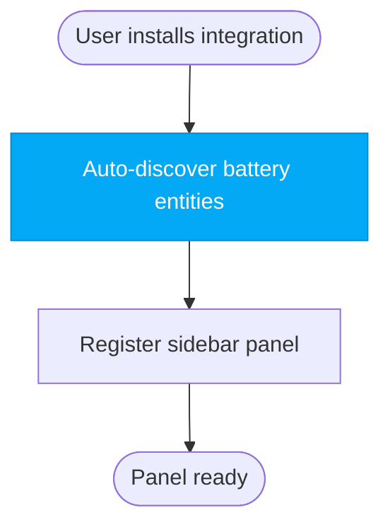
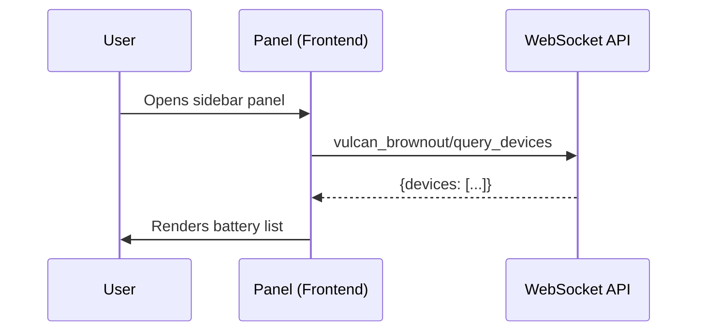
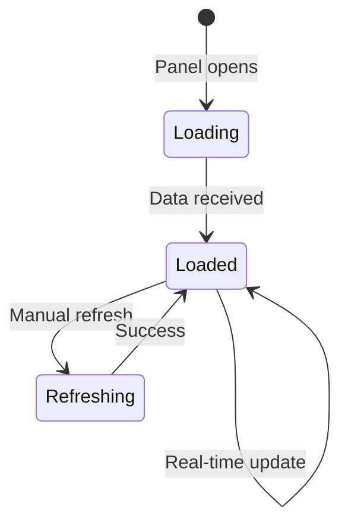
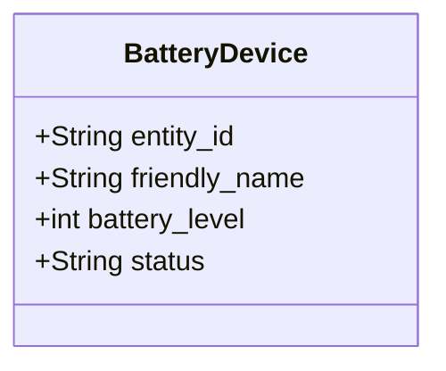
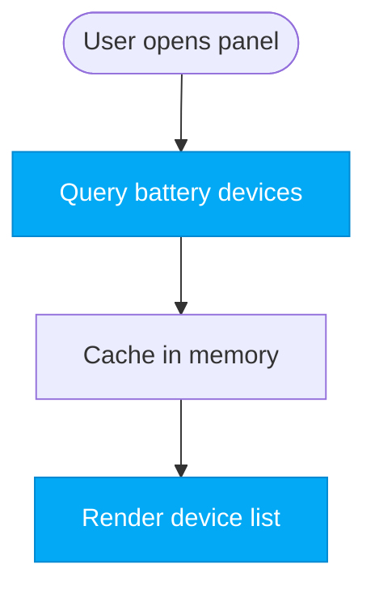

# Vulcan Brownout — Mermaid Diagram Style Guide

All diagrams in the project use Mermaid syntax. This guide defines conventions, colors, and patterns.

## General Rules

- Every diagram must be valid Mermaid syntax
- One concept per diagram — split rather than cram
- Use meaningful node IDs (`panel`, `backend`, not `A`, `B`, `C`)
- Label all edges with actions or data being passed
- Use `%%` comments to label diagram sections

## Color Palette

```
Primary (HA blue):       #03A9F4
Background (dark):       #1C1C1C
Background (light):      #FFFFFF
Critical (battery low):  #F44336 (red)
Warning (battery mid):   #FF9800 (amber)
Healthy (battery good):  #4CAF50 (green)
Unavailable:             #9E9E9E (grey)
Text primary (dark):     #FFFFFF
Text primary (light):    #212121
Text secondary (dark):   #B0B0B0
Text secondary (light):  #757575
```

## CSS Class Definitions

```mermaid
classDef primary fill:#03A9F4,stroke:#0288D1,color:#FFF
classDef critical fill:#F44336,stroke:#D32F2F,color:#FFF
classDef warning fill:#FF9800,stroke:#F57C00,color:#FFF
classDef healthy fill:#4CAF50,stroke:#388E3C,color:#FFF
classDef unavailable fill:#9E9E9E,stroke:#757575,color:#FFF
classDef neutral fill:#F5F5F5,stroke:#E0E0E0,color:#212121
```

Use these class names consistently. Don't invent new color classes.

## Diagram Types & Patterns

### Flowcharts (graph TD / graph LR)

Use for: Architecture overviews, component relationships, deployment flows.

**Convention**: `TD` (top-down) for hierarchies, `LR` (left-right) for flows.



### Sequence Diagrams (sequenceDiagram)

Use for: API interactions, WebSocket flows, user interaction sequences.

**Convention**: Name participants with alias AND descriptive label.



### State Diagrams (stateDiagram-v2)

Use for: UI component states, entity lifecycle, connection states.

**Convention**: Always show `[*]` initial state. Label every transition.



### Class Diagrams (classDiagram)

Use for: Data models, module structure, entity relationships.

**Convention**: Use `+` for public, `-` for private. Include types.



## Node Shapes

| Shape | Meaning | Syntax |
|-------|---------|--------|
| Rectangle | Process/Component | `[Label]` |
| Rounded | User action/UI | `(Label)` |
| Stadium | Start/End point | `([Label])` |
| Cylinder | Database/Store | `[(Label)]` |
| Diamond | Decision | `{Label}` |
| Hexagon | External system | `{{Label}}` |

## Edge Styles

| Style | Meaning | Syntax |
|-------|---------|--------|
| Solid arrow | Direct call/data flow | `-->` |
| Dotted arrow | Response/callback | `-.->` |
| Thick arrow | Critical path | `==>` |
| Labeled edge | Describe action | `-->&#124;action&#124;` |

## File Organization

- Architecture diagrams: `architecture/diagrams/` or inline in markdown
- UX flow diagrams: `design/diagrams/` or inline in markdown
- **Preferred**: Inline in markdown using fenced code blocks

For diagrams referenced from multiple documents, save as `.mermaid` file and reference by path.

## Example: Good vs Bad

**Bad** (no labels, generic IDs):
```
graph TD
    A --> B
    B --> C
```

**Good** (meaningful IDs, colors, shapes):


## Consistency Guidelines

- **Naming**: Use camelCase for node IDs, clear English for labels
- **Colors**: Use palette colors only (don't invent new hex values)
- **Layout**: Group related components; use comments to separate sections
- **Edges**: Label all edges except obvious ones (e.g., `load → parse` doesn't need label)
- **Sizing**: Keep diagrams readable on mobile (avoid overly complex layouts)
