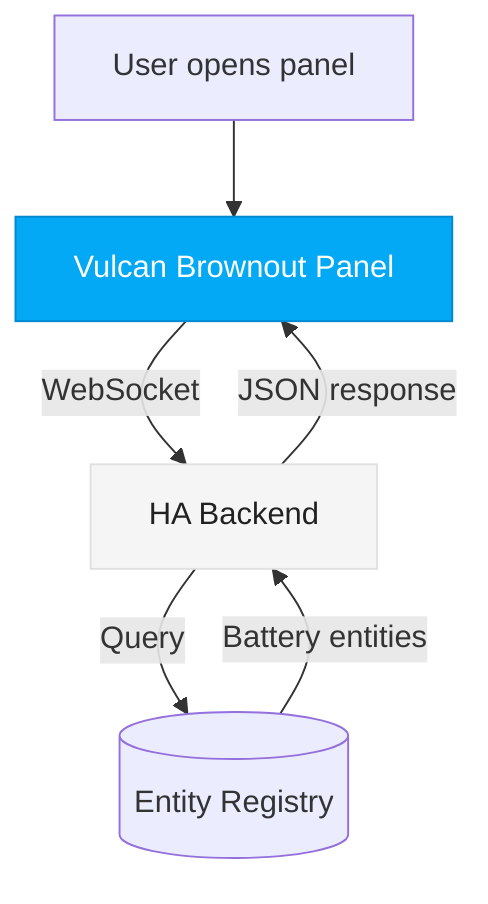
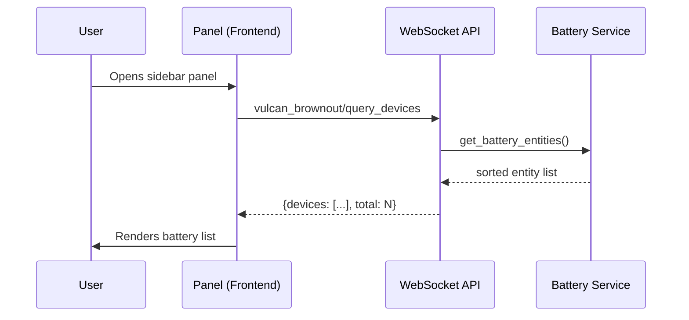
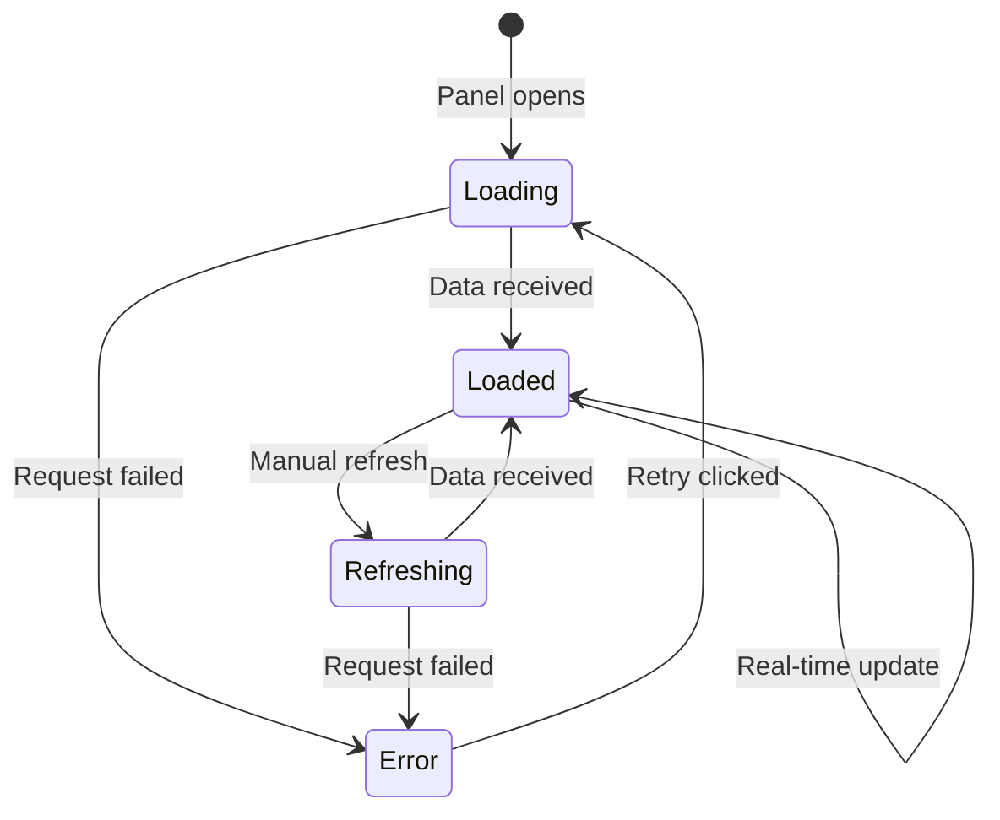
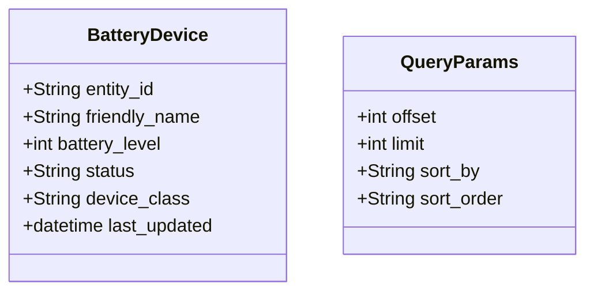
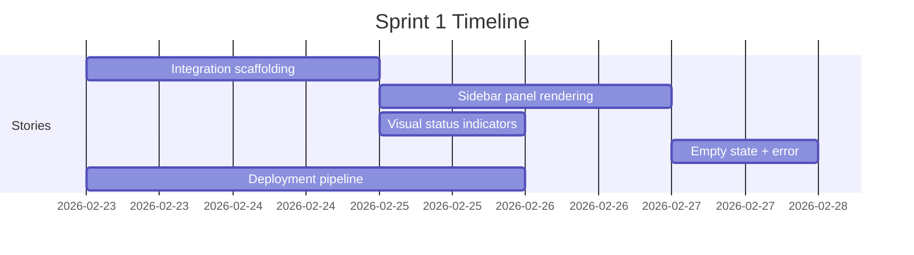
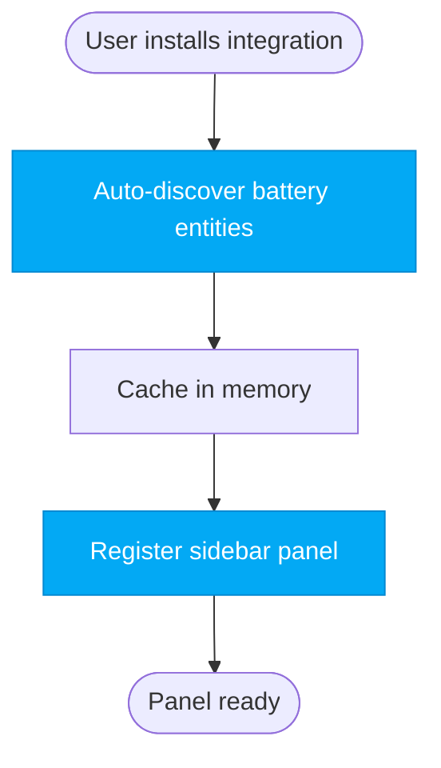

# Vulcan Brownout — Mermaid Diagram Style Guide

All diagrams across the project must use Mermaid syntax. This guide defines the conventions, color palette, and patterns every team member follows when producing diagrams.

## General Rules

- Every diagram must be valid Mermaid syntax renderable by GitHub, GitLab, Mermaid Live Editor, or any standard Mermaid renderer
- Use `%%` comments to label sections within complex diagrams
- Keep diagrams focused — one concept per diagram. Split rather than cram.
- Use meaningful node IDs (not `A`, `B`, `C` — use `panel`, `backend`, `websocket`)
- Label all edges with the action or data being passed

## Color Palette

Aligned with Home Assistant's visual language and Vulcan Brownout's battery status colors.

```
%% Vulcan Brownout Theme Colors
%% Primary (HA blue):       #03A9F4
%% Background:              #1C1C1C (dark) / #FFFFFF (light)
%% Card background:         #2C2C2C (dark) / #F5F5F5 (light)
%% Critical (battery low):  #F44336 (red)
%% Warning (battery mid):   #FF9800 (amber)
%% Healthy (battery good):  #4CAF50 (green)
%% Unavailable:             #9E9E9E (grey)
%% Accent:                  #03A9F4 (HA primary blue)
%% Text primary:            #FFFFFF (dark) / #212121 (light)
%% Text secondary:          #B0B0B0 (dark) / #757575 (light)
```

### Applying Colors with `classDef`

```mermaid
graph TD
    classDef primary fill:#03A9F4,stroke:#0288D1,color:#FFF
    classDef critical fill:#F44336,stroke:#D32F2F,color:#FFF
    classDef warning fill:#FF9800,stroke:#F57C00,color:#FFF
    classDef healthy fill:#4CAF50,stroke:#388E3C,color:#FFF
    classDef unavailable fill:#9E9E9E,stroke:#757575,color:#FFF
    classDef background fill:#2C2C2C,stroke:#444,color:#FFF
    classDef neutral fill:#F5F5F5,stroke:#E0E0E0,color:#212121
```

Use these class names consistently. Don't invent new color classes without adding them here first.

## Diagram Types & When to Use Them

### Flowcharts (`graph TD` / `graph LR`)
Use for: architecture overviews, component relationships, deployment flows.



**Convention**: `TD` (top-down) for hierarchical views, `LR` (left-right) for flows and pipelines.

### Sequence Diagrams (`sequenceDiagram`)
Use for: API interactions, WebSocket message flows, user interaction sequences.



**Convention**: Always name participants with both short alias and descriptive label.

### State Diagrams (`stateDiagram-v2`)
Use for: UI component states, entity lifecycle, connection states.



**Convention**: Always show the `[*]` initial state and label every transition.

### Class Diagrams (`classDiagram`)
Use for: data models, module structure, entity relationships.



**Convention**: Use `+` for public, `-` for private. Include types.

### Gantt Charts (`gantt`)
Use for: sprint timelines, story dependencies, release planning.



**Convention**: Use story IDs that match the sprint plan. Show dependencies with `after`.

## Node Shape Conventions

| Shape | Meaning | Syntax |
|-------|---------|--------|
| Rectangle | Process / Component | `[Label]` |
| Rounded | User action / UI element | `(Label)` |
| Stadium | Start / End point | `([Label])` |
| Cylinder | Database / Store | `[(Label)]` |
| Diamond | Decision | `{Label}` |
| Hexagon | External system | `{{Label}}` |
| Parallelogram | Input / Output | `[/Label/]` |

## Edge Style Conventions

| Style | Meaning | Syntax |
|-------|---------|--------|
| Solid arrow | Direct call / data flow | `-->` |
| Dotted arrow | Response / callback | `-.->` |
| Thick arrow | Critical path | `==>` |
| Labeled edge | Describe the action | `-->|action|` |

## File Naming

All Mermaid diagram files go in the relevant role directory:

- Architecture diagrams: `architecture/diagrams/` or inline in markdown
- UX flow diagrams: `design/diagrams/` or inline in markdown
- Inline in markdown: Preferred for most cases using fenced code blocks

When a diagram is referenced from multiple documents, save it as a standalone `.mermaid` file and reference it by path.

## Examples

### Bad
```
graph TD
    A --> B
    B --> C
    C --> D
```
No meaningful labels, no colors, generic node IDs.

### Good


Descriptive IDs, labeled flow, colored key nodes, meaningful shapes.
